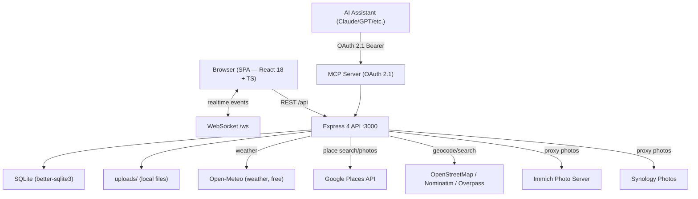

# 02 — TREK_alt: Reference Codebase Architecture

> **READ-ONLY reference.** TREK_alt is an open-source self-hosted travel planner (AGPL v3).
> We study and borrow ideas from it. Do not edit files inside `TREK_alt/`.
>
> Source: `TREK_alt/` · Live demo: https://demo-nomad.pakulat.org
> Wiki: `TREK_alt/wiki/` (~80 pages)

---

## 1. High-Level Architecture



**Deploy:** Single Docker container (`mauriceboe/trek`). Node 22 serves both API and built SPA.

---

## 2. Server Routes

**File:** `TREK_alt/server/src/app.ts`

### 2.1 Auth — `TREK_alt/server/src/routes/auth.ts` → `/api/auth`

- App config (public), demo login, invite lookup
- Register / login (local + OIDC)
- Forgot password / reset password
- `GET /me`, logout, password change, account delete
- Per-user API key management (maps, Unsplash, OpenWeather)
- User settings (generic key/value store)
- Avatar upload/delete
- User search
- Key validation endpoint
- Travel stats
- **MFA:** verify-login OTP, setup TOTP, enable, disable
- **MCP static tokens:** CRUD
- **Ephemeral tokens:** `ws-token` (for WebSocket auth), `resource-token` (for gated assets)

### 2.2 Admin — `TREK_alt/server/src/routes/admin.ts` → `/api/admin`

Requires `authenticate + adminOnly`:

- User CRUD + stats + permissions matrix + audit log
- OIDC admin config
- Demo baseline reset
- GitHub releases / version check
- Notification preferences management
- Invite tokens CRUD
- Per-addon toggle + configuration (admin can enable/disable addons)
- Admin MCP token revoke
- OAuth session list/revoke
- Packing templates CRUD (nested categories + items)
- Google Places feature flags (toggle photos/autocomplete/details per-instance)
- Collab sub-feature flags (chat, notes, polls per-instance)
- Bag-tracking toggle

### 2.3 Airports — `TREK_alt/server/src/routes/airports.ts` → `/api/airports`

- `GET /search` — airport search by name/IATA
- `GET /:iata` — single airport lookup

### 2.4 Assignments — `TREK_alt/server/src/routes/assignments.ts`

Mounted at trip-level paths; requires `requireTripAccess`:

- List / create / delete / reorder assignments (place → day mappings)
- Move assignment between days
- Per-assignment participants (which trip members are attending this stop)
- Update assignment time (`place_time`, `end_time`, `duration_minutes`)

### 2.5 Atlas — `TREK_alt/server/src/routes/atlas.ts` → `/api/addons/atlas`

Atlas addon (world map of visited countries):

- Stats (countries visited, total, percentage, regions)
- Regions with geo data
- Country detail
- Mark / unmark country as visited
- Mark / unmark sub-region as visited
- Bucket list CRUD (places to visit)

### 2.6 Backup — `TREK_alt/server/src/routes/backup.ts` → `/api/backup`

Requires admin:

- List backups (DB + uploads ZIP archives)
- Create backup now
- Download backup
- Restore from server file or uploaded file
- Auto-backup settings (schedule + retention)
- Delete backup

### 2.7 Budget — `TREK_alt/server/src/routes/budget.ts` → `/api/trips/:tripId/budget`

- List items with per-person and per-day splits
- Create / update / delete budget items
- Reorder items and categories
- Member split editing
- Member "paid" flag toggle
- Settlement recording (mark debts as settled)

### 2.8 Categories — `TREK_alt/server/src/routes/categories.ts` → `/api/categories`

- List (auth) — used for place category pins on map
- Create / update / delete (admin only)
- Each category has: name, color, icon

### 2.9 Collab — `TREK_alt/server/src/routes/collab.ts` → `/api/trips/:tripId/collab`

Collab addon (collaborative tools for trip members):

- **Notes:** CRUD + file attachments + delete attachments
- **Polls:** CRUD, vote, close, delete
- **Messages (Chat):** list, send, react with emoji, delete
- Link preview for URLs shared in chat

### 2.10 Day Notes — `TREK_alt/server/src/routes/dayNotes.ts` → `/api/trips/:tripId/days/:dayId/notes`

- Day notes CRUD (timestamped, icon-tagged free-text notes within a day plan)

### 2.11 Days — `TREK_alt/server/src/routes/days.ts` → `/api/trips/:tripId/days`

- Days CRUD (numbered days within a trip)
- **Accommodations** sub-router → `/api/trips/:tripId/accommodations` (same file)
  - Accommodation covers: check-in/out dates, confirmation, notes, linked place

### 2.12 Files — `TREK_alt/server/src/routes/files.ts` → `/api/trips/:tripId/files`

- Authenticated: list, upload, update metadata, star, trash, restore, permanent delete
- Public download with share token pattern
- File linking: attach files to places or reservations

### 2.13 Journey — `TREK_alt/server/src/routes/journey.ts` → `/api/journeys`

Journey addon (magazine-style travel journal):

- Full journey CRUD
- Entries CRUD + reorder (rich content blocks)
- Photo gallery on entries
- Contributors (invite other users to co-author)
- Preferences (layout, cover style)
- Share link: create, get, delete
- Trip links: attach TREK trips to journey entries
- Suggestions API (which entries need photos, etc.)
- Available trips for linking

### 2.14 Journey Public — `TREK_alt/server/src/routes/journeyPublic.ts` → `/api/public/journey`

- Public read by share token
- Proxy routes for journey photos/assets

### 2.15 Maps — `TREK_alt/server/src/routes/maps.ts` → `/api/maps`

- `GET /search` — place text search (Google or OSM)
- `GET /autocomplete` — typeahead (Google Places)
- `GET /place` — place details (Google; hours, rating, phone, website, photos)
- `GET /photo` — proxy place photo bytes from Google (SSRF-guarded)
- `GET /reverse` — reverse geocode (Nominatim)
- `GET /resolve-url` — server-side resolution of Google Maps share links

### 2.16 Memories (Integrations)

`TREK_alt/server/src/routes/memories/` — three sub-routers:

| Sub-router | Path | Role |
|-----------|------|------|
| `unified.ts` | `/api/integrations/memories` | Unified trip memories (photos from all providers + sharing flags + album links) |
| `immich.ts` | Under memories router | Immich: settings, status, test, browse albums, search photos, proxied asset delivery, album sync to trip |
| `synology.ts` | Under memories router | Synology Photos: settings, status, test, albums, search, asset proxy, sync |

### 2.17 Notifications — `TREK_alt/server/src/routes/notifications.ts` → `/api/notifications`

- Channel preferences (email, webhook, ntfy, in-app)
- Test SMTP / webhook / ntfy
- In-app notification feed (paginated)
- Unread count
- Mark all read
- Per-notification: read, unread, delete
- **Respond** — interactive notifications (accept/decline trip invites, etc.)

### 2.18 OAuth — `TREK_alt/server/src/routes/oauth.ts`

Public + protected OAuth 2.1 endpoints (for MCP):

- `/.well-known/oauth-authorization-server` — discovery
- `POST /oauth/token` — authorization code + refresh
- `POST /oauth/revoke`
- `POST /oauth/register` — Dynamic Client Registration
- `/api/oauth/authorize` — consent UI validate + submit
- OAuth client CRUD (admin + user)
- Session list/revoke

### 2.19 OIDC — `TREK_alt/server/src/routes/oidc.ts` → `/api/auth/oidc`

- OIDC login redirect (to provider)
- Callback handler
- Token exchange for SPA session cookie

### 2.20 Packing — `TREK_alt/server/src/routes/packing.ts` → `/api/trips/:tripId/packing`

- Items CRUD + import + reorder
- Bags CRUD (optional bag-tracking with weight distribution)
- Template apply (from admin-managed templates)
- Save-as-template
- Category assignees (which member is responsible for each category)
- Packing item category CRUD (beyond system categories)

### 2.21 Photos — `TREK_alt/server/src/routes/photos.ts` → `/api/photos`

- Authenticated thumbnail/original/info for uploaded trip photos by id

### 2.22 Places — `TREK_alt/server/src/routes/places.ts` → `/api/trips/:tripId/places`

- Places CRUD (lat, lng, name, description, category, price, reservation status, timings, notes, image, Google Place ID, website, phone, transport mode)
- Bulk delete
- **Import sources:**
  - GPX file upload
  - Google Maps list URL (via `resolve-url` service)
  - **Naver Maps list import** (one-click import from shared Naver list)
  - Generic map file
- Place image proxy (server-side fetch → client)

### 2.23 Public Config — `TREK_alt/server/src/routes/publicConfig.ts` → `/api/config`

- Minimal public info for the login page (unauthenticated): server version, OIDC config, invite-only mode flag

### 2.24 Reservations — `TREK_alt/server/src/routes/reservations.ts` → `/api/trips/:tripId/reservations`

- Reservations CRUD: flights, accommodations, restaurants with type, status, confirmation number, linked day/place, timings
- Position updates (reorder within day)
- Triggers WebSocket broadcasts + budget/accommodation service sync

### 2.25 Settings — `TREK_alt/server/src/routes/settings.ts` → `/api/settings`

- User settings get / put / bulk (key/value store per user)

### 2.26 Share — `TREK_alt/server/src/routes/share.ts` → `/api`

- Create / get / delete trip share link
- `GET /shared/:token` — public trip payload (read-only, shareable without login)

### 2.27 System Notices — `TREK_alt/server/src/routes/systemNotices.ts` → `/api/system-notices`

- Active notices (server admin posts to users)
- Dismiss by id

### 2.28 Tags — `TREK_alt/server/src/routes/tags.ts` → `/api/tags`

- User tags CRUD (color-coded labels applied to places)

### 2.29 Todo — `TREK_alt/server/src/routes/todo.ts` → `/api/trips/:tripId/todo`

- Todos CRUD with reorder
- Category assignees (which member owns each todo category)

### 2.30 Trips — `TREK_alt/server/src/routes/trips.ts` → `/api/trips`

- Trip list / create / get / update / delete
- Cover image upload
- **Copy trip** (duplicate entire trip with all places/days/assignments)
- Members: add / remove
- **Bundle** — offline sync endpoint (all trip data in one response, cached in Dexie)
- **Export ICS** — trip as iCal calendar file

### 2.31 Vacay — `TREK_alt/server/src/routes/vacay.ts` → `/api/addons/vacay`

Vacay addon (personal vacation planner):

- Vacation plan CRUD (owned by one user, can invite team members)
- Holiday calendars: add/remove/reorder (country + national holiday feeds)
- Invites: send/accept/decline/cancel
- User colors (color-code each team member on the calendar)
- Years and vacation day quotas
- Toggle vacation entries (mark specific days as vacation)
- Company holidays CRUD
- Stats (days used, remaining, carry-over)
- Public holiday API by country/year (100+ countries)

### 2.32 Weather — `TREK_alt/server/src/routes/weather.ts` → `/api/weather`

- Current / summary forecast → Open-Meteo (free, no API key)
- Detailed 16-day forecast
- Historical climate fallback

---

## 3. SQLite Database Schema

**File:** `TREK_alt/server/src/db/schema.ts` (baseline)
**Migrations:** `TREK_alt/server/src/db/migrations.ts` (adds ~30 more tables)

### Core tables (baseline schema.ts)

| Table | Purpose |
|-------|---------|
| `users` | Users: username, email, password_hash, role, maps_api_key, unsplash_api_key, avatar, OIDC fields, MFA secret/backup codes, Immich/Synology credentials, password version |
| `password_reset_tokens` | Secure password reset: token_hash, expiry, consumed_at |
| `settings` | Per-user key/value settings store |
| `trips` | Trips: title, description, dates, currency, cover_image, archived, reminder_days |
| `days` | Day plans within a trip: day_number, date, notes, title |
| `categories` | Place categories: name, color, icon (admin-managed globally) |
| `tags` | User-defined tags: name, color (per-user) |
| `places` | Trip places: name, lat/lng, address, category, price, reservation_status, timings, image_url, google_place_id, website, phone, transport_mode |
| `place_tags` | Junction: places ↔ tags |
| `day_assignments` | Which places are assigned to which days + order_index, notes, reservation data |
| `packing_items` | Packing checklist items: name, checked, category, sort_order |
| `photos` | Trip photos: filename, day/place links, caption, taken_at |
| `trip_files` | File attachments (docs, tickets, PDFs): filename, place/reservation links |
| `reservations` | Bookings: flight/hotel/restaurant, type, status, confirmation, time, linked day/place/assignment |
| `trip_members` | Which users have access to a trip: role, invited_by |
| `day_notes` | Day-level timestamped notes: text, time, icon, sort_order |
| `app_settings` | Global app settings (key/value, admin-managed) |
| `budget_items` | Trip budget items: category, name, total_price, persons, days, sort_order |
| `addons` | Addon registry: id, name, enabled, config (admin toggles per instance) |
| `photo_providers` | Photo provider registry (Immich, Synology) |
| `photo_provider_fields` | Per-provider config field definitions |
| `day_accommodations` | Accommodation spans: check-in day → check-out day + times + confirmation |
| `collab_notes` | Shared notes: title, content, category, color, pinned |
| `collab_polls` | Decision polls: question, options JSON, multiple-choice, closed, deadline |
| `collab_poll_votes` | Poll votes: unique(poll_id, user_id, option_index) |
| `collab_messages` | Group chat messages: text, reply_to, reactions |
| `assignment_participants` | Which trip members participate in a specific day assignment |
| `audit_log` | Admin audit trail: action, resource, details, ip |
| `notifications` | Rich interactive notifications: type (simple/boolean/navigate), scope (trip/user/admin), sender, title/text keys (i18n), callbacks, response |
| `notification_channel_preferences` | Per-user, per-event-type, per-channel (email/webhook/ntfy/in-app) enabled flags |

### Tables added via migrations (selected important ones)

| Table | Added | Purpose |
|-------|-------|---------|
| `invite_tokens` | Early migration | One-time or reusable invite links |
| `packing_bags` | Later | Physical bags with optional weight tracking |
| `packing_templates` | Later | Admin-managed reusable packing list templates |
| `packing_template_categories` | Later | Categories within templates |
| `packing_template_items` | Later | Items within template categories |
| `packing_item_members` / `packing_bag_members` | Later | Member assignment to packing categories/bags |
| `visited_countries` | Atlas | Countries marked visited per user |
| `bucket_list` | Atlas | Country/region wish list |
| `place_regions` / `visited_regions` | Atlas | Sub-region tracking |
| `trek_photos` / `trip_photos` | Memories | Trip photo sync from Immich/Synology |
| `file_links` | Files | Files attached to specific places or reservations |
| `share_tokens` | Trips | Public share link tokens with expiry |
| `mcp_tokens` | Auth | Static MCP API tokens for AI assistants |
| `oauth_clients` | OAuth | MCP OAuth 2.1 registered clients |
| `oauth_consents` | OAuth | User consent records per client+scope |
| `oauth_tokens` | OAuth | Active OAuth access/refresh tokens |
| `trip_album_links` | Memories | Links between TREK trips and Immich/Synology albums |
| `todo_items` | Todo addon | Trip-level todo checklist items |
| `todo_category_assignees` | Todo | Member responsibility per category |
| `journeys` | Journey addon | Magazine-style travel journals |
| `journey_entries` | Journey | Rich content entry blocks |
| `journey_photos` | Journey | Photos on journal entries |
| `journey_contributors` | Journey | Co-authors |
| `journey_share_tokens` | Journey | Public share links for journeys |
| `journey_trips` | Journey | Links between journey entries and TREK trips |
| `idempotency_keys` | Infra | Idempotency for mutating requests |
| `user_notice_dismissals` | Notices | Which notices a user has dismissed |
| `google_place_photo_meta` | Maps | Cached Google place photo metadata |
| `place_details_cache` | Maps | Cached place details responses |
| `budget_item_members` | Budget | Per-member split amounts |
| `budget_category_order` | Budget | Custom category ordering |
| `reservation_day_positions` | Reservations | Position of reservations within days |
| `collab_message_reactions` | Collab | Emoji reactions on chat messages |
| `vacay_plans` | Vacay | Vacation planning group |
| `vacay_plan_members` | Vacay | Members invited to a vacay plan |
| `vacay_user_years` | Vacay | Per-user vacation day quota per year |
| `vacay_entries` | Vacay | Days marked as vacation per user |
| `vacay_company_holidays` | Vacay | Company-defined holidays |
| `vacay_holiday_calendars` | Vacay | Country public holiday calendars linked to plan |

---

## 4. WebSocket Protocol

**File:** `TREK_alt/server/src/websocket.ts`
**Path:** `/ws`
**Auth:** Ephemeral token (`trek_...`) consumed via query param `?token=`

### Connection flow

1. Client calls `GET /api/auth/ws-token` → receives short-lived `ws_token`
2. Client opens `ws://server/ws?token=<ws_token>`
3. Server consumes token, loads user, sends `{ type: 'welcome', socketId }`
4. Client sends `{ type: 'join', tripId }` → server verifies access, replies `{ type: 'joined', tripId }`

### Client → Server message types

| Type | Payload | Description |
|------|---------|-------------|
| `join` | `{ tripId }` | Enter a trip's realtime room |
| `leave` | `{ tripId }` | Leave a trip room |
| `ping` | — | Keep-alive heartbeat |

### Server → Client event types (broadcast to trip rooms)

| Domain | Event | Trigger |
|--------|-------|---------|
| **Trips** | `trip:updated` | Trip metadata edited |
| | `trip:deleted` | Trip deleted |
| | `member:added` | Member added (MCP only) |
| | `member:removed` | Member removed (MCP only) |
| **Places** | `place:created` | Place added to trip |
| | `place:updated` | Place edited |
| | `place:deleted` | Place removed |
| **Assignments** | `assignment:created` | Place assigned to day |
| | `assignment:deleted` | Assignment removed |
| | `assignment:reordered` | Assignments reordered within day |
| | `assignment:moved` | Assignment moved to different day |
| | `assignment:updated` | Assignment time/notes edited |
| | `assignment:participants` | Participants updated |
| **Days** | `day:created` | Day added |
| | `day:updated` | Day title/notes edited |
| | `day:deleted` | Day removed |
| **Day Notes** | `dayNote:created` | Note added to day |
| | `dayNote:updated` | Note edited |
| | `dayNote:deleted` | Note removed |
| **Accommodations** | `accommodation:created` | Accommodation added |
| | `accommodation:updated` | Accommodation edited |
| | `accommodation:deleted` | Accommodation removed |
| **Reservations** | `reservation:created` | Booking added |
| | `reservation:updated` | Booking edited |
| | `reservation:deleted` | Booking removed |
| | `reservation:positions` | Booking position reordered |
| **Budget** | `budget:created` | Budget item added |
| | `budget:updated` | Budget item edited |
| | `budget:deleted` | Budget item removed |
| | `budget:reordered` | Items reordered |
| | `budget:members-updated` | Split amounts updated |
| | `budget:member-paid-updated` | Paid flag toggled |
| **Packing** | `packing:created` | Item added |
| | `packing:updated` | Item edited/checked |
| | `packing:deleted` | Item removed |
| | `packing:bag-*` | Bag events |
| | `packing:template-applied` | Template applied |
| | `packing:assignees` | Category assignees updated |
| **Files** | `file:created` | File uploaded |
| | `file:updated` | File metadata edited |
| | `file:deleted` | File removed |
| **Todos** | `todo:created` | Todo added |
| | `todo:updated` | Todo edited/checked |
| | `todo:deleted` | Todo removed |
| | `todo:assignees` | Assignees updated |
| **Collab** | `collab:note:created/updated/deleted` | Note events |
| | `collab:poll:created/updated/voted/closed/deleted` | Poll events |
| | `collab:message:created` | Chat message sent |
| | `collab:message:reacted` | Emoji reaction on message |
| | `collab:message:deleted` | Message deleted |
| **Memories** | `memories:updated` | Photo sync complete |

### Rate limiting

~30 messages per 10 seconds per socket. Excess → `error` message.

---

## 5. MCP Server

**File:** `TREK_alt/server/src/mcp/index.ts`
**Protocol:** Model Context Protocol (MCP) over Streamable HTTP
**Auth:** OAuth 2.1 Bearer token (`trekoa_*`) or deprecated static MCP token (`trek_*`)

### OAuth Scopes (27 scopes across 13 groups)

| Scope | Permission |
|-------|-----------|
| `trips:read` / `trips:write` | Read/write trips, members, sharing |
| `places:read` / `places:write` | Read/write places, categories, tags, imports |
| `atlas:read` / `atlas:write` | Read/write visited countries, bucket list, regions |
| `packing:read` / `packing:write` | Read/write packing items, bags, templates |
| `todos:read` / `todos:write` | Read/write todo items |
| `budget:read` / `budget:write` | Read/write budget items, splits, settlements |
| `reservations:read` / `reservations:write` | Read/write reservations, transport |
| `collab:read` / `collab:write` | Read/write chat, notes, polls |
| `notifications:read` | Read notifications |
| `vacay:read` / `vacay:write` | Read/write vacation plans |
| `geo:read` | Search places, geocode, resolve URLs |
| `weather:read` | Read weather forecasts |
| `journey:read` / `journey:write` | Read/write journey journal entries |

### MCP Tools (grouped)

**Trip management (~13 tools)**
`create_trip`, `update_trip`, `delete_trip`, `list_trips`, `get_trip_summary`,
`list_trip_members`, `add_trip_member`, `remove_trip_member`, `copy_trip`,
`export_trip_ics`, `get_share_link`, `create_share_link`, `delete_share_link`

**Places and geo (~12 tools)**
`create_place`, `create_and_assign_place`, `update_place`, `delete_place`, `list_places`,
`list_categories`, `search_place`, `import_places_from_url`, `bulk_delete_places`,
`get_place_details`, `reverse_geocode`, `resolve_maps_url`

**Days, notes, accommodations (~14 tools)**
`create_day`, `update_day`, `delete_day`,
`create_day_note`, `update_day_note`, `delete_day_note`,
`create_accommodation`, `create_place_accommodation`, `update_accommodation`, `delete_accommodation`

**Assignments (~7 tools)**
`assign_place_to_day`, `unassign_place`, `update_assignment_time`, `move_assignment`,
`get_assignment_participants`, `set_assignment_participants`, `reorder_day_assignments`

**Tags (~4 tools)**
`list_tags`, `create_tag`, `update_tag`, `delete_tag`

**Maps, weather, airports (~7 tools)**
`get_place_details`, `reverse_geocode`, `resolve_maps_url`,
`get_weather`, `get_detailed_weather`, `search_airports`, `get_airport`

**Budget (~7 tools)**
`create_budget_item`, `delete_budget_item`, `update_budget_item`,
`create_budget_item_with_members`, `set_budget_item_members`, `toggle_budget_member_paid`,
settlement tools

**Packing (~14 tools)**
`create_packing_item`, `toggle_packing_item`, `delete_packing_item`, `update_packing_item`,
`reorder_packing_items`, `list_packing_bags`, `create/update/delete_packing_bag`,
`set_bag_members`, `get/set_packing_category_assignees`, `apply_packing_template`,
`save_packing_template`, `bulk_import_packing`

**Reservations and transport (~8 tools)**
`create_reservation`, `update_reservation`, `delete_reservation`, `reorder_reservations`,
`link_hotel_accommodation`, `create_transport`, `update_transport`, `delete_transport`

**Todos (~8 tools)**
`list_todos`, `create_todo`, `update_todo`, `toggle_todo`, `delete_todo`,
`reorder_todos`, `get/set_todo_category_assignees`

**Notifications (~5 tools)**
`list_notifications`, `get_unread_notification_count`,
`mark_notification_read`, `mark_notification_unread`, `mark_all_notifications_read`

**Atlas (~10 tools)**
`create/update/delete_bucket_list_item`, `mark/unmark_country_visited`,
`get_atlas_stats`, `list_visited_regions`, `mark/unmark_region_visited`,
`get_country_atlas_places`

**Collab (~9 tools, gated by addon flags)**
`create/update/delete_collab_note`,
`list/create/vote/close/delete_collab_poll`,
`list/send/delete_collab_message`, `react_collab_message`

**Journey (~20 tools)**
`list/get/create/update/delete_journey`,
`list/create/update/delete_journey_entry`, `reorder_journey_entries`,
`add/update/remove_journey_contributor`,
`get/create/delete_journey_share_link`, `add/remove_journey_trip`,
`update_journey_preferences`, `get_journey_suggestions`, `list_journey_available_trips`

**Vacay (~15+ tools)**
`get/update_vacay_plan`, `set_vacay_color`, `get_available_vacay_users`,
invite flow (send/accept/decline/cancel), `dissolve_vacay_plan`,
year/entry/stats management, holiday calendar CRUD, `list_holidays`, `list_holiday_countries`

### MCP Resources (30 URIs)

JSON resources at `trek://...` URIs for: trips, days, places, budget, packing, reservations,
day notes, accommodations, members, atlas (stats/countries/regions/bucket-list), notifications,
vacay (plan/entries/holidays), collab (notes/polls/messages), journey (list/detail/entries/contributors)

### MCP Prompts

| Prompt | Description |
|--------|-------------|
| `token_auth_notice` | Shown when using static (deprecated) MCP token |
| `trip-summary` | Summarize a trip across all addons |
| `packing-list` | Create optimized packing list (packing addon required) |
| `budget-overview` | Budget analysis and tips (budget addon required) |

---

## 6. Client Architecture

**Framework:** React 18 + Vite + TypeScript + Tailwind 3
**File:** `TREK_alt/client/src/App.tsx`

### Pages and Routes

| Route | Page | Notes |
|-------|------|-------|
| `/login` | `LoginPage` | Also handles register path |
| `/forgot-password`, `/reset-password` | Recovery pages | |
| `/shared/:token` | `SharedTripPage` | Public shared trip (read-only) |
| `/public/journey/:token` | `JourneyPublicPage` | Public journey view |
| `/oauth/authorize` | `OAuthAuthorizePage` | MCP OAuth consent UI |
| `/dashboard` | `DashboardPage` | Trip list + dashboard widgets |
| `/trips/:id` | `TripPlannerPage` | Main trip planner (map + day sidebar) |
| `/trips/:id/files` | `FilesPage` | Per-trip document manager |
| `/admin` | `AdminPage` | Admin panel (admin role required) |
| `/settings` | `SettingsPage` | Account, display, maps, notifications, integrations, MFA, photo providers |
| `/vacay` | `VacayPage` | Vacation planner addon |
| `/atlas` | `AtlasPage` | Atlas addon (visited countries map) |
| `/journey` | `JourneyPage` | Journey list + creation |
| `/journey/:id` | `JourneyDetailPage` | Individual journey editor |
| `/notifications` | `InAppNotificationsPage` | Notification center |

### Component Directories

| Directory | Notable components |
|-----------|-------------------|
| `Admin/` | User management table, addon toggles, packing template editor, audit log viewer |
| `Budget/` | Budget table, pie chart, per-person/day summaries, settlement UI |
| `Collab/` | WhatsNext widget, chat panel, notes grid, polls list |
| `Dashboard/` | Trip cards, widgets (weather, packing progress, upcoming reservations) |
| `Files/` | File list, upload dropzone, trash management |
| `Journey/` | Entry editor, photo lightbox, map integration, mood/day colors, markdown toolbar |
| `Layout/` | Navbar, BottomNav, offline banner, notification bell |
| `Map/` | **Leaflet adapter**, **Mapbox GL adapter**, route calculator, photo markers, clustering |
| `Memories/` | Immich browser, Synology browser, unified photo picker |
| `Notifications/` | Notification list, interactive notification (accept/decline buttons) |
| `OAuth/` | Scope group picker for OAuth consent |
| `PDF/` | `TripPDF` (full trip export), `JourneyBookPDF` (magazine-style journey export) |
| `Packing/` | Packing list + bags + progress bars + template picker |
| `Photos/` | Trip photo uploader, gallery, day/place linking |
| `Planner/` | Day plan sidebar, place sidebar, day detail panel, reservation modal, transport modal, file import modal |
| `Settings/` | Tabs: account, display, map settings, notification channels, integrations (Immich/Synology), offline cache, photo providers, about |
| `SystemNotices/` | Banner for admin-broadcast notices |
| `Todo/` | Todo list with categories and assignees |
| `Trips/` | Trip form modal, members modal |
| `Vacay/` | Calendar grid, team member overlay, holiday display |
| `Weather/` | WeatherWidget (forecast card on planner) |
| `shared/` | Modal, toast, pickers, virtual scroll, color picker, etc. |

### Zustand Stores

| Store | State held |
|-------|-----------|
| `authStore` | Session, user, MFA flags, app config (server-side), maps key hints, demo mode |
| `tripStore` | Active trip data / planner state |
| `journeyStore` | Journeys and entries |
| `vacayStore` | Vacation plan UI state |
| `settingsStore` | Display settings + language (ties to i18n) |
| `addonStore` | Enabled addons and photo providers (from `/api/addons`) |
| `permissionsStore` | Fine-grained UI permissions from server config |
| `inAppNotificationStore` | Unread count + feed hooks |
| `systemNoticeStore` | Active system notices |

### Offline-First Sync Layer

**Files:** `TREK_alt/client/src/sync/` + `TREK_alt/client/src/repo/`

```
syncTriggers.ts     ← window online event, visibility, 30s timer, WS pre-reconnect
tripSyncManager.ts  ← fetches /trips/:id/bundle, writes to Dexie
mutationQueue.ts    ← queues writes offline, replays with X-Idempotency-Key when online
tilePrefetcher.ts   ← map tile prefetch for offline use
offlineDb.ts        ← Dexie (IndexedDB) schema for trips, places, days, etc.
```

**Repo facades** (choose Dexie vs API, enqueue mutations):
`tripRepo`, `placeRepo`, `dayRepo`, `accommodationRepo`, `packingRepo`, `todoRepo`, `budgetRepo`, `reservationRepo`, `fileRepo`

### i18n

**File:** `TREK_alt/client/src/i18n/TranslationContext.tsx`

- 15 locale files: `en`, `de`, `es`, `fr`, `hu`, `it`, `ru`, `zh`, `zh-TW`, `nl`, `id`, `ar` (RTL), `br`, `cs`, `pl`
- Browser language auto-detected on first load
- RTL support (`ar`)
- Language preference stored in user settings

### PWA / Service Worker

**File:** `TREK_alt/client/vite.config.js`

- `vite-plugin-pwa` with Workbox
- `registerType: 'autoUpdate'`
- Runtime caches:
  - Carto + OSM tiles → CacheFirst
  - unpkg (Leaflet assets) → CacheFirst
  - API calls → NetworkFirst (excludes auth/admin/backup/settings)
  - Cover images + avatars → CacheFirst
- Navigate fallback: SPA `index.html` (deny: `/api`, `/uploads`, `/mcp`)
- On version change: purge all caches + unregister SW + reload
- Web app manifest: name "TREK — Travel Planner", standalone, themed icons
- Installable on iOS (Add to Home Screen) and Android without App Store

---

## 7. Map Stack

| Feature | Technology |
|---------|-----------|
| **Base maps** | Leaflet (react-leaflet) OR Mapbox GL (admin toggle) |
| **3D buildings + terrain** | Mapbox GL |
| **Tile sources** | Carto, OpenStreetMap, Mapbox raster |
| **Place search** | Google Places Autocomplete (server-proxied) OR Nominatim OSM (free, no key) |
| **Place details** | Google Places Details (hours, rating, phone, photos) |
| **Reverse geocode** | Google Geocoding OR Nominatim |
| **Routing / route display** | OSRM (open source routing machine) |
| **Route optimization** | Auto-sort places and export to Google Maps |
| **Photo markers** | Custom Leaflet/Mapbox markers with trip photos |
| **Clustering** | Leaflet.markercluster |
| **Category filter** | Show/hide pins by category on map |

All Google API calls are **server-proxied** through `/api/maps` (SSRF-guarded, no key exposure to client).

---

## 8. Middleware

**Directory:** `TREK_alt/server/src/middleware/`

| File | Purpose |
|------|---------|
| `auth.ts` | `extractToken` (cookie `trek_session` then `Authorization: Bearer`); `authenticate`; `optionalAuth`; `adminOnly`; `demoUploadBlock` |
| `mfaPolicy.ts` | `enforceGlobalMfaPolicy` — forces TOTP if admin has enabled global MFA requirement; exempt paths: public routes + MFA setup flow |
| `idempotency.ts` | `applyIdempotency` — caches response for `X-Idempotency-Key` + user + method + path (24h TTL). Powers offline mutation replay. |
| `tripAccess.ts` | `requireTripAccess` (any trip member), `requireTripOwner` (creator only) |
| `validate.ts` | `validateStringLengths`, `maxLength` — input sanitation |

---

## 9. Scheduler / Background Jobs

**File:** `TREK_alt/server/src/scheduler.ts`

| Job | Schedule | Action |
|-----|----------|--------|
| **Auto-backup** | Per user config | Zip DB + uploads → save to `data/backups/` |
| **Backup retention** | After each backup | Delete old backups beyond retention count |
| **Trip reminders** | Daily 09:00 (server TZ) | Notify members of trips starting in N days |
| **Todo reminders** | Daily 09:00 | Notify of unchecked todos with due dates approaching |
| **Demo reset** | Hourly (demo mode) | Reset DB to baseline seed state |
| **Version check** | Daily | Compare against GitHub releases, notify admin |
| **Idempotency cleanup** | Nightly 03:00 | Delete old `idempotency_keys` rows |
| **Trek photo cache sweep** | Every 2h + startup | Evict stale Google Places photo cache entries |

---

## 10. Notable Services to Study / Port

**Directory:** `TREK_alt/server/src/services/`

| Service | What to study |
|---------|--------------|
| `weatherService.ts` | Open-Meteo integration — free, no API key, 16-day forecast, historical fallback |
| `mapsService.ts` | SSRF guard pattern, Google Places server-proxy, OSM fallback |
| `tripService.ts` | Bundle endpoint (offline sync in one response), ICS export |
| `budgetService.ts` | Debt simplification algorithm (multi-person settlement) |
| `assignmentService.ts` | Drag-drop reorder logic with fractional sort orders |
| `packingService.ts` | Template apply logic, bag-weight distribution |
| `journeyService.ts` | Magazine-style layout state, entry types (text/photos/map/quote) |
| `atlasService.ts` | Country/region geo data, visit stats, bucket list scoring |
| `notificationService.ts` | Multi-channel delivery (in-app, email, webhook, ntfy) |
| `inAppNotifications.ts` | Rich interactive notifications (boolean accept/decline actions) |
| `shareService.ts` | Time-limited share tokens (trips + journeys) |
| `backupService.ts` | ZIP creation, restore from archive |
| `oauthService.ts` | OAuth 2.1 server implementation, DCR, consent flow |
| `ephemeralTokens.ts` | One-time tokens for WS auth and asset gating |
| `auditLog.ts` | Action/resource/IP logging pattern |
| `placePhotoCache.ts` | LRU cache for Google place photo bytes |
| `demo.ts` | Demo reset strategy (seed to baseline without wiping user-uploaded files) |

---

## 11. Operational / Admin Features

| Feature | How implemented |
|---------|----------------|
| **Backups** | ZIP of SQLite DB + uploads, scheduled or manual, restore via admin UI |
| **Audit log** | Every admin action logged with user/IP/resource |
| **OIDC SSO** | `openid-client` library; Google, Apple, Authentik, Keycloak |
| **TOTP 2FA** | `otplib`; backup codes; global MFA enforcement option |
| **OAuth 2.1** | Full server implementation with DCR, consent UI, token rotation |
| **Demo mode** | Hourly reset + upload blocking + read-only alert banners |
| **Admin panel** | User CRUD, addon toggles, packing templates, categories, MCP tokens, backups, version history |
| **Multi-language** | 15 locales including RTL Arabic |
| **Dark mode** | Full theme + matching browser status bar color |
| **PWA** | Offline map tiles, offline API cache, installable via browser |
| **MCP rate limiting** | 300 requests/minute/user; 20 concurrent MCP sessions/user |
| **Idempotency** | Server-side replay prevention for offline mutations |
| **Health check** | `GET /api/health` — Render/Docker ping keeps service alive |
