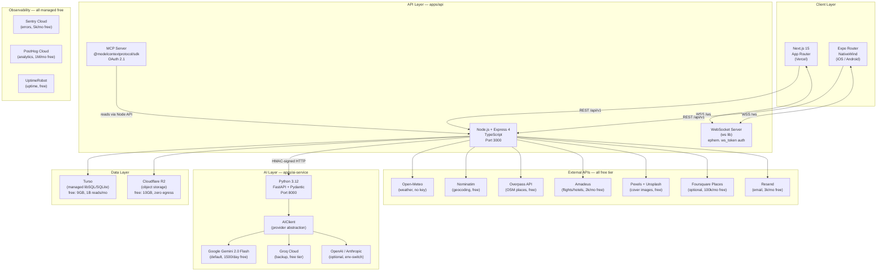
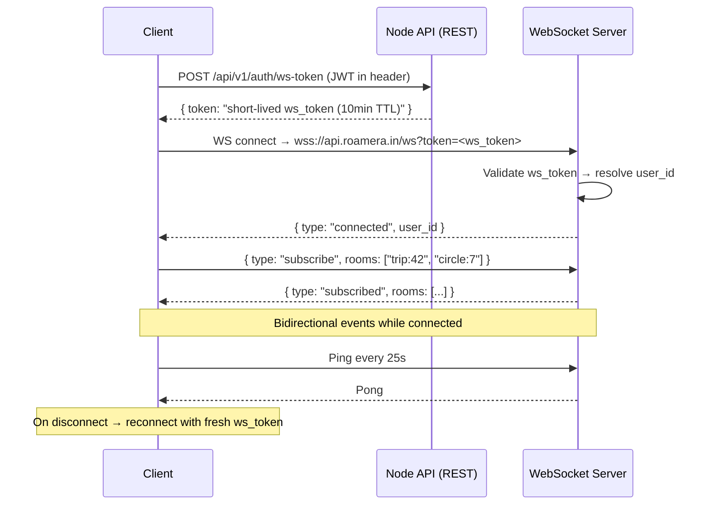
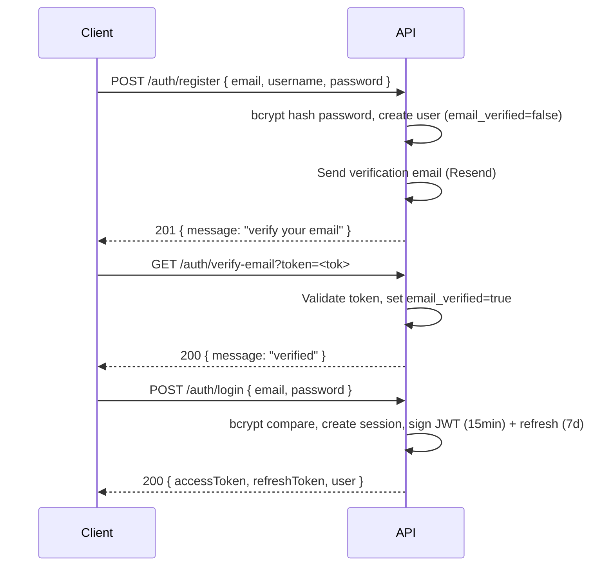
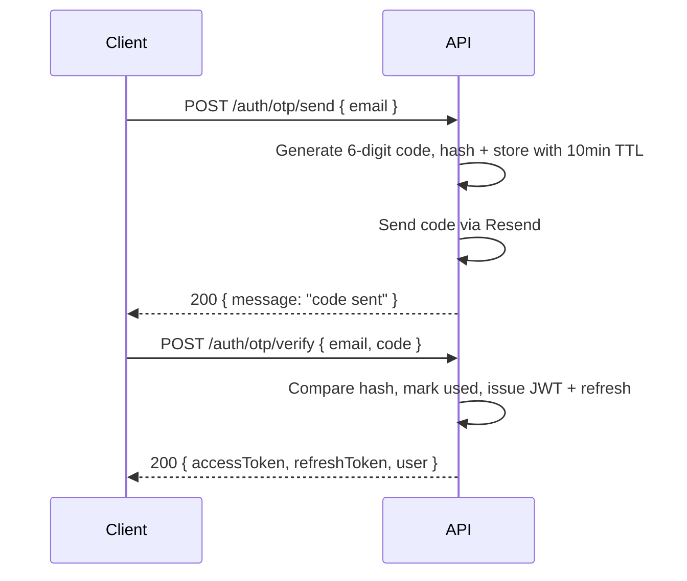
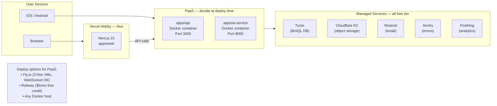

# 06 — Roamera V2: Full System Architecture

> **Status:** Locked design. No V1 code is reused. All features are rebuilt fresh.
> V1 (`backend/` `frontend/` `mobile/`) is archived to `legacy/` for feature reference only.
> Stack is maximally aligned with `TREK_alt/` patterns.
> **Cost target: $0/mo runtime; ~$10/yr for a domain.**

---

## 1. Architecture Overview



---

## 2. Monorepo Structure

```
fullstack-main/                         repo root
├── apps/
│   ├── web/                            Next.js 15 App Router
│   ├── mobile/                         Expo SDK + Expo Router
│   ├── api/                            Node + Express 4 + TS + Drizzle + ws
│   └── ai-service/                     Python 3.12 + FastAPI
├── packages/
│   ├── types/                          Zod schemas + TS types (shared source of truth)
│   ├── sdk/                            Typed REST client + TanStack Query hooks
│   ├── ui/                             Cross-platform UI primitives (Next.js + Expo compatible)
│   └── config/                         tsconfig / eslint / prettier / tailwind preset
├── legacy/                             V1 archived (backend/ frontend/ mobile/) — DO NOT IMPORT
│   └── README.md                       "Feature reference only — do not import from this directory"
├── TREK_alt/                           Read-only reference (AGPL, unchanged)
├── docs/architecture/                  All architecture docs (this file + 01–08)
├── data/                               LOCAL ONLY — dev DB file + dev uploads (gitignored)
├── docker-compose.yml                  Local dev: api + ai-service containers
├── turbo.json                          Turborepo pipeline config
├── pnpm-workspace.yaml
├── AGENTS.md
└── README.md
```

---

## 3. Service Responsibilities

### 3.1 `apps/api` — Node.js Main API

**Owns:** everything except AI inference.

| Module | Responsibility |
|--------|---------------|
| `auth` | Register, login, JWT issue/refresh, email verify, OTP, password reset, account delete, session list, avatar upload |
| `users` | Profile CRUD, travel preferences, budget band, user search, follow/unfollow, fellow travelers |
| `posts` | Moments CRUD (create/edit/delete/get), photo upload to R2, rich text, day itinerary JSON |
| `social` | Reactions (5 types), comments, follow graph, bucket list, wanna-go |
| `feed` | Compass (global + following), trending destinations, discover, pagination cursor |
| `trips` | Trip CRUD, days, places, assignments, drag-drop order, copy trip, share token, ICS export |
| `trip.budget` | Budget items, per-member splits, settlements, multi-currency |
| `trip.packing` | Packing items, bags, templates, category assignees |
| `trip.collab` | Group chat, notes, polls, votes, message reactions |
| `trip.files` | Trip file attachments (PDFs, tickets), star, trash, share download token |
| `trip.reservations` | Flight/hotel/restaurant reservations, linked to days + places |
| `trip.accommodations` | Check-in/out accommodation spans |
| `circles` | Meetways/Circles CRUD, member management, linked expense group |
| `justsplit` | Multi-user expense splitting, weighted splits, settlement tracking, debt simplification |
| `journey` | Magazine-style travel journals, rich content entries, contributors, share link |
| `atlas` | Visited countries/regions, world map stats, bucket list countries |
| `gamification` | Badges, travel stats, leaderboards |
| `travellens` | Flight + hotel search via Amadeus API, deep-links to booking sites |
| `destinations` | Destination listings, categories, trending, cover images |
| `maps` | Place search, geocoding, reverse geocode, POI details, weather |
| `notifications` | In-app + email notifications, read/unread, interactive respond, per-type preferences |
| `admin` | User management, audit log, system notices, packing templates, addon flags |
| `mcp` | MCP server OAuth 2.1 endpoints, token management, static tokens |
| `files` | Signed upload/download URL generation for R2, local multer fallback in dev |
| `ws` | WebSocket upgrade handler, room subscriptions, event broadcast |
| `idempotency` | Idempotency key middleware for all mutating requests (TREK pattern) |

### 3.2 `apps/ai-service` — FastAPI AI Service

**Owns:** all AI inference. Called only by Node API (internal HTTP, HMAC-signed).

| Endpoint | Role |
|----------|------|
| `POST /v1/ai/plan` | Generate full trip itinerary from user prompt + preferences |
| `POST /v1/ai/plan/refine` | Conversationally refine an existing plan |
| `POST /v1/ai/optimize-budget` | Rewrite itinerary within a tighter budget |
| `POST /v1/ai/caption` | Generate photo caption from image URL + context |
| `POST /v1/ai/hashtags` | Generate hashtag suggestions from post content |
| `POST /v1/ai/translate` | Translate text content (for i18n user content) |
| `GET /health` | Health check |

**AI provider abstraction (`AIClient` interface):**

```python
class AIClient(Protocol):
    async def generate(self, prompt: str, schema: dict | None) -> str: ...
    async def generate_with_image(self, prompt: str, image_url: str) -> str: ...
```

Implementations: `GeminiClient`, `GroqClient`, `OpenAIClient`, `AnthropicClient`.
Selected via `AI_PROVIDER` env var (default: `gemini`).
Retry + fallback chain: primary → backup → error.

### 3.3 `apps/web` — Next.js 15

- **App Router** with Server Components for SEO pages (public posts/profiles/destinations)
- **Client Components** for interactive modules (AI planner chat, maps, realtime feed)
- **Route groups:** `(public)` for unauthenticated, `(app)` for authenticated
- **Middleware:** auth guard via JWT cookie check, locale detection
- Calls `apps/api` via the `packages/sdk` typed client
- WebSocket connection managed by a singleton `WsClient` in Zustand store

### 3.4 `apps/mobile` — Expo Router

- **File-based routing** in `app/` directory
- **NativeWind** for Tailwind-compatible styles
- Shares `packages/types`, `packages/sdk`, `packages/ui` with web
- Offline: Dexie + mutation queue (same pattern as TREK)
- Background push: Expo Notifications (APNs/FCM) triggered by Node API events

---

## 4. Database Strategy — Drizzle + libSQL (Turso)

### 4.1 Why this stack

| Concern | Solution |
|---------|----------|
| Local dev (no infra) | `@libsql/client` in file mode — `file:data/app.db` |
| Production (managed, $0) | Turso remote — same `@libsql/client`, just a different URL |
| Type safety | Drizzle ORM (`drizzle-orm/libsql`) — TypeScript-first, no DSL |
| Migrations | `drizzle-kit push` (dev) / `drizzle-kit migrate` (prod) |
| Growth path | Swap `drizzle-orm/libsql` → `drizzle-orm/postgres-js` (1-day port, schema is dialect-portable) |
| Backups | Turso automated backups (free tier); nightly `turso db dump` via GitHub Actions artifact |

### 4.2 Schema Groups

```
Identity
  users                  id, username, email, password_hash, role, avatar_key,
                         home_city, bio, budget_band, interests[], email_verified,
                         created_at, updated_at
  sessions               id, user_id, token_hash, expires_at, created_at
  otp_tokens             id, user_id, email, code_hash, expires_at, used_at
  password_reset_tokens  id, user_id, token_hash, expires_at, used_at
  invite_tokens          id, created_by, token, max_uses, uses, expires_at
  user_settings          user_id, key, value (per-user key/value store)
  audit_log              id, user_id, action, resource_type, resource_id, details, ip, created_at

Social
  posts                  id, user_id, title, content, destinations[], date_from, date_to,
                         activities[], accommodation, budget_inr, vacation_type,
                         transport_mode, hashtags[], itinerary_json, is_published,
                         created_at, updated_at
  post_photos            id, post_id, storage_key, order_index, caption
  reactions              id, post_id, user_id, type (love|epic|wander|wanna_go|amazing), created_at
  comments               id, post_id, user_id, parent_id, content, created_at
  follows                follower_id, following_id, created_at
  bucket_list            id, user_id, place_name, lat, lng, country, note, created_at
  saved_posts            user_id, post_id, created_at

Notifications
  notifications          id, user_id, type, title, body, data_json, read_at,
                         actor_id, resource_type, resource_id, created_at
  notification_prefs     user_id, event_type, in_app, email, push

Feed / Destinations
  destinations           id, name, country, description, category, cover_key,
                         lat, lng, is_featured, created_at
  destination_tags       destination_id, tag

Trips (TREK pattern)
  trips                  id, owner_id, title, description, date_from, date_to,
                         currency, cover_key, is_archived, reminder_days,
                         share_token, share_token_expires_at, created_at, updated_at
  trip_members           trip_id, user_id, role (owner|editor|viewer), invited_by, created_at
  days                   id, trip_id, day_number, date, title, notes
  categories             id, name, color, icon (admin-managed place categories)
  tags                   id, user_id, name, color (user-defined labels)
  places                 id, trip_id, name, lat, lng, address, category_id,
                         price, website, phone, image_url, google_place_id,
                         transport_mode, notes, created_at
  place_tags             place_id, tag_id
  day_assignments        id, trip_id, day_id, place_id, order_index,
                         place_time, end_time, duration_minutes, notes
  assignment_participants  assignment_id, user_id
  day_notes              id, day_id, text, time, icon, sort_order
  reservations           id, trip_id, day_id, place_id, type (flight|hotel|restaurant),
                         status, confirmation, name, start_time, end_time, notes
  accommodations         id, trip_id, checkin_day_id, checkout_day_id,
                         checkin_time, checkout_time, confirmation, notes, place_id
  trip_files             id, trip_id, filename, storage_key, mime_type, size_bytes,
                         place_id, reservation_id, is_starred, is_trashed,
                         share_token, created_by, created_at
  share_tokens           id, trip_id, token, expires_at, created_by
  idempotency_keys       id, key, user_id, method, path, response_status,
                         response_body, created_at, expires_at

Packing (TREK pattern)
  packing_lists          id, trip_id, title
  packing_categories     id, list_id, name, sort_order
  packing_items          id, list_id, category_id, name, quantity, is_packed,
                         assigned_to_user_id, sort_order
  packing_bags           id, list_id, name, color, weight_limit_kg
  packing_bag_items      bag_id, item_id
  packing_templates      id, name, description, created_by (admin)
  packing_template_cats  id, template_id, name, sort_order
  packing_template_items id, category_id, name, quantity

Budget (TREK pattern)
  budget_items           id, trip_id, category, name, total_price, currency,
                         persons, days, sort_order
  budget_item_members    budget_item_id, user_id, amount, is_paid
  budget_category_order  trip_id, category, sort_order
  settlements            id, trip_id, from_user_id, to_user_id, amount, currency,
                         settled_at, created_at

Circles / Meetways
  circles                id, owner_id, title, description, destination,
                         date_from, date_to, is_public, cover_key,
                         linked_trip_id, created_at
  circle_members         circle_id, user_id, role, joined_at
  circle_messages        id, circle_id, user_id, content, reply_to_id,
                         is_deleted, created_at
  circle_message_reactions  message_id, user_id, emoji
  circle_polls           id, circle_id, user_id, question, options_json,
                         is_multiple, is_closed, deadline, created_at
  circle_poll_votes      poll_id, user_id, option_index

JustSplit
  expense_groups         id, name, currency, owner_id, created_at
  expense_group_members  group_id, user_id, joined_at
  expenses               id, group_id, paid_by, description, amount, currency,
                         date, split_type (equal|weighted|exact), created_at
  expense_splits         id, expense_id, user_id, amount, is_settled, settled_at

Journey Magazine
  journeys               id, user_id, title, description, cover_key,
                         layout_pref, is_public, share_token, created_at
  journey_entries        id, journey_id, title, content_json, order_index, created_at
  journey_photos         id, entry_id, storage_key, caption, taken_at, order_index
  journey_contributors   journey_id, user_id, role, invited_at
  journey_trip_links     journey_id, trip_id

Atlas
  visited_countries      id, user_id, country_code, visited_at
  visited_regions        id, user_id, country_code, region_code, visited_at

Gamification
  user_badges            id, user_id, badge_type, earned_at, details_json

Media
  uploads                id, storage_key, user_id, mime_type, size_bytes,
                         width, height, ref_count, created_at

MCP / OAuth
  mcp_tokens             id, user_id, token_hash, name, scopes[], last_used_at, created_at
  oauth_clients          id, client_id, client_secret_hash, name, redirect_uris[],
                         scopes[], created_by
  oauth_tokens           id, client_id, user_id, access_token_hash,
                         refresh_token_hash, scopes[], expires_at
  oauth_consents         client_id, user_id, scopes[], granted_at

Observability
  system_notices         id, title, body, type, is_active, created_by, created_at
  user_notice_dismissals user_id, notice_id, dismissed_at
```

---

## 5. Realtime Architecture (WebSocket)

Pattern taken directly from TREK_alt.

### 5.1 Connection Lifecycle



### 5.2 Room Model

| Room key | Who joins | Events |
|----------|-----------|--------|
| `user:{id}` | Authenticated user (always joined on connect) | `notification:new`, `notification:update`, `dm:new` |
| `trip:{id}` | Trip members only (verified server-side) | `trip:*` events |
| `circle:{id}` | Circle members only | `circle:*` events |
| `admin` | Admins only | `admin:*` events |

### 5.3 Event Categories

| Category | Events | Payload |
|----------|--------|---------|
| **Trip** | `trip:updated`, `member:added`, `member:removed` | `{ tripId, data }` |
| **Day/Places** | `day:created`, `day:updated`, `day:deleted`, `place:created`, `place:updated`, `place:deleted`, `assignment:created`, `assignment:updated`, `assignment:deleted`, `note:created`, `note:updated`, `note:deleted` | `{ tripId, ... }` |
| **Budget** | `budget:item_added`, `budget:item_updated`, `budget:settled` | `{ tripId, data }` |
| **Packing** | `packing:item_checked`, `packing:item_added` | `{ tripId, data }` |
| **Collab** | `chat:message`, `chat:reaction`, `poll:new`, `poll:voted`, `poll:closed` | `{ tripId, data }` |
| **Circle** | `circle:message`, `circle:reaction`, `circle:poll_new`, `circle:poll_voted` | `{ circleId, data }` |
| **Notifications** | `notification:new`, `notification:updated` | `{ notification }` |
| **Presence** | `user:online`, `user:offline` | `{ userId }` |
| **System** | `system:notice`, `system:maintenance` | `{ notice }` |

---

## 6. File / Object Storage

```
STORAGE_DRIVER=local   → multer writes to data/uploads/{yyyy}/{mm}/{sha256.ext}
STORAGE_DRIVER=r2      → @aws-sdk/client-s3 pointing to R2 bucket (S3-compatible)
```

**Production (R2):**
- Upload: Node API generates presigned PUT URL → client uploads directly to R2 → client confirms key to API
- Download public: direct R2 public URL (for post photos, destination covers)
- Download gated: Node API generates time-limited presigned GET URL (for trip files, invoices)
- Thumbnails: `sharp` processes images on upload, stores `{key}_thumb.webp`
- Content-addressed: filename = `sha256(content).ext`; deduplication via `uploads.ref_count`

---

## 7. Service-to-Service Auth (Node API → FastAPI)

```
Node API → FastAPI: POST http://ai-service:8000/v1/ai/plan
Headers:
  X-Service-Token: HMAC-SHA256(timestamp + body_hash, AI_SERVICE_SECRET)
  X-Timestamp: <unix-ms>
  X-User-Id: <userId>   ← propagated user context (FastAPI may use for per-user rate limits)
```

FastAPI validates: signature is valid + timestamp within 60s window → accept.
Secret rotated via `AI_SERVICE_SECRET` env var.

---

## 8. Shared Packages

### `packages/types`

```
src/
  schemas/
    auth.ts          UserSchema, LoginSchema, RegisterSchema, OtpSchema
    post.ts          PostSchema, CreatePostSchema, ReactionSchema
    trip.ts          TripSchema, DaySchema, PlaceSchema, AssignmentSchema
    ...              (one file per domain)
  index.ts           re-exports all schemas + inferred TS types
```

All schemas are Zod — used for:
- Request body validation in Node API (`z.parse`)
- Form validation in Next.js and Expo (react-hook-form + zodResolver)
- Type generation for `packages/sdk`

### `packages/sdk`

```
src/
  client.ts          axios instance factory (base URL from env)
  hooks/
    auth.ts          useLogin(), useRegister(), useMeQuery()
    posts.ts         usePostsQuery(), useCreatePost(), useReact()
    trips.ts         useTripsQuery(), useTripQuery(), useCreateTrip()
    ...
  ws.ts              WsClient class: connect, subscribe, on(event, handler), reconnect
  index.ts
```

TanStack Query hooks wrap all API calls. Cache keys match resource paths.

### `packages/ui`

```
src/
  components/
    Button.tsx        Works in Next.js (uses className) + Expo (uses NativeWind)
    Card.tsx
    Avatar.tsx
    Input.tsx
    Modal.tsx
    ...
  index.ts
```

Cross-platform via `Platform.OS` branching where needed.

### `packages/config`

```
tsconfig/
  base.json
  nextjs.json
  expo.json
eslint/
  index.js
prettier/
  index.js
tailwind/
  preset.js          Shared theme tokens (colors, fonts, radii)
```

---

## 9. Auth Flow

### 9.1 Email + Password (primary)



### 9.2 Email OTP (passwordless)



### 9.3 Token Refresh

```
POST /auth/refresh { refreshToken }
→ Rotate refresh token (old invalidated), issue new access + refresh pair
```

---

## 10. AI Provider Abstraction (FastAPI)

```python
# apps/ai-service/src/ai/client.py

AI_PROVIDER = os.getenv("AI_PROVIDER", "gemini")   # gemini | groq | openai | anthropic

class GeminiClient(AIClient):
    model = "gemini-2.0-flash"    # 1500 req/day free

class GroqClient(AIClient):
    model = "llama-3.3-70b-versatile"   # free tier

class OpenAIClient(AIClient):
    model = "gpt-4o-mini"   # cheap if needed

class AnthropicClient(AIClient):
    model = "claude-3-5-haiku-20241022"   # cheap if needed
```

**Fallback chain** (configured in `FALLBACK_PROVIDERS` env):
1. Primary (`AI_PROVIDER`)
2. On `429 / 5xx` → try backup (`AI_FALLBACK_PROVIDER`)
3. On second failure → return structured error to Node API

**Prompt templates** live in `apps/ai-service/src/prompts/`:
- `plan.jinja2` — full itinerary generation
- `refine.jinja2` — conversational refinement
- `caption.jinja2` — photo caption
- `hashtags.jinja2` — social hashtag suggestions

---

## 11. Deployment Topology (Free Tier)



**Platform-agnostic contract:**
- Both `apps/api` and `apps/ai-service` are plain Dockerfiles
- All config via env vars (no platform-specific features)
- No Vercel Edge Functions or Cloudflare Workers in the API path
- Switch hosting provider by updating the `API_BASE_URL` env var in Vercel

### 11.1 Required Environment Variables

**`apps/api`**

```
DATABASE_URL=libsql://...            # Turso remote (prod) or file:data/app.db (dev)
DATABASE_AUTH_TOKEN=...              # Turso auth token (prod only)
JWT_SECRET=...
JWT_REFRESH_SECRET=...
AI_SERVICE_URL=http://ai-service:8000
AI_SERVICE_SECRET=...                # HMAC signing secret
STORAGE_DRIVER=r2                    # local | r2
R2_ACCOUNT_ID=...
R2_ACCESS_KEY_ID=...
R2_SECRET_ACCESS_KEY=...
R2_BUCKET_NAME=...
RESEND_API_KEY=...
SENTRY_DSN=...
CORS_ORIGINS=https://roamera.in,https://www.roamera.in
PORT=3000
NODE_ENV=production
AMADEUS_CLIENT_ID=...
AMADEUS_CLIENT_SECRET=...
PEXELS_API_KEY=...
FOURSQUARE_API_KEY=...               # optional
```

**`apps/ai-service`**

```
AI_PROVIDER=gemini                   # gemini | groq | openai | anthropic
AI_FALLBACK_PROVIDER=groq
GOOGLE_API_KEY=...                   # Gemini
GROQ_API_KEY=...
OPENAI_API_KEY=...                   # optional
ANTHROPIC_API_KEY=...                # optional
AI_SERVICE_SECRET=...                # must match API service value
PORT=8000
```

**`apps/web` (Vercel)**

```
NEXT_PUBLIC_API_URL=https://api.roamera.in
NEXT_PUBLIC_WS_URL=wss://api.roamera.in/ws
NEXT_PUBLIC_POSTHOG_KEY=...
NEXT_PUBLIC_SENTRY_DSN=...
```

---

## 12. Local Development

```bash
# From repo root
pnpm install                         # install all packages
cp apps/api/.env.example apps/api/.env
cp apps/ai-service/.env.example apps/ai-service/.env

docker compose up -d                 # starts api (3000) + ai-service (8000)
                                     # api uses file:data/app.db (no DB container)

pnpm --filter api db:migrate         # apply Drizzle migrations to local SQLite
pnpm --filter api db:seed            # seed demo data (5 users, destinations)

pnpm dev                             # Turborepo: web (3001) + api (3000) + ai (8000)
```

**Turborepo pipeline (`turbo.json`):**
```json
{
  "pipeline": {
    "build": { "dependsOn": ["^build"], "outputs": [".next/**", "dist/**"] },
    "dev":   { "cache": false, "persistent": true },
    "lint":  {},
    "test":  { "dependsOn": ["^build"] },
    "typecheck": {}
  }
}
```

---

## 13. Observability

| Signal | Tool | How |
|--------|------|-----|
| **Errors** | Sentry Cloud (free 5k/mo) | `@sentry/node` in API, `@sentry/nextjs` in web, `sentry-sdk` in FastAPI |
| **Analytics** | PostHog Cloud (free 1M/mo) | `posthog-js` in web, `posthog-python` in FastAPI, central `track()` wrapper |
| **Uptime** | UptimeRobot (free 50 monitors) | Monitor `GET /api/health` every 5 min |
| **Logs** | `pino` (Node) + `structlog` (Python) → stdout; ship to Better Stack Logs free (1 GB, 3 days) or Axiom free (0.5 GB/mo) | Log shipping via Docker log driver or agent |
| **Health endpoint** | `GET /api/health` | Returns `{ status, db, version, uptime }` |

---

## 14. Security

| Concern | Mechanism |
|---------|-----------|
| Rate limiting | `express-rate-limit` per IP + per user (stricter on auth routes) |
| CORS | `cors` middleware, whitelist `CORS_ORIGINS` env |
| Security headers | `helmet` defaults (CSP, HSTS, X-Frame, etc.) |
| Input validation | Zod on every request body/query; Pydantic in FastAPI |
| SQL injection | Drizzle parameterized queries (no raw string interpolation) |
| XSS | JSON-only API; no HTML rendering in Node; Next.js CSP headers |
| CSRF | API uses Bearer tokens (not cookies in main API path); WS uses ws_token |
| Secrets | All via env vars; `.env` gitignored; no secrets in code |
| Service-to-service | HMAC-SHA256 signed envelopes with 60s timestamp window |
| Asset access | Gated trip files: presigned URLs with TTL (no public listing) |
| Idempotency | TREK-pattern idempotency key table for all POST/PATCH/DELETE mutations |
| Audit log | Every admin action written to `audit_log` table |

---

## 15. No-V1-Code Rule

> The `legacy/` directory is **feature reference only.**
> - Do not `import` from `legacy/` in any `apps/` or `packages/` file.
> - Do not copy-paste code from `legacy/`.
> - Use V1 as a checklist of what exists, then design and write it fresh.
> - TREK patterns are the preferred starting point for backend structure.
> - The `TREK_alt/` directory is also **read-only** (AGPL) — study and adapt, do not copy verbatim.

---

## 16. Upgrade / Growth Paths

| Component | When to upgrade | Action |
|-----------|----------------|--------|
| Turso free tier | > 1 B row reads/mo | Turso Scaler ($29/mo) or migrate to Neon Postgres |
| Drizzle dialect | When migrating to Postgres | Swap `drizzle-orm/libsql` → `drizzle-orm/postgres-js` |
| Gemini free tier | > 1500 req/day | Switch `AI_PROVIDER=openai` or upgrade to Gemini paid |
| Cloudflare R2 | > 10 GB storage | R2 paid (very cheap at $0.015/GB) |
| Vercel Hobby | Need team features or private domain on Pro | Vercel Pro ($20/mo) |
| SQLite concurrency | Write-heavy load (> 100 concurrent writes) | Migrate to Postgres (Neon free tier) |
| Amadeus free tier | > 2000 API calls/mo | Amadeus Self-Service paid (pay-as-you-go) |
