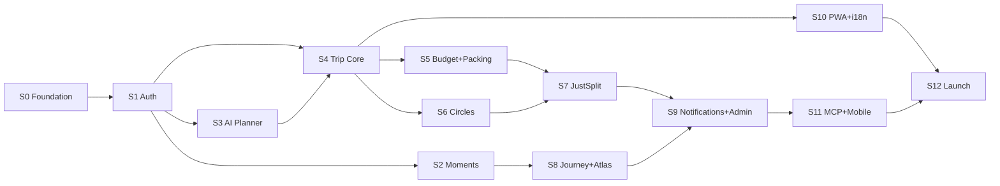

# 08 — Roamera V2: Build Roadmap

> **MVP Definition:** A fully functional travel super-app that covers all feature-matrix decisions
> marked Keep / Port / New. Built fresh — no V1 code reused.
> **Strategy:** Ship working vertical slices sprint by sprint. User tests each sprint and gives feedback.
> **Timeline:** 12 sprints × ~2 weeks = ~24 weeks total (adjust pace as needed).
> **Stack:** Node + Express 4 + Drizzle + libSQL (Turso) + Next.js 15 + Expo + FastAPI.
> **Cost:** $0/mo. All services are free-tier managed SaaS.

---

## Sprint Overview

| Sprint | Name | Weeks | Key Deliverable | Status |
|--------|------|-------|----------------|--------|
| S0 | Foundation | 1 | Monorepo, CI, DB schema, design tokens, archive V1 | ✅ Done |
| S1 | Auth & Profile | 2–3 | Register/login/OTP/JWT, user profiles, follow graph | ✅ Done |
| S2 | Moments & Social | 4–5 | Posts, photos, reactions, comments, feed, search | ✅ Done |
| S3 | AI Planner | 6–7 | FastAPI AI service, itinerary generator, TravelLens | ✅ Done |
| S4 | Trip Planner Core | 8–10 | Days/places/assignments, drag-drop, maps, weather |
| S5 | Budget & Packing | 11–12 | Budget tracker, splits, packing lists, bags, templates |
| S6 | Circles & Collab | 13–14 | Meetways Circles, real-time chat, polls, notes |
| S7 | JustSplit | 15–16 | Multi-currency expense groups, debt simplification |
| S8 | Journey & Atlas | 17–18 | Magazine journals, visited countries map, gamification |
| S9 | Notifications & Admin | 19–20 | Real-time notifications, admin panel, audit log |
| S10 | Reservations & Export | 21–22 | Reservations, trip files, ICS/PDF, PWA, i18n |
| S11 | MCP & Mobile Polish | 23 | MCP server, Expo mobile app, push notifications |
| S12 | Production Launch | 24 | E2E tests, performance, deploy, cutover |

---

## Sprint 0 — Foundation
**Duration:** Week 1
**Goal:** A working monorepo skeleton with CI, database schema, and design system in place. Nothing user-facing yet — just the scaffold every sprint builds on.

### Deliverables

- [ ] `pnpm-workspace.yaml` + root `package.json` configured
- [ ] `turbo.json` pipeline: `build`, `dev`, `lint`, `test`, `typecheck`
- [ ] Move existing code: `backend/` → `legacy/backend/`, `frontend/` → `legacy/frontend/`, `mobile/` → `legacy/mobile/`; add `legacy/README.md` ("feature reference only — do not import")
- [ ] Delete empty `fusion/` directory
- [ ] Scaffold `apps/api`: Express 4 + TypeScript + `@libsql/client` + Drizzle + `ws` + `helmet` + `cors` + `pino` + `zod`
- [ ] Scaffold `apps/ai-service`: FastAPI + Pydantic + `httpx` + `structlog` + provider clients
- [ ] Scaffold `apps/web`: Next.js 15 App Router + TypeScript + Tailwind 3 + shadcn/ui + next-intl
- [ ] Scaffold `apps/mobile`: Expo SDK 52 + Expo Router + NativeWind + i18next
- [ ] Scaffold `packages/types`: Zod schemas directory structure
- [ ] Scaffold `packages/sdk`: typed client + TanStack Query hooks stubs
- [ ] Scaffold `packages/ui`: shared component stubs (Button, Card, Avatar, Input)
- [ ] Scaffold `packages/config`: shared tsconfig + eslint + prettier + tailwind preset
- [ ] Drizzle schema in `apps/api/src/db/schema.ts` — **all tables** from §4.2 of `06-system-architecture.md`
- [ ] Drizzle migrations: `pnpm --filter api db:generate` + `db:migrate`
- [ ] `docker-compose.yml`: api + ai-service containers; api uses `file:data/app.db` locally
- [ ] `.env.example` files for all apps
- [ ] GitHub Actions CI: lint + typecheck + build on every PR
- [ ] Design tokens in `packages/config/tailwind/preset.js`: teal primary, coral accent, slate neutral, `rounded-2xl`, dark mode support
- [ ] `GET /api/health` endpoint returns `{ status, db, version, uptime_ms }`
- [ ] Seed script: 5 demo users + 15 destinations + sample data

### Acceptance Criteria
- `pnpm dev` starts all services without error
- `pnpm lint && pnpm typecheck` passes with zero errors
- `GET http://localhost:3000/api/health` → `{ status: "ok", db: "ok" }`
- DB schema migration runs clean on empty SQLite file

### Dependencies
- Accounts needed: Turso (create free DB), GitHub repo set up
- No external API keys needed yet

---

## Sprint 1 — Auth & Profile
**Duration:** Weeks 2–3
**Goal:** Users can register, log in (password or OTP), verify email, manage their profile, and follow other users. JWT auth guards all protected routes. This is the foundation every sprint depends on.

### Deliverables

**Backend (`apps/api`)**
- [ ] `POST /api/v1/auth/register` — bcrypt hash, store user, send verification email (Resend)
- [ ] `GET /api/v1/auth/verify-email?token=` — mark `email_verified=true`
- [ ] `POST /api/v1/auth/login` — bcrypt compare, issue JWT (15min) + refresh (7d)
- [ ] `POST /api/v1/auth/otp/send` — 6-digit OTP, hash+store, send via Resend
- [ ] `POST /api/v1/auth/otp/verify` — compare hash, issue JWT pair
- [ ] `POST /api/v1/auth/refresh` — rotate refresh token
- [ ] `POST /api/v1/auth/logout` — invalidate session
- [ ] `POST /api/v1/auth/password/reset-request` + `POST .../password/reset`
- [ ] `GET /api/v1/auth/ws-token` — ephemeral WebSocket token (10 min TTL)
- [ ] `GET /api/v1/auth/me` — current user
- [ ] JWT middleware (`authenticate`) used on all protected routes
- [ ] `GET /api/v1/users/:username` — public profile
- [ ] `PATCH /api/v1/users/me` — update bio/city/interests/budget band
- [ ] `POST /api/v1/users/me/avatar` — upload avatar → R2 (or local in dev)
- [ ] `DELETE /api/v1/users/me` — soft delete (30d grace)
- [ ] `GET /api/v1/users/search?q=`
- [ ] `POST /api/v1/users/:userId/follow` + `DELETE .../follow`
- [ ] `GET /api/v1/users/:userId/followers` + `.../following`
- [ ] `GET/PUT /api/v1/users/me/settings` — key/value store
- [ ] Idempotency middleware wired up for all POST/PATCH/DELETE

**Web (`apps/web`)**
- [ ] Auth route group `(auth)`: login page, register page, OTP entry, email verify landing
- [ ] App route group `(app)`: auth guard (redirect if no JWT cookie)
- [ ] Auth flow: register → verify email → login → home
- [ ] OTP flow: send OTP → enter code → home
- [ ] User profile page: `/u/:username`
- [ ] Edit profile modal (bio, city, interests, budget band)
- [ ] Avatar upload
- [ ] Follow / unfollow button
- [ ] Followers / following modal
- [ ] Auth context + JWT cookie management

**Mobile (`apps/mobile`)**
- [ ] Auth stack: `login.tsx`, `register.tsx`, `otp.tsx`
- [ ] JWT storage in `expo-secure-store`
- [ ] Profile screen: view + edit
- [ ] Follow button

**Types & SDK (`packages/`)**
- [ ] `RegisterSchema`, `LoginSchema`, `OtpSendSchema`, `OtpVerifySchema`, `UserSchema`
- [ ] `useLogin()`, `useRegister()`, `useMeQuery()`, `useFollowUser()` hooks

### Acceptance Criteria
- Register → receive verification email → verify → login → see profile
- OTP flow works end-to-end (email arrives, code works, JWT issued)
- JWT expires → refresh happens transparently
- All auth routes return 401 without valid JWT
- Follow/unfollow persists across page refresh

### Dependencies
- Resend account + API key
- Cloudflare R2 bucket configured (for avatar upload)
- Turso DB created + `DATABASE_URL` set

---

## Sprint 2 — Moments & Social Feed
**Duration:** Weeks 4–5
**Goal:** Users can create travel posts (Moments) with up to 5 photos, all 5 reaction types, comments, save posts, and see a global/following feed. This is the core social loop.

### Deliverables

**Backend**
- [ ] `POST /api/v1/posts` — create Moment (title, content, destinations, dates, activities, budget, hashtags, itinerary_json, vacation_type, transport_mode)
- [ ] `GET /api/v1/posts/:postId` — post detail (public)
- [ ] `PATCH /api/v1/posts/:postId` + `DELETE`
- [ ] `POST /api/v1/posts/:postId/photos` — multi-upload → R2 (up to 5, sharp thumbnail)
- [ ] `POST /api/v1/posts/:postId/reactions` — all 5 types; `wanna_go` → adds to `bucket_list`
- [ ] `GET /api/v1/posts/:postId/comments` — paginated, nested
- [ ] `POST /api/v1/posts/:postId/comments` + `PATCH` + `DELETE`
- [ ] `POST /api/v1/posts/:postId/save` + `DELETE`
- [ ] `GET /api/v1/feed/compass?feed=global|following&cursor=` — cursor-paginated
- [ ] `GET /api/v1/feed/trending` — trending destinations + hashtags
- [ ] `GET /api/v1/feed/destinations` + `GET /api/v1/feed/destinations/:id`
- [ ] `GET /api/v1/feed/search?q=` — posts + users + destinations
- [ ] `GET /api/v1/feed/saved` — user's saved posts
- [ ] `GET /api/v1/feed/bucket-list` + `POST` + `DELETE /:id`

**Web**
- [ ] Compass page (home): global/following feed toggle, infinite scroll
- [ ] Post card: cover photo, title, location, budget, reactions bar with all 5 emoji, comment count
- [ ] Reaction popover: hover/tap → all 5 reactions; animated emoji burst on select
- [ ] Post detail page: full photo carousel, rich text, day itinerary, comments section
- [ ] Create Moment modal: multi-photo upload, form fields, hashtag input, itinerary day builder
- [ ] Destinations page: grid with filters
- [ ] Search overlay: unified results
- [ ] Saved posts / bucket list page
- [ ] User feed on profile page

**Mobile**
- [ ] Compass screen (home): feed list, pull-to-refresh
- [ ] Post card component
- [ ] Post detail screen: carousel, reactions, comments
- [ ] Create post screen: camera/gallery picker (expo-image-picker), form

**Types & SDK**
- [ ] `PostSchema`, `CreatePostSchema`, `ReactionSchema`, `CommentSchema`
- [ ] `usePostsQuery()`, `useCreatePost()`, `useReact()`, `useCommentsQuery()`, `useFeedQuery()`

### Acceptance Criteria
- Create post with 5 photos → appears in global feed immediately
- All 5 reactions work; `wanna_go` adds post to bucket list
- `wanna_go` reaction auto-saves the destination to bucket list
- Comments: create, edit, delete, nested replies
- Following feed shows only posts from followed users
- Feed is infinite-scroll with cursor pagination

---

## Sprint 3 — AI Planner & TravelLens
**Duration:** Weeks 6–7
**Goal:** Users can generate AI trip itineraries through a conversational UI, and search flights/hotels through Amadeus with deep-links to booking sites.

### Deliverables

**AI Service (`apps/ai-service`)**
- [ ] `AIClient` interface + `GeminiClient` (default) + `GroqClient` (backup)
- [ ] HMAC-signed request validation middleware
- [ ] `POST /v1/ai/plan` — generate full `DayPlan[]` from prompt
- [ ] `POST /v1/ai/plan/refine` — conversational refinement loop
- [ ] `POST /v1/ai/optimize-budget` — rewrite plan for tighter budget
- [ ] `POST /v1/ai/caption` — photo caption from image URL
- [ ] `POST /v1/ai/hashtags` — hashtag suggestions
- [ ] Prompt templates in `src/prompts/` as Jinja2 files
- [ ] Structured JSON output via provider-specific function calling / JSON mode
- [ ] `GET /health`

**Backend (`apps/api`)**
- [ ] `POST /api/v1/ai/plan` — HMAC-signed proxy to FastAPI, returns itinerary
- [ ] `POST /api/v1/ai/plan/refine` — streaming SSE response to client
- [ ] `GET /api/v1/travel/flights?origin=&destination=&date=&adults=`
- [ ] `GET /api/v1/travel/hotels?city=&checkin=&checkout=&adults=`
- [ ] `GET /api/v1/travel/airports?q=`
- [ ] Response includes `deep_links` object: `{ skyscanner, google_flights, booking_com }` for each result

**Web**
- [ ] AI Planner page: conversational chat UI (multi-turn), streaming response display
- [ ] Generated itinerary preview: day-by-day card layout
- [ ] "Save as Trip" button — creates a trip in the planner from AI output
- [ ] "Optimize budget" prompt button
- [ ] TravelLens page: flight search form + results with deep-link booking buttons
- [ ] Hotel search form + results
- [ ] Airport autocomplete input (uses `/travel/airports`)

**Mobile**
- [ ] AI Planner screen: chat interface, itinerary result
- [ ] TravelLens screen: flight/hotel search

**Types & SDK**
- [ ] `AIPlanSchema`, `AIPlanResultSchema`, `FlightSearchSchema`, `HotelSearchSchema`
- [ ] `useAIPlan()`, `useFlightSearch()`, `useHotelSearch()`

### Acceptance Criteria
- AI generates a 5-day Tokyo itinerary from a text prompt in < 15 seconds
- Conversational refinement: "make it cheaper" → updated itinerary
- Flight search returns results with working Skyscanner deep-links
- Hotel search returns results with working Booking.com deep-links
- AI service falls back to Groq when Gemini returns 429

---

## Sprint 4 — Trip Planner Core
**Duration:** Weeks 8–10 (3 weeks — most complex sprint)
**Goal:** Full trip planning UI: days, places, drag-drop assignments, Leaflet map with POI pins, geocoding, weather widget. Real-time collaboration via WebSocket. Users can plan a complete trip end-to-end.

### Deliverables

**Backend**
- [ ] Full trips CRUD (`/api/v1/trips`)
- [ ] Trip members: add/remove/roles
- [ ] Days CRUD + day notes
- [ ] Places CRUD + bulk delete + GPX import
- [ ] Assignments CRUD + reorder + move between days
- [ ] Assignment participants (which trip members attend a stop)
- [ ] Place categories (admin-managed, used for map pin colors)
- [ ] User tags (color-coded labels on places)
- [ ] Trip share link (public read-only view)
- [ ] Bundle endpoint (full trip data for offline sync)
- [ ] ICS export
- [ ] WebSocket server (`ws`): auth via `ws_token`, room model, all `trip:*` events broadcast on mutations
- [ ] `GET /api/v1/maps/search`, `GET .../reverse`, `GET .../place`, `GET .../overpass`
- [ ] `GET /api/v1/weather/current`, `GET .../forecast` (Open-Meteo)
- [ ] `PATCH .../assignments/:id/move` — move place to different day, broadcast WS event

**Web**
- [ ] Trips list page
- [ ] Create trip modal (title, dates, destination, cover image, currency)
- [ ] Trip detail page:
  - Left panel: day list with collapsible places
  - Center: Leaflet map with POI pins (colored by category)
  - Right panel (desktop): place detail / add place form
- [ ] Drag-and-drop day plan (`@dnd-kit/core`): reorder places within a day, move between days
- [ ] Place card: name, category pin, time, duration, notes, image
- [ ] Add place: map click + place search (Nominatim autocomplete)
- [ ] Overpass POI search: filter by type (restaurant, hotel, attraction, etc.) on map
- [ ] Day notes: timestamped notes attached to a day
- [ ] Weather widget on day header (Open-Meteo)
- [ ] Real-time updates: WebSocket hook — places added by other members appear live
- [ ] Trip member management modal
- [ ] Share trip: copy public link / view public read-only page
- [ ] Offline: Dexie stores trip bundle; mutations queue with idempotency keys; sync on reconnect
- [ ] Optimistic UI: place add / check shows immediately, reverts on error

**Mobile**
- [ ] Trips list screen
- [ ] Trip detail screen: day plan list + place cards
- [ ] Map screen: Leaflet (react-native-webview wrapper or react-native-maps with OSM tiles)
- [ ] Add place screen

**Types & SDK**
- [ ] `TripSchema`, `DaySchema`, `PlaceSchema`, `AssignmentSchema`, `WeatherSchema`
- [ ] `useTripsQuery()`, `useTripQuery()`, `useCreateTrip()`, `usePlacesQuery()`, `useAssignments()`
- [ ] `WsClient` class in `packages/sdk/src/ws.ts`

### Acceptance Criteria
- Create trip → add 3 days → add 5 places → drag-drop to reorder → see on map
- Two browser tabs open the same trip → adding a place in tab 1 appears in tab 2 without refresh
- Weather widget shows 5-day forecast for trip destination
- Disconnect, add a place offline, reconnect → place syncs to server
- Public share link opens trip in read-only mode without login
- ICS export downloaded and importable to Google Calendar

---

## Sprint 5 — Budget & Packing
**Duration:** Weeks 11–12
**Goal:** Per-trip budget tracker with member splits and settlement tracking. Packing lists with bags, category assignees, and reusable templates.

### Deliverables

**Backend**
- [ ] Budget items CRUD + reorder by category
- [ ] Per-member splits (set amounts per person)
- [ ] Settlement recording + balance summary
- [ ] Multi-currency display (exchange rate via a free API: Frankfurt or Open Exchange Rates free tier)
- [ ] Packing items CRUD + check/uncheck + reorder
- [ ] Packing bags CRUD + assign items to bags
- [ ] Packing category assignees (which member owns a category)
- [ ] Packing template apply (from admin-managed templates)
- [ ] Admin: packing templates CRUD (`/api/v1/admin/packing-templates`)
- [ ] WS events for budget + packing changes broadcast to trip room

**Web**
- [ ] Budget tab on trip detail: categorized items, totals, per-person breakdown
- [ ] Add budget item form: category, name, price, currency, persons, days
- [ ] Member splits modal: enter per-person amounts
- [ ] Settlement record modal: who paid whom
- [ ] Balance summary card: who owes whom (simplified debts)
- [ ] Packing tab on trip detail: checklist by category
- [ ] Check/uncheck items (optimistic, WS broadcast)
- [ ] Add item / edit item / reorder (drag-drop)
- [ ] Bags panel: create bag, drag items into bag
- [ ] Apply template modal: pick from admin templates
- [ ] Category assignee: assign category to a trip member
- [ ] Real-time: another member checking an item shows live

**Mobile**
- [ ] Budget screen on trip
- [ ] Packing checklist screen
- [ ] Swipe to check item

**Types & SDK**
- [ ] `BudgetItemSchema`, `PackingItemSchema`, `PackingBagSchema`
- [ ] `useBudgetQuery()`, `usePackingQuery()`

### Acceptance Criteria
- Add 10 budget items across 3 categories → totals correct in multiple currencies
- Assign split amounts per person → per-person balance calculated correctly
- Record a settlement → balance updates and shows settled
- Apply packing template → items appear in correct categories
- Check an item → real-time update in other browser tab

---

## Sprint 6 — Circles & Collab
**Duration:** Weeks 13–14
**Goal:** Meetways Circles for group travel coordination: real-time chat, polls, linked expense groups.

### Deliverables

**Backend**
- [ ] Circles CRUD + member management + public/private circles
- [ ] Circle messages: send, delete, emoji react
- [ ] Circle polls: create, vote, close
- [ ] Link circle to a trip (`linked_trip_id`)
- [ ] Trip collab: chat messages + reactions + notes + polls (within a specific trip)
- [ ] All circle + collab events broadcast via WebSocket

**Web**
- [ ] Circles page: list joined + public circles near a destination
- [ ] Create circle modal: destination, dates, description, public/private
- [ ] Circle detail page:
  - Chat panel: real-time messages, emoji reactions, reply-to, link preview
  - Polls panel: create vote → live results update
  - Notes panel: shared notes (create/edit/pin)
  - Members panel
- [ ] Trip collab tab: same components within trip context
- [ ] Poll create modal: question, options, multi-select flag, deadline
- [ ] Typing indicators (WS presence event)
- [ ] Message link preview (server-side fetch)
- [ ] Unread message badge on circle nav item

**Mobile**
- [ ] Circles list screen
- [ ] Circle detail screen with chat (real-time)
- [ ] Poll create/vote screen

**Types & SDK**
- [ ] `CircleSchema`, `MessageSchema`, `PollSchema`
- [ ] `useCirclesQuery()`, `useCircleMessages()`, `usePollVote()`

### Acceptance Criteria
- Create circle → invite 2 members → exchange messages in real-time
- Create poll → vote → all members see live result update
- Link circle to a trip → trip shows in circle sidebar
- Circle chat reconnects cleanly after network drop
- Unread badge clears on opening circle

---

## Sprint 7 — JustSplit
**Duration:** Weeks 15–16
**Goal:** Standalone multi-user expense splitting (not tied to a trip). Multi-currency, weighted splits, debt simplification algorithm.

### Deliverables

**Backend**
- [ ] Expense groups CRUD + member management
- [ ] Expenses CRUD: equal / weighted / exact splits
- [ ] Per-expense split records with amounts
- [ ] Balances calculation: who owes whom
- [ ] Debt simplification: minimum number of transactions to settle all debts (greedy algorithm)
- [ ] Settlement recording + history
- [ ] Multi-currency: store amounts + currency, display converted totals

**Web**
- [ ] JustSplit page: groups list
- [ ] Group detail: expense list, balance summary, settlement flow
- [ ] Add expense form: description, amount, currency, paid by, split type
  - Equal split: auto-calculated
  - Weighted split: slider per person
  - Exact split: amount per person
- [ ] Balance card: color-coded (green = owed, red = owes), simplified debt paths
- [ ] Settle up flow: mark specific debts as paid
- [ ] Expense history with edit/delete
- [ ] Link expense group to a Circle

**Mobile**
- [ ] JustSplit screen: groups → group detail → expenses
- [ ] Add expense form
- [ ] Balance screen

**Types & SDK**
- [ ] `ExpenseGroupSchema`, `ExpenseSchema`, `BalanceSchema`
- [ ] `useExpenseGroupQuery()`, `useExpensesQuery()`, `useBalances()`

### Acceptance Criteria
- 4 people, 10 expenses with mixed splits → balances match hand-calculation
- Debt simplification: 6 debts reduced to 3 transactions
- Settle one debt → balance updates immediately
- Multi-currency: USD + INR expenses, shown with totals in group currency

---

## Sprint 8 — Journey Magazine & Atlas
**Duration:** Weeks 17–18
**Goal:** Magazine-style travel journals with rich content, photo galleries, public sharing. Visited countries world map. Gamification badges and travel stats.

### Deliverables

**Backend**
- [ ] Journeys CRUD + share link + public view
- [ ] Journey entries CRUD + reorder (rich content JSON blocks: text, photo, heading, quote, divider)
- [ ] Entry photos: upload to R2 + gallery
- [ ] Journey contributors: invite + remove + co-author
- [ ] Link journey entries to trips
- [ ] Atlas: visited countries CRUD + visited regions
- [ ] Atlas stats: countries count, % of world, breakdown by continent/region
- [ ] Gamification: badge definitions table + badge award logic (triggered by actions)
  - Example badges: First Post, 10 Countries, 50 Posts, Trip Planner, Group Traveler
- [ ] `GET /api/v1/gamification/stats` — aggregated travel stats
- [ ] `GET /api/v1/gamification/leaderboard`

**Web**
- [ ] Journeys page: list + cover grid
- [ ] Create journey modal
- [ ] Journey editor: block-based rich content editor (text, photo, heading, quote)
  - Drag-drop block reorder
  - Photo block: multi-upload, caption, grid layout
- [ ] Journey public view: beautiful magazine layout (good typography, full-width photos)
- [ ] Share journey modal: copy link
- [ ] Invite contributor modal
- [ ] Atlas page: SVG world map, hover → country name + visit date, fill by visited
- [ ] Mark country as visited (click on map or search)
- [ ] Country detail drawer: regions list, mark sub-regions
- [ ] Atlas stats panel: progress bar, continent breakdown
- [ ] Gamification: badges tab on profile, achievement notification
- [ ] Travel stats section on profile: countries, posts, trips, total days traveled

**Mobile**
- [ ] Journeys screen: list + cover
- [ ] Journal reader screen (public layout)
- [ ] Atlas screen: map view + country list

**Types & SDK**
- [ ] `JourneySchema`, `JourneyEntrySchema`, `AtlasSchema`, `BadgeSchema`
- [ ] `useJourneysQuery()`, `useAtlasQuery()`, `useBadgesQuery()`

### Acceptance Criteria
- Create journey → add 5 content blocks (text + photos) → publish → share link opens beautifully without login
- Mark 10 countries visited → world map fills in, stats update
- Earn "First Post" badge → notification appears + badge shows on profile
- Co-author can edit journal entries in real-time (WS)

---

## Sprint 9 — Notifications & Admin
**Duration:** Weeks 19–20
**Goal:** Rich interactive notification system (in-app + email). Admin panel for user management, audit log, and system notices.

### Deliverables

**Backend**
- [ ] Notification creation service: called by all other modules on relevant events (new follower, comment, trip invite, poll result, etc.)
- [ ] In-app feed: paginated, mark read, mark all read, delete, unread count
- [ ] Interactive notifications: `respond` endpoint (accept/decline trip invite, etc.)
- [ ] Per-type, per-channel preferences: in-app, email, push (push deferred to S11)
- [ ] Email notifications via Resend (triggered by background job `node-cron`)
- [ ] Admin user CRUD: list, detail, update role/suspend, delete
- [ ] Admin audit log: paginated, filterable by action/user
- [ ] Admin system notices: CRUD + active/inactive toggle
- [ ] User notice dismissals (per-user)
- [ ] Admin dashboard stats: total users, posts, trips, DAU, error count
- [ ] Rate limiting hardened: stricter limits on auth routes (5/min), file upload (10/min), AI routes (30/min)
- [ ] Backup: nightly `turso db dump` via node-cron → upload to R2 as `backups/db-{date}.sql`

**Web**
- [ ] Notification bell with unread badge (live via WS)
- [ ] Notification drawer: list, mark read, interactive respond (accept/decline buttons in-line)
- [ ] Notification preferences page: toggle per-type per-channel
- [ ] Admin area (`/admin`): accessible only to role=admin users
  - Users table: search, filter, edit role, suspend, delete
  - Audit log table: filter by user/action
  - System notices: create / edit / toggle active
  - Stats dashboard: simple counters + charts (recharts)

**Mobile**
- [ ] Notification screen: list + mark read
- [ ] Notification badge on tab bar icon

**Types & SDK**
- [ ] `NotificationSchema`, `NotificationPrefSchema`
- [ ] `useNotificationsQuery()`, `useNotificationPrefs()`, `useNotificationRespond()`

### Acceptance Criteria
- Follow a user → followee receives in-app notification within 1s (WS delivery)
- Trip invite notification has accept/decline buttons that work inline
- Turn off email notifications for "new comment" → no email sent on comment
- Admin can suspend a user → suspended user gets 403 on API calls
- Nightly backup runs and `backups/` folder in R2 has today's dump

---

## Sprint 10 — Reservations, Files, Export, PWA & i18n
**Duration:** Weeks 21–22
**Goal:** Trip reservations, file attachments, ICS/PDF export, PWA installability, offline caching, and 5-language i18n baseline.

### Deliverables

**Backend**
- [ ] Reservations CRUD (flight/hotel/restaurant) + position within day
- [ ] Accommodations CRUD (multi-day check-in/out spans)
- [ ] Trip files: upload → R2, star, trash, restore, permanent delete
- [ ] File share token: public download URL with TTL
- [ ] File attachment to place or reservation
- [ ] ICS export (already in S4 — validate + improve)
- [ ] PDF export: trip itinerary as PDF (using `puppeteer` or `pdfmake`)
- [ ] Invite tokens: create + accept invite to join app (admin-configurable invite-only mode)
- [ ] Packing templates public API: `GET /api/v1/packing-templates` (for copy-to-trip in UI)

**Web**
- [ ] Reservations section on trip detail: grouped by day, create/edit/delete
- [ ] Accommodation spans on day timeline view
- [ ] Files panel on trip: upload, list, star, trash, share
- [ ] File preview: image lightbox, PDF viewer
- [ ] Download gated file: triggers presigned URL flow
- [ ] PDF export button: downloads trip itinerary as formatted PDF
- [ ] ICS export button (already wired)
- [ ] PWA: `next-pwa` / `@serwist/next` with service worker
  - Cache strategy: stale-while-revalidate for feed/trips
  - Offline fallback page
  - Install prompt (beforeinstallprompt)
- [ ] i18n with `next-intl`: 5 initial locales: `en`, `hi`, `fr`, `es`, `de`
  - Locale switcher in settings
  - All static UI strings externalized to locale JSON files
  - RTL support structure prepared (for Arabic later)
- [ ] Invite flow: share invite link → register via invite token

**Mobile**
- [ ] Reservations screen on trip
- [ ] Files screen on trip
- [ ] i18n with `i18next`: same 5 locales
- [ ] Offline sync: Dexie stores trip bundles; mutation queue clears on reconnect

**Types & SDK**
- [ ] `ReservationSchema`, `AccommodationSchema`, `TripFileSchema`
- [ ] `useReservationsQuery()`, `useTripFilesQuery()`

### Acceptance Criteria
- Upload PDF ticket → attach to reservation → gated download works without login using share token
- PWA install prompt appears on Chrome mobile after 2nd visit
- App loads core content offline (trip plans, packing list)
- Switch language to Hindi → all UI labels change; trip names/content stay unchanged
- ICS export → import to Google Calendar → events appear with correct dates/times
- PDF export generates a readable itinerary with day plan and places

---

## Sprint 11 — MCP Server & Mobile Polish
**Duration:** Week 23
**Goal:** MCP server with OAuth 2.1 for AI assistants. Full Expo mobile app with push notifications and native feel.

### Deliverables

**Backend**
- [ ] MCP server routes: OAuth 2.1 discovery, token exchange, Dynamic Client Registration, consent
- [ ] Static MCP tokens: CRUD
- [ ] MCP tool implementations: 11 tools from §17 of `07-api-surface.md`
- [ ] `@modelcontextprotocol/sdk` integration
- [ ] Push notification registration: store Expo push tokens per user
- [ ] Send push via Expo Push API (node-cron + `expo-server-sdk`)

**Mobile (`apps/mobile`)**
- [ ] Push notifications: `expo-notifications` — request permission, register token, handle foreground/background
- [ ] Deep links: `exp://` and `roamera://` scheme — link to trip, circle, post
- [ ] Share sheet: share trip/post to native share menu
- [ ] Haptic feedback on reactions, check items (expo-haptics)
- [ ] Bottom tab bar: Home, Trips, AI Planner, Circles, Profile
- [ ] Splash screen + app icon (Expo)
- [ ] Gesture navigation: swipe-back on Android
- [ ] Image viewer: pinch-to-zoom on post photos
- [ ] Pull-to-refresh on all list screens
- [ ] Loading skeletons everywhere (no blank screens)
- [ ] Dark mode: NativeWind `dark:` classes, respects system preference
- [ ] Offline banner: show when disconnected

**Web**
- [ ] MCP token management page in user settings (`/settings/mcp`)
- [ ] Dark mode: toggle in settings + respects `prefers-color-scheme`
- [ ] Performance: next/image for all images, lazy loading, code splitting
- [ ] Accessibility: keyboard navigation, ARIA labels on interactive elements

### Acceptance Criteria
- AI assistant (Claude Desktop with MCP) connects using OAuth 2.1, calls `get_trips` → returns user's trip list
- Push notification arrives on device when someone follows user
- Deep link from notification → opens correct trip in app
- App works fully in dark mode (no light flashes or contrast issues)
- App passes Expo Go smoke test (loads, navigates, auth works)

---

## Sprint 12 — Production Launch
**Duration:** Week 24
**Goal:** The product is stable, tested, and live. Roamera V2 is accessible at the production domain.

### Deliverables

**Testing**
- [ ] Vitest unit tests: Drizzle schema validators, JWT util, budget calculation, debt simplification
- [ ] Playwright E2E tests (happy path):
  - Register → verify → login → create post → react → comment
  - Create trip → add days + places → drag-drop → share link
  - AI planner: generate itinerary → save as trip
  - JustSplit: group → expenses → settle
- [ ] Load test (`autocannon` or `k6`): 100 concurrent users on feed endpoint — target < 200ms p95
- [ ] Security audit checklist: rate limits, input validation, SQL injection test, auth token rotation

**Performance**
- [ ] Next.js: Core Web Vitals ≥ 90 (LCP < 2.5s, CLS < 0.1, INP < 200ms) via Lighthouse
- [ ] API: enable Drizzle query caching for frequently-read endpoints (destinations, trending)
- [ ] Images: all served as WebP via sharp, next/image, or direct from R2 with `?format=webp`

**Deploy**
- [ ] Choose PaaS for API + AI service (Fly.io or Railway) — set up accounts, deploy Dockerfiles
- [ ] Set all production env vars in PaaS dashboard
- [ ] Turso: switch `DATABASE_URL` to remote Turso endpoint
- [ ] R2: set production bucket, CORS policy for direct upload
- [ ] Vercel: deploy `apps/web`, set env vars, set custom domain
- [ ] GitHub Actions: add production deploy pipeline (tag → build → deploy)
- [ ] DNS: point `roamera.in` → Vercel; `api.roamera.in` → PaaS
- [ ] Sentry: verify error events appear
- [ ] PostHog: verify pageview + custom events appear
- [ ] UptimeRobot: monitors configured for `/api/health`, web app
- [ ] Seed production DB: 30 destinations, 5 admin-created packing templates

**Documentation**
- [ ] Update `README.md` with V2 setup instructions
- [ ] Update `AGENTS.md` with resolved decisions and current monorepo layout
- [ ] `docs/architecture/` — verify all 8 docs are current

### Acceptance Criteria
- All E2E tests pass in CI against production environment
- Lighthouse score ≥ 90 on Compass (home) and Trip Detail pages
- `GET /api/health` returns 200 with `{ status: "ok", db: "ok" }` in production
- `api.roamera.in` and `roamera.in` resolve correctly with HTTPS
- Sentry shows 0 unhandled errors after smoke test
- UptimeRobot shows 100% uptime after 1 hour of monitoring

---

## Tech Debt & Stretch Goals (Post-MVP)

These are deferred features from the feature matrix that come after the MVP launches:

| Feature | Effort | Value |
|---------|--------|-------|
| OIDC SSO (Google, Apple) | Medium | High — reduces signup friction |
| TOTP 2FA | Small | Medium — security hardening |
| Trails (short-form stories) | High | High — Instagram-style content |
| Vlogs (video) | Very High | Medium — requires video processing |
| Marketplace (curated trips) | High | High — monetization path |
| Experiences & Events aggregation | High | Medium |
| Workations listings | Medium | Medium |
| Fellow Travelers (people you may know) | Medium | Medium |
| AI recommendation system (feed) | High | High — long-term retention |
| AI translate for user content | Small | Medium — already in FastAPI |
| Phone OTP (SMS) | Medium | High — Indian market |
| Block / mute users | Small | Medium — safety |
| UPI intent links + payment stubs | Medium | High — Indian market |
| Vacay calendar addon | Medium | Low |
| Multi-photo providers (Immich, Synology) | Medium | Low |
| Song/background music on posts | Medium | Low |
| Naver Maps import | Small | Low |
| OIDC admin panel | Small | Low |
| Postgres migration (when SQLite limits hit) | Low (1 day) | As-needed |

---

## Running Dependency Order

Sprints 2, 3, 4 can begin in parallel after Sprint 1 (all require auth). Sprint 3 and 4 have a dependency: AI plan output can be saved as a trip (S4 feature).
