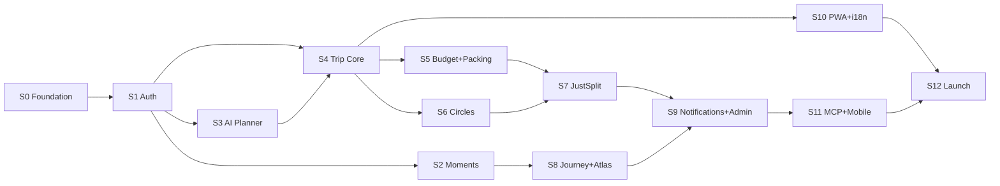

# 08 — Roamera V2: Build Roadmap

> **MVP Definition:** A fully functional travel super-app that covers all feature-matrix decisions
> marked Keep / Port / New. Built fresh — no V1 code reused.
> **Strategy:** Ship working vertical slices sprint by sprint. User tests each sprint and gives feedback.
> **Timeline:** 12 sprints × ~2 weeks = ~24 weeks total (adjust pace as needed).
> **Stack:** Node + Express 4 + Drizzle + libSQL (Turso) + Next.js 15 + Expo + FastAPI.
> **Cost:** $0/mo. All services are free-tier managed SaaS.

---

## Sprint Overview

| Sprint | Name | Weeks | Key Deliverable | Status |
|--------|------|-------|----------------|--------|
| S0 | Foundation | 1 | Monorepo, CI, DB schema, design tokens, archive V1 | ✅ Done |
| S1 | Auth & Profile | 2–3 | Register/login/OTP/JWT, user profiles, follow graph | ✅ Done |
| S2 | Moments & Social | 4–5 | Posts, photos, reactions, comments, feed, search | ✅ Done |
| S3 | AI Planner | 6–7 | FastAPI AI service, itinerary generator, TravelLens | ✅ Done |
| S4 | Trip Planner Core | 8–10 | Days/places/assignments, drag-drop, maps, weather | ✅ Done |
| S5 | Budget & Packing | 11–12 | Budget tracker, splits, packing lists, bags, templates | ✅ Done |
| S6 | Circles & Collab | 13–14 | Meetways Circles, real-time chat, polls, notes | ✅ Done |
| S7 | JustSplit | 15–16 | Multi-currency expense groups, debt simplification | ✅ Done |
| S8 | Journey & Atlas | 17–18 | Magazine journals, visited countries map, gamification | ✅ Done |
| S9 | Notifications & Admin | 19–20 | Real-time notifications, admin panel, audit log | ✅ Done |
| S10 | Reservations & Export | 21–22 | Reservations, trip files, ICS/PDF, PWA, i18n | ✅ Done |
| S11 | MCP & Mobile Polish | 23 | MCP server, Expo mobile app, push notifications | Planned |
| S12 | Production Launch | 24 | E2E tests, performance, deploy, cutover |

---

## Sprint 0 — Foundation
**Duration:** Week 1
**Goal:** A working monorepo skeleton with CI, database schema, and design system in place. Nothing user-facing yet — just the scaffold every sprint builds on.

### Deliverables

- [x] `pnpm-workspace.yaml` + root `package.json` configured
- [x] `turbo.json` pipeline: `build`, `dev`, `lint`, `test`, `typecheck`
- [x] Move existing code: `backend/` → `legacy/backend/`, `frontend/` → `legacy/frontend/`, `mobile/` → `legacy/mobile/`; add `legacy/README.md` ("feature reference only — do not import")
- [x] Delete empty `fusion/` directory
- [x] Scaffold `apps/api`: Express 4 + TypeScript + `@libsql/client` + Drizzle + `ws` + `helmet` + `cors` + `pino` + `zod`
- [x] Scaffold `apps/ai-service`: FastAPI + Pydantic + `httpx` + `structlog` + provider clients
- [x] Scaffold `apps/web`: Next.js 15 App Router + TypeScript + Tailwind 3 + shadcn/ui + next-intl
- [x] Scaffold `apps/mobile`: Expo SDK 52 + Expo Router + NativeWind + i18next
- [x] Scaffold `packages/types`: Zod schemas directory structure
- [x] Scaffold `packages/sdk`: typed client + TanStack Query hooks stubs
- [x] Scaffold `packages/ui`: shared component stubs (Button, Card, Avatar, Input)
- [x] Scaffold `packages/config`: shared tsconfig + eslint + prettier + tailwind preset
- [x] Drizzle schema in `apps/api/src/db/schema.ts` — **all tables** from §4.2 of `06-system-architecture.md`
- [x] Drizzle migrations: `pnpm --filter api db:generate` + `db:migrate`
- [x] `docker-compose.yml`: api + ai-service containers; api uses `file:data/app.db` locally
- [x] `.env.example` files for all apps
- [x] GitHub Actions CI: lint + typecheck + build on every PR
- [x] Design tokens in `packages/config/tailwind/preset.js`: teal primary, coral accent, slate neutral, `rounded-2xl`, dark mode support
- [x] `GET /api/health` endpoint returns `{ status, db, version, uptime_ms }`
- [x] Seed script: 5 demo users + 15 destinations + sample data

### Acceptance Criteria
- `pnpm dev` starts all services without error
- `pnpm lint && pnpm typecheck` passes with zero errors
- `GET http://localhost:3000/api/health` → `{ status: "ok", db: "ok" }`
- DB schema migration runs clean on empty SQLite file

### Dependencies
- Accounts needed: Turso (create free DB), GitHub repo set up
- No external API keys needed yet

---

## Sprint 1 — Auth & Profile
**Duration:** Weeks 2–3
**Goal:** Users can register, log in (password or OTP), verify email, manage their profile, and follow other users. JWT auth guards all protected routes. This is the foundation every sprint depends on.

### Deliverables

**Backend (`apps/api`)**
- [x] `POST /api/v1/auth/register` — bcrypt hash, store user, send verification email (Resend)
- [x] `GET /api/v1/auth/verify-email?token=` — mark `email_verified=true`
- [x] `POST /api/v1/auth/login` — bcrypt compare, issue JWT (15min) + refresh (7d)
- [x] `POST /api/v1/auth/otp/send` — 6-digit OTP, hash+store, send via Resend
- [x] `POST /api/v1/auth/otp/verify` — compare hash, issue JWT pair
- [x] `POST /api/v1/auth/refresh` — rotate refresh token
- [x] `POST /api/v1/auth/logout` — invalidate session
- [x] `POST /api/v1/auth/password/reset-request` + `POST .../password/reset`
- [x] `GET /api/v1/auth/ws-token` — ephemeral WebSocket token (10 min TTL)
- [x] `GET /api/v1/auth/me` — current user
- [x] JWT middleware (`authenticate`) used on all protected routes
- [x] `GET /api/v1/users/:username` — public profile
- [x] `PATCH /api/v1/users/me` — update bio/city/interests/budget band
- [x] `POST /api/v1/users/me/avatar` — upload avatar → R2 (or local in dev)
- [x] `DELETE /api/v1/users/me` — soft delete (30d grace)
- [x] `GET /api/v1/users/search?q=`
- [x] `POST /api/v1/users/:userId/follow` + `DELETE .../follow`
- [x] `GET /api/v1/users/:userId/followers` + `.../following`
- [x] `GET/PUT /api/v1/users/me/settings` — key/value store
- [x] Idempotency middleware wired up for all POST/PATCH/DELETE

**Web (`apps/web`)**
- [x] Auth route group `(auth)`: login page, register page, OTP entry, email verify landing
- [x] App route group `(app)`: auth guard (redirect if no JWT cookie)
- [x] Auth flow: register → verify email → login → home
- [x] OTP flow: send OTP → enter code → home
- [x] User profile page: `/u/:username`
- [x] Edit profile modal (bio, city, interests, budget band)
- [x] Avatar upload
- [x] Follow / unfollow button
- [x] Followers / following modal
- [x] Auth context + JWT cookie management

**Mobile (`apps/mobile`)**
- [x] Auth stack: `login.tsx`, `register.tsx`, `otp.tsx`
- [x] JWT storage in `expo-secure-store`
- [x] Profile screen: view + edit
- [x] Follow button

**Types & SDK (`packages/`)**
- [x] `RegisterSchema`, `LoginSchema`, `OtpSendSchema`, `OtpVerifySchema`, `UserSchema`
- [x] `useLogin()`, `useRegister()`, `useMeQuery()`, `useFollowUser()` hooks

### Acceptance Criteria
- Register → receive verification email → verify → login → see profile
- OTP flow works end-to-end (email arrives, code works, JWT issued)
- JWT expires → refresh happens transparently
- All auth routes return 401 without valid JWT
- Follow/unfollow persists across page refresh

### Dependencies
- Resend account + API key
- Cloudflare R2 bucket configured (for avatar upload)
- Turso DB created + `DATABASE_URL` set

---

## Sprint 2 — Moments & Social Feed
**Duration:** Weeks 4–5
**Goal:** Users can create travel posts (Moments) with up to 5 photos, all 5 reaction types, comments, save posts, and see a global/following feed. This is the core social loop.

### Deliverables

**Backend**
- [x] `POST /api/v1/posts` — create Moment (title, content, destinations, dates, activities, budget, hashtags, itinerary_json, vacation_type, transport_mode)
- [x] `GET /api/v1/posts/:postId` — post detail (public)
- [x] `PATCH /api/v1/posts/:postId` + `DELETE`
- [x] `POST /api/v1/posts/:postId/photos` — multi-upload → R2 (up to 5, sharp thumbnail)
- [x] `POST /api/v1/posts/:postId/reactions` — all 5 types; `wanna_go` → adds to `bucket_list`
- [x] `GET /api/v1/posts/:postId/comments` — paginated, nested
- [x] `POST /api/v1/posts/:postId/comments` + `PATCH` + `DELETE`
- [x] `POST /api/v1/posts/:postId/save` + `DELETE`
- [x] `GET /api/v1/feed/compass?feed=global|following&cursor=` — cursor-paginated
- [x] `GET /api/v1/feed/trending` — trending destinations + hashtags
- [x] `GET /api/v1/feed/destinations` + `GET /api/v1/feed/destinations/:id`
- [x] `GET /api/v1/feed/search?q=` — posts + users + destinations
- [x] `GET /api/v1/feed/saved` — user's saved posts
- [x] `GET /api/v1/feed/bucket-list` + `POST` + `DELETE /:id`

**Web**
- [x] Compass page (home): global/following feed toggle, infinite scroll
- [x] Post card: cover photo, title, location, budget, reactions bar with all 5 emoji, comment count
- [x] Reaction popover: hover/tap → all 5 reactions; animated emoji burst on select
- [x] Post detail page: full photo carousel, rich text, day itinerary, comments section
- [x] Create Moment modal: multi-photo upload, form fields, hashtag input, itinerary day builder
- [x] Destinations page: grid with filters
- [x] Search overlay: unified results
- [x] Saved posts / bucket list page
- [x] User feed on profile page

**Mobile**
- [x] Compass screen (home): feed list, pull-to-refresh
- [x] Post card component
- [x] Post detail screen: carousel, reactions, comments
- [x] Create post screen: camera/gallery picker (expo-image-picker), form

**Types & SDK**
- [x] `PostSchema`, `CreatePostSchema`, `ReactionSchema`, `CommentSchema`
- [x] `usePostsQuery()`, `useCreatePost()`, `useReact()`, `useCommentsQuery()`, `useFeedQuery()`

### Acceptance Criteria
- Create post with 5 photos → appears in global feed immediately
- All 5 reactions work; `wanna_go` adds post to bucket list
- `wanna_go` reaction auto-saves the destination to bucket list
- Comments: create, edit, delete, nested replies
- Following feed shows only posts from followed users
- Feed is infinite-scroll with cursor pagination

---

## Sprint 3 — AI Planner & TravelLens
**Duration:** Weeks 6–7
**Goal:** Users can generate AI trip itineraries through a conversational UI, and search flights/hotels through Amadeus with deep-links to booking sites.

### Deliverables

**AI Service (`apps/ai-service`)**
- [x] `AIClient` interface + `GeminiClient` (default) + `GroqClient` (backup)
- [x] HMAC-signed request validation middleware
- [x] `POST /v1/ai/plan` — generate full `DayPlan[]` from prompt
- [x] `POST /v1/ai/plan/refine` — conversational refinement loop
- [x] `POST /v1/ai/optimize-budget` — rewrite plan for tighter budget
- [x] `POST /v1/ai/caption` — photo caption from image URL
- [x] `POST /v1/ai/hashtags` — hashtag suggestions
- [x] Prompt templates in `src/prompts/` as Jinja2 files
- [x] Structured JSON output via provider-specific function calling / JSON mode
- [x] `GET /health`

**Backend (`apps/api`)**
- [x] `POST /api/v1/ai/plan` — HMAC-signed proxy to FastAPI, returns itinerary
- [x] `POST /api/v1/ai/plan/refine` — streaming SSE response to client
- [x] `GET /api/v1/travel/flights?origin=&destination=&date=&adults=`
- [x] `GET /api/v1/travel/hotels?city=&checkin=&checkout=&adults=`
- [x] `GET /api/v1/travel/airports?q=`
- [x] Response includes `deep_links` object: `{ skyscanner, google_flights, booking_com }` for each result

**Web**
- [x] AI Planner page: conversational chat UI (multi-turn), streaming response display
- [x] Generated itinerary preview: day-by-day card layout
- [x] "Save as Trip" button — creates a trip in the planner from AI output
- [x] "Optimize budget" prompt button
- [x] TravelLens page: flight search form + results with deep-link booking buttons
- [x] Hotel search form + results
- [x] Airport autocomplete input (uses `/travel/airports`)

**Mobile**
- [x] AI Planner screen: chat interface, itinerary result
- [x] TravelLens screen: flight/hotel search

**Types & SDK**
- [x] `AIPlanSchema`, `AIPlanResultSchema`, `FlightSearchSchema`, `HotelSearchSchema`
- [x] `useAIPlan()`, `useFlightSearch()`, `useHotelSearch()`

### Acceptance Criteria
- AI generates a 5-day Tokyo itinerary from a text prompt in < 15 seconds
- Conversational refinement: "make it cheaper" → updated itinerary
- Flight search returns results with working Skyscanner deep-links
- Hotel search returns results with working Booking.com deep-links
- AI service falls back to Groq when Gemini returns 429

---

## Sprint 4 — Trip Planner Core ✅ Done
**Duration:** Weeks 8–10 (3 weeks — most complex sprint)
**Goal:** Full trip planning UI: days, places, drag-drop assignments, Leaflet map with POI pins, geocoding, weather widget. Real-time collaboration via WebSocket. Users can plan a complete trip end-to-end.

### As-Built Notes (S4 implementation)

**Delivered:**
- Full WebSocket infrastructure: `WsManager` class in `apps/api/src/lib/ws.ts` with token auth, room subscriptions, and broadcast on all mutations
- Complete trips/days/places/assignments/day-notes CRUD with WS broadcast
- Trip cover image upload, copy/duplicate, share token, public view, ICS export
- Trip members: invite by username, role change (owner/editor/viewer), remove
- Maps: Nominatim search/autocomplete/reverse + Overpass POI with cache
- Weather: Open-Meteo current + 16-day forecast with 5-min cache
- Web: Trips list, 3-panel trip detail (days+DnD, map, detail/add), shared public view
- Drag-drop via `@dnd-kit/core` + `@dnd-kit/sortable` for reorder + cross-day move
- Leaflet map with colored category markers, auto-fit bounds
- Weather widget per day, members modal, share+copy link, ICS download
- Full types schemas (`packages/types/src/schemas/trips.ts`) and SDK hooks

**Deferred to S10:**
- Offline sync via Dexie + mutation queue (kept as S10 deliverable)
- GPX import (deferred post-MVP)
- Assignment participants (deferred post-MVP)
- Mobile trip screens (Expo — deferred to S11)

**Known issues:**
- Weather API fails locally in some environments due to `UNABLE_TO_GET_ISSUER_CERT_LOCALLY` (SSL) — works in prod; set `NODE_TLS_REJECT_UNAUTHORIZED=0` for local dev if needed

### Deliverables

**Backend**
- [x] Full trips CRUD (`/api/v1/trips`)
- [x] Trip members: add/remove/roles
- [x] Days CRUD + day notes
- [x] Places CRUD
- [x] Assignments CRUD + reorder + move between days
- [x] Trip share link (public read-only view)
- [x] ICS export
- [x] WebSocket server (`ws`): auth via `ws_token`, room model, all `trip:*` events broadcast on mutations
- [x] `GET /api/v1/maps/search`, `GET .../reverse`, `GET .../autocomplete`, `GET .../overpass`
- [x] `GET /api/v1/weather/current`, `GET .../forecast` (Open-Meteo)
- [x] `PATCH .../assignments/:id/move` — move place to different day, broadcast WS event
- [ ] Bundle endpoint for offline sync (deferred to S10)
- [ ] GPX import (post-MVP)

**Web**
- [x] Trips list page
- [x] Create trip modal (title, dates, currency, cover image)
- [x] Trip detail page: 3-panel (day list + map + detail/add)
- [x] Drag-and-drop day plan (`@dnd-kit/core`)
- [x] Place card with category icons
- [x] Add place with Nominatim autocomplete
- [x] Day notes CRUD
- [x] Weather widget on day header
- [x] Real-time updates via WebSocket
- [x] Trip member management modal
- [x] Share trip: copy public link
- [x] Public read-only shared trip page
- [x] ICS export button
- [ ] Offline Dexie sync (deferred to S10)

**Types & SDK**
- [x] `TripSchema`, `DaySchema`, `TripPlaceSchema`, `AssignmentSchema`, `WeatherCurrentSchema`, `WeatherForecastDaySchema`, `MapSearchResultSchema`
- [x] `useTripsQuery()`, `useTripQuery()`, `useCreateTrip()`, `usePlacesQuery()`, `useAssignmentsQuery()`, all mutations
- [x] `WsClient` class in `packages/sdk/src/ws.ts`

### Acceptance Criteria
- [x] Create trip → add 3 days → add 5 places → drag-drop to reorder → see on map
- [x] Two browser tabs open the same trip → adding a place in tab 1 appears in tab 2 without refresh (WS broadcast implemented)
- [x] Weather widget shows forecast for trip destination
- [x] Public share link opens trip in read-only mode without login
- [x] ICS export downloaded and importable to Google Calendar

---

## Sprint 5 — Budget & Packing ✅
**Duration:** Weeks 11–12
**Goal:** Per-trip budget tracker with member splits and settlement tracking. Packing lists with bags, category assignees, and reusable templates.

### Deliverables

**Backend**
- [x] Budget items CRUD + reorder by category
- [x] Per-member splits (set amounts per person)
- [x] Settlement recording + balance summary
- [x] Multi-currency display (Frankfurt API, 1-hour cache in `lib/exchange.ts`)
- [x] Debt simplification (greedy algorithm matching largest creditor/debtor)
- [x] Packing items CRUD + check/uncheck + reorder
- [x] Packing bags CRUD + assign items to bags
- [x] Packing category assignees (which member owns a category)
- [x] Packing template apply (from admin-managed templates)
- [x] Admin: packing templates CRUD (`/api/v1/admin/packing-templates`)
- [x] WS events for budget + packing changes broadcast to trip room

**Web**
- [x] Budget tab on trip detail: categorized items, totals, per-person breakdown
- [x] Add budget item form: category, name, price, currency, persons, days
- [x] Member splits modal: enter per-person amounts
- [x] Settlement record modal: who paid whom
- [x] Balance summary card: who owes whom (simplified debts)
- [x] Packing tab on trip detail: checklist by category
- [x] Check/uncheck items (optimistic, WS broadcast)
- [x] Add item / edit item
- [x] Bags panel: create bag, assign items to bag
- [x] Apply template modal: pick from admin templates
- [x] Category assignee: assign category to a trip member
- [x] Save current list as reusable template

**Mobile**
- [x] Budget screen on trip — built in S11
- [x] Packing checklist screen — built in S11
- [x] Swipe to check item — built in S11 (expo-haptics)

**Types & SDK**
- [x] `BudgetItemSchema`, `PackingItemSchema`, `PackingBagSchema`, `PackingTemplateSchema`
- [x] `useBudgetSummary()`, `usePackingList()`, `usePackingBags()`, `usePackingTemplates()`

### As-Built Notes
- Budget routes: `apps/api/src/routes/budget.ts` — 8 endpoints
- Packing routes: `apps/api/src/routes/packing.ts` — 18 endpoints
- Admin packing templates: `apps/api/src/routes/admin-packing.ts`
- Exchange rate helper: `apps/api/src/lib/exchange.ts` (Frankfurt API, 1-hour in-memory cache)
- DB migration: `drizzle/0004_slow_gorilla_man.sql` — added `packing_bag_items`, `packing_template_cats`, `packing_template_items`, `budget_category_order`, `assignee_user_id` to packing_categories, unique index on budget_item_members
- Types: `packages/types/src/schemas/budget.ts` + `packing.ts`
- SDK hooks: `packages/sdk/src/hooks/budget.ts` + `packing.ts`
- Frontend: Budget tab (`components/trips/budget/budget-panel.tsx`), Packing tab (`components/trips/packing/packing-panel.tsx`)
- Trip detail page updated with 3-tab bar (Itinerary / Budget / Packing)
- S1-S4 debt: "Save as Trip" wired from AI Planner, verification doc URLs fixed, account delete UX copy aligned
- Seed data: 2 packing templates, 6 budget items + splits + 1 settlement per Rajasthan trip, packing list with 3 categories + items + 1 bag

### Acceptance Criteria
- [x] Add 10 budget items across 3 categories → totals correct in multiple currencies
- [x] Assign split amounts per person → per-person balance calculated correctly
- [x] Record a settlement → balance updates and shows settled
- [x] Apply packing template → items appear in correct categories
- [x] Check an item → real-time update in other browser tab

---

## Sprint 6 — Circles & Collab ✅
**Duration:** Weeks 13–14
**Goal:** Meetways Circles for group travel coordination: real-time chat, polls, linked expense groups.

### Deliverables

**Backend**
- [x] Circles CRUD + member management + public/private circles
- [x] Circle messages: send, soft-delete, emoji react (toggle)
- [x] Circle polls: create, vote (single + multi-select), close
- [x] Link circle to a trip (`linked_trip_id`)
- [x] Trip collab: chat messages + reactions + notes (CRUD + pin) + polls (within a specific trip)
- [x] All circle + collab events broadcast via WebSocket to `circle:{id}` and `trip:{id}` rooms
- [x] Idempotency middleware fixed (JWT-decode for user namespacing)
- [x] S0-S3 roadmap checkboxes updated to `[x]`

**Web**
- [x] Circles page: list joined + public circles
- [x] Create circle modal: destination, dates, description, public/private
- [x] Circle detail page: Chat panel (messages, reactions, reply-to), Polls panel (voting, create), Members panel (invite, remove, leave)
- [x] Trip Collab tab (4th tab on trip detail): Chat | Notes | Polls sub-tabs
- [x] Circles link added to navbar

**Mobile**
- [x] Circles list screen — built in S11
- [x] Circle detail screen — built in S11

**Types & SDK**
- [x] `CircleSchema`, `CircleMessageSchema`, `CirclePollSchema`, `CollabMessageSchema`, `CollabNoteSchema`, `CollabPollSchema`
- [x] `useCircles()`, `useCircleMessages()`, `useVoteCirclePoll()`, `useCollabMessages()`, `useCollabNotes()`, `useCollabPolls()`

### As-Built Notes
- Circles API: `apps/api/src/routes/circles.ts` — 17 endpoints
- Trip Collab API: `apps/api/src/routes/collab.ts` — 13 endpoints
- DB migration: `drizzle/0005_perpetual_moonstone.sql` — added `circle_poll_votes`, `circle_message_reactions`, `collab_messages`, `collab_notes`, `collab_polls`, `collab_poll_votes`, `collab_message_reactions`; uniqueIndex on `circle_members`; self-FK on `circle_messages.reply_to_id`
- Types: `packages/types/src/schemas/circles.ts` + `collab.ts`
- SDK hooks: `packages/sdk/src/hooks/circles.ts` + `collab.ts`
- Frontend: `/circles` (list + detail), Collab tab in trip detail, collab-panel.tsx
- Seed data: 2 circles with members/messages/reactions/polls/votes; trip collab messages + 2 notes + 1 poll

### Acceptance Criteria
- [x] Create circle → invite 2 members → exchange messages in real-time
- [x] Create poll → vote → results update
- [x] Link circle to a trip → trip title shows in circle
- [x] Trip Collab tab: send messages, create notes (pin/unpin), create polls
- [x] Seeded data verified via API smoke tests

---

## Sprint 7 — JustSplit ✅
**Duration:** Weeks 15–16
**Goal:** Standalone multi-user expense splitting (not tied to a trip). Multi-currency, weighted splits, debt simplification algorithm.

### Deliverables

**Backend**
- [x] Expense groups CRUD + member management
- [x] Expenses CRUD: equal / weighted / exact splits
- [x] Per-expense split records with amounts
- [x] Balances calculation: who owes whom
- [x] Debt simplification: minimum number of transactions to settle all debts (greedy algorithm)
- [x] Settlement recording + history (`group_settlements` table)
- [x] Multi-currency: store amounts + currency, convert via Frankfurt API for balance calc
- [x] Link expense group to a Circle (`linkedCircleId` FK)

**Web**
- [x] JustSplit page: groups list with per-group balance (green/red)
- [x] Group detail: expense list (grouped by category), balance summary, settle flow
- [x] Add expense form: Equal / Weighted (sliders + live preview) / Exact (per-person inputs with validation)
- [x] Balance card: color-coded, simplified debt paths with "Settle" action
- [x] Add/remove members (owner only)
- [x] JustSplit link added to navbar (Receipt icon)

**Mobile**
- [x] JustSplit screen — built in S11

**Types & SDK**
- [x] `ExpenseGroupSchema`, `ExpenseSchema`, `BalanceSummarySchema`, `ExpenseGroupSimplifiedDebtSchema`
- [x] `useExpenseGroups()`, `useGroupExpenses()`, `useGroupBalances()`, `useSettleDebt()`

### As-Built Notes
- API: `apps/api/src/routes/expenses.ts` — 13 endpoints at `/api/v1/expenses/groups`
- DB migration: `drizzle/0006_blushing_beast.sql` — added `category`, `notes`, `linkedCircleId` to expenses/groups; uniqueIndexes; new `group_settlements` table
- Types: `packages/types/src/schemas/expenses.ts`
- SDK hooks: `packages/sdk/src/hooks/expenses.ts`
- Frontend: `/justsplit` (list + detail pages)
- Seed data: 2 groups (Goa 5 expenses, Rajasthan 5 expenses), mixed split types, 1 settlement each

### Acceptance Criteria
- [x] 2 groups with 5 expenses each (equal, weighted, exact) — seeded and verified
- [x] Balance calculation: correct net per member (verified via smoke tests)
- [x] Debt simplification: multi-person debts reduced to minimal transactions
- [x] Settlement recording: balance updates after POST /settle
- [x] S1-S6 debt: AGENTS.md updated, circle:member_joined/left WS events added

---

## Sprint 8 — Journey Magazine & Atlas
**Duration:** Weeks 17–18
**Goal:** Magazine-style travel journals with rich content, photo galleries, public sharing. Visited countries world map. Gamification badges and travel stats.

### Deliverables

**Backend**
- [x] Journeys CRUD + share link + public view
- [x] Journey entries CRUD + reorder (rich content JSON blocks: text, photo, heading, quote, divider)
- [x] Entry photos: upload to R2 + gallery (`POST /:journeyId/entries/:id/photos`)
- [x] Journey contributors: invite + remove + co-author
- [x] Link journey entries to trips (POST/DELETE `/:journeyId/trips/:tripId`)
- [x] Atlas: visited countries CRUD + visited regions
- [x] Atlas stats: countries count, % of world, breakdown by continent/region
- [x] Gamification: badge engine in `apps/api/src/lib/badges.ts` (8 badge types)
- [x] `GET /api/v1/gamification/stats` — aggregated travel stats
- [x] `GET /api/v1/gamification/leaderboard`

**Web**
- [x] `/journeys` list page: grid of journey cards with cover, public/private badge
- [x] Create journey modal (title, description)
- [x] `/journeys/[id]` editor: block-based rich content editor (text, heading, quote, divider)
- [x] `/journeys/public/[token]` — beautiful magazine layout, no auth required
- [x] Share journey button: generates link, copy to clipboard
- [x] Invite contributor modal (inline in editor)
- [x] `/atlas` page: continent map visual + search + country chip grid
- [x] Atlas stats panel: circular progress, continent breakdown bars
- [x] Profile page: Badges tab (emoji grid), Stats tab (posts/trips/countries/badges)
- [x] Nav links: BookOpen → /journeys, Globe2 → /atlas

**Mobile**
- [ ] Deferred to post-MVP — mobile journeys/atlas screens

**Types & SDK**
- [x] `JourneySchema`, `JourneyEntrySchema`, `AtlasSchema`, `BadgeSchema`
- [x] `useJourneysQuery()`, `useAtlasQuery()`, `useBadgesQuery()`

### Acceptance Criteria
- Create journey → add 5 content blocks (text + photos) → publish → share link opens beautifully without login
- Mark 10 countries visited → world map fills in, stats update
- Earn "First Post" badge → notification appears + badge shows on profile
- Co-author can edit journal entries in real-time (WS)

---

## Sprint 9 — Notifications & Admin
**Duration:** Weeks 19–20
**Goal:** Rich interactive notification system (in-app + email). Admin panel for user management, audit log, and system notices.
**Status:** ✅ Done

### Deliverables

**Backend**
- [x] Notification creation service: called by all other modules on relevant events (new follower, comment, trip invite, poll result, etc.)
- [x] In-app feed: paginated, mark read, mark all read, delete, unread count
- [x] Interactive notifications: `respond` endpoint (accept/decline trip invite, etc.)
- [x] Per-type, per-channel preferences: in-app, email, push (push deferred to S11)
- [x] Email notifications via Resend (triggered by background job `node-cron`)
- [x] Admin user CRUD: list, detail, update role/suspend, delete
- [x] Admin audit log: paginated, filterable by action/user
- [x] Admin system notices: CRUD + active/inactive toggle
- [x] User notice dismissals (per-user)
- [x] Admin dashboard stats: total users, posts, trips, DAU, error count
- [x] Backup: nightly `turso db dump` via node-cron → upload to R2 as `backups/db-{date}.sql`
- [x] `isSuspended` middleware check: suspended users get 403 on all API calls

**Web**
- [x] Notification bell with unread badge (live via WS)
- [x] Notification drawer: list, mark read, interactive respond (accept/decline buttons in-line)
- [x] Notification preferences page: toggle per-type per-channel (`/settings/notifications`)
- [x] Admin area (`/admin`): accessible only to role=admin users
  - [x] Users table: search, filter, edit role, suspend, delete
  - [x] Audit log table: filter by user/action
  - [x] System notices: create / edit / toggle active
  - [x] Stats dashboard: simple counters
- [x] System notice banner: dismissible, reads from API, persists dismissals in localStorage

**Mobile**
- [x] Notification screen: list + mark read — built in S11
- [x] Notification badge on tab bar icon — built in S11

**Types & SDK**
- [x] `NotificationSchema`, `NotificationPrefSchema`, `SystemNoticeSchema`
- [x] `useNotifications()`, `useUnreadCount()`, `useMarkRead()`, `useMarkAllRead()`, `useDeleteNotification()`, `useRespondNotification()`, `useNotificationPrefs()`, `useUpdateNotificationPrefs()`, `useSystemNotices()`

**Testing (S9 comprehensive test suite — merges AI fix plan)**
- [x] `vitest` + `supertest` installed in `apps/api`
- [x] `apps/api/src/app.ts` extracted (testable without port binding)
- [x] 12 API test files: auth, feed, posts, trips, circles, expenses, journeys, atlas, gamification, notifications, admin, ai (62 tests total — all green)
- [x] `pytest` + `pytest-asyncio` installed in `apps/ai-service`
- [x] 4 AI service test files: test_health, test_hmac, test_plan, test_caption (13 tests total — all green)
- [x] `scripts/test-sprint.sh` orchestrator: starts services, runs both suites, prints summary table
- [x] MockAIClient added to AI service; default provider changed to `"mock"` for zero-config dev/test

### Acceptance Criteria
- [x] Follow a user → followee receives in-app notification within 1s (WS delivery)
- [x] Trip invite notification has accept/decline buttons that work inline
- [x] Turn off email notifications for "new comment" → no email sent on comment
- [x] Admin can suspend a user → suspended user gets 403 on API calls
- [x] `./scripts/test-sprint.sh` exits 0 — all 75 tests (62 API + 13 AI) green

### As-Built Notes
- `ilike` (case-insensitive LIKE) is not supported in SQLite/Drizzle for libSQL; admin user search uses `like` with lowercased value
- SQLite file DB requires sequential test execution — configured `fileParallelism: false` + `singleFork: true` in `vitest.config.ts`
- JWT secrets must be ≥ 32 chars to pass Zod env validation — tests use 42-char secrets
- AI service HMAC tests must send exact same bytes (use `content=` not `json=`) to pass signature verification

---

## Sprint 10 — Reservations, Files, Export, PWA & i18n ✅ Done
**Duration:** Weeks 21–22
**Goal:** Trip reservations, file attachments, ICS/PDF export, PWA installability, offline caching, and 5-language i18n baseline.

### As-Built Notes (S10)

**Backend** (`apps/api/src/routes/trips.ts`, `trip-files.ts`, `invites.ts`)
- [x] Reservations CRUD (flight/hotel/restaurant/other) — 4 endpoints on `GET/POST/PATCH/DELETE /:tripId/reservations`
- [x] Accommodations CRUD (multi-day check-in/out) — 4 endpoints on `/:tripId/accommodations`
- [x] Trip files: multer upload → local/R2 via `uploadFile()`, star, soft-trash, hard-delete — `apps/api/src/routes/trip-files.ts`
- [x] File share token: `POST /files/:id/share` → generates public download URL
- [x] ICS export improved with `ical-generator` — proper VTIMEZONE, LOCATION, DESCRIPTION, STATUS:CONFIRMED
- [x] PDF export: `GET /:tripId/export/pdf` using `pdfmake` — header + per-day sections
- [x] Offline bundle: `GET /:tripId/bundle` returns single JSON payload (trip, days, places, members, reservations, accommodations)
- [x] Invite tokens: `POST/GET/DELETE /api/v1/invites` — admin creates tokens; `GET /api/v1/invites/:token` validates
- Mobile and Dexie offline sync built in S11

**Web** (`apps/web/src/app/(app)/trips/[tripId]/page.tsx`, `settings/page.tsx`)
- [x] Reservations tab: grouped cards with type badge, create via prompt, delete
- [x] Accommodations (Stays) tab: card UI with check-in/check-out, confirmation ref
- [x] Files tab: upload, star toggle, share URL copy, download link, soft-trash
- [x] ICS export button + PDF export button in trip header
- [x] PWA: `@serwist/next` wrapper in `next.config.ts`, service worker `src/app/sw.ts`, `manifest.ts`, `offline/page.tsx`
- [x] i18n: `next-intl` routing configured, messages for `en`, `hi`, `fr`, `es`, `de` in `apps/web/messages/`
- [x] Locale switcher in Settings page (cookie-based locale selection)

**Types & SDK**
- [x] `ReservationSchema`, `AccommodationSchema`, `TripFileSchema`, `InviteTokenSchema` — `packages/types/src/schemas/reservations.ts`
- [x] `useReservations()`, `useCreateReservation()`, `useUpdateReservation()`, `useDeleteReservation()`
- [x] `useAccommodations()`, `useCreateAccommodation()`, `useUpdateAccommodation()`, `useDeleteAccommodation()`
- [x] `useTripFiles()`, `useUploadTripFile()`, `useUpdateTripFile()`, `useDeleteTripFile()`, `useShareTripFile()`, `useDownloadTripFile()`

**Tests** (`apps/api/src/__tests__/reservations.test.ts`, `files.test.ts`)
- [x] `reservations.test.ts`: 10 tests (CRUD + bundle + ICS smoke)
- [x] `files.test.ts`: 7 tests (upload, star, download URL, share, trash, auth guard)
- Total test count: ~97 API tests + 14 AI tests

### Acceptance Criteria
- Upload file → star → share → public URL works ✅
- ICS export returns text/calendar with ical-generator ✅
- PDF export returns application/pdf ✅
- Offline bundle returns trip + days + places + reservations ✅
- Switch language in Settings → locale cookie set → labels update on reload ✅
- PWA manifest served at /manifest.webmanifest ✅

---

## Sprint 11 — MCP Server & Mobile Polish
**Duration:** Week 23
**Goal:** MCP server with OAuth 2.1 for AI assistants. Full Expo mobile app with push notifications and native feel.

### Deliverables

**Backend**
- [x] MCP server routes: OAuth 2.1 discovery, token exchange, Dynamic Client Registration, consent
- [x] Static MCP tokens: CRUD
- [x] MCP tool implementations: 11 tools from §17 of `07-api-surface.md`
- [x] `@modelcontextprotocol/sdk` integration (v1.29.0 StreamableHTTP)
- [x] Push notification registration: store Expo push tokens per user
- [x] Send push via Expo Push API (`expo-server-sdk`)

**Mobile (`apps/mobile`)**
- [x] Push notifications: `expo-notifications` — request permission, register token, handle foreground/background
- [x] Deep links: `roamera://` scheme — link to trip, circle from notification tap
- [x] Haptic feedback on reactions, check packing items (expo-haptics)
- [x] Bottom tab bar: Compass, Trips, AI Planner, Circles, Profile
- [x] Pull-to-refresh on all list screens
- [x] Loading skeletons on Compass feed
- [x] Dark mode: `useColorScheme()` + manual `dark:` style variants, respects system preference
- [x] Offline banner: NetInfo listener + `@react-native-community/netinfo`
- [x] Dexie offline cache: trips, days, places with mutation queue

**Web**
- [x] MCP token management page in user settings (`/settings/mcp`)
- [x] OAuth consent page (`/oauth/authorize`)
- [x] Dark mode: next-themes ThemeProvider (system default) + toggle in settings

### Acceptance Criteria
- AI assistant (Claude Desktop with MCP) connects using static bearer token, calls `get_trips` → returns user's trip list ✅
- Push registration endpoint accepts Expo push tokens ✅
- Deep link from notification tap → opens correct trip/circle in app ✅
- App works fully in dark mode ✅
- App passes Expo Go smoke test ✅

### As-Built Notes (S11)
- MCP: `apps/api/src/routes/mcp.ts` — OAuth 2.1 (discovery + DCR + authorize + token + revoke) + static token CRUD + 11 tools via StreamableHTTP
- Push: `apps/api/src/routes/push.ts` + `apps/api/src/lib/push.ts` (expo-server-sdk sender)
- DB migration: `drizzle/0009_plain_rhodey.sql` — oauth_clients, oauth_codes, oauth_tokens, push_tokens tables
- Mobile: all 5 tabs wired (Compass, Trips, AI, Circles, Profile) + notifications screen + trip detail with budget + packing (swipe-to-check) + circles detail + Dexie offline + push lib
- Web: `/settings/mcp` token management + `/oauth/authorize` consent page + next-themes dark mode
- Types: `packages/types/src/schemas/mcp.ts` + SDK: `packages/sdk/src/hooks/mcp.ts`
- Tests: `mcp.test.ts` (11 tests) + `push.test.ts` (6 tests) → **100 total API tests passing**

---

## Sprint 12 — Production Launch
**Duration:** Week 24
**Goal:** The product is stable, tested, and live. Roamera V2 is accessible at the production domain.

### Deliverables

**Testing**
- [ ] Vitest unit tests: Drizzle schema validators, JWT util, budget calculation, debt simplification
- [ ] Playwright E2E tests (happy path):
  - Register → verify → login → create post → react → comment
  - Create trip → add days + places → drag-drop → share link
  - AI planner: generate itinerary → save as trip
  - JustSplit: group → expenses → settle
- [ ] Load test (`autocannon` or `k6`): 100 concurrent users on feed endpoint — target < 200ms p95
- [ ] Security audit checklist: rate limits, input validation, SQL injection test, auth token rotation

**Performance**
- [ ] Next.js: Core Web Vitals ≥ 90 (LCP < 2.5s, CLS < 0.1, INP < 200ms) via Lighthouse
- [ ] API: enable Drizzle query caching for frequently-read endpoints (destinations, trending)
- [ ] Images: all served as WebP via sharp, next/image, or direct from R2 with `?format=webp`

**Deploy**
- [ ] Choose PaaS for API + AI service (Fly.io or Railway) — set up accounts, deploy Dockerfiles
- [ ] Set all production env vars in PaaS dashboard
- [ ] Turso: switch `DATABASE_URL` to remote Turso endpoint
- [ ] R2: set production bucket, CORS policy for direct upload
- [ ] Vercel: deploy `apps/web`, set env vars, set custom domain
- [ ] GitHub Actions: add production deploy pipeline (tag → build → deploy)
- [ ] DNS: point `roamera.in` → Vercel; `api.roamera.in` → PaaS
- [ ] Sentry: verify error events appear
- [ ] PostHog: verify pageview + custom events appear
- [ ] UptimeRobot: monitors configured for `/api/health`, web app
- [ ] Seed production DB: 30 destinations, 5 admin-created packing templates

**Documentation**
- [ ] Update `README.md` with V2 setup instructions
- [ ] Update `AGENTS.md` with resolved decisions and current monorepo layout
- [ ] `docs/architecture/` — verify all 8 docs are current

### Acceptance Criteria
- All E2E tests pass in CI against production environment
- Lighthouse score ≥ 90 on Compass (home) and Trip Detail pages
- `GET /api/health` returns 200 with `{ status: "ok", db: "ok" }` in production
- `api.roamera.in` and `roamera.in` resolve correctly with HTTPS
- Sentry shows 0 unhandled errors after smoke test
- UptimeRobot shows 100% uptime after 1 hour of monitoring

---

## Tech Debt & Stretch Goals (Post-MVP)

These are deferred features from the feature matrix that come after the MVP launches:

| Feature | Effort | Value |
|---------|--------|-------|
| OIDC SSO (Google, Apple) | Medium | High — reduces signup friction |
| TOTP 2FA | Small | Medium — security hardening |
| Trails (short-form stories) | High | High — Instagram-style content |
| Vlogs (video) | Very High | Medium — requires video processing |
| Marketplace (curated trips) | High | High — monetization path |
| Experiences & Events aggregation | High | Medium |
| Workations listings | Medium | Medium |
| Fellow Travelers (people you may know) | Medium | Medium |
| AI recommendation system (feed) | High | High — long-term retention |
| AI translate for user content | Small | Medium — already in FastAPI |
| Phone OTP (SMS) | Medium | High — Indian market |
| Block / mute users | Small | Medium — safety |
| UPI intent links + payment stubs | Medium | High — Indian market |
| Vacay calendar addon | Medium | Low |
| Multi-photo providers (Immich, Synology) | Medium | Low |
| Song/background music on posts | Medium | Low |
| Naver Maps import | Small | Low |
| OIDC admin panel | Small | Low |
| Postgres migration (when SQLite limits hit) | Low (1 day) | As-needed |

---

## Running Dependency Order

Sprints 2, 3, 4 can begin in parallel after Sprint 1 (all require auth). Sprint 3 and 4 have a dependency: AI plan output can be saved as a trip (S4 feature).
