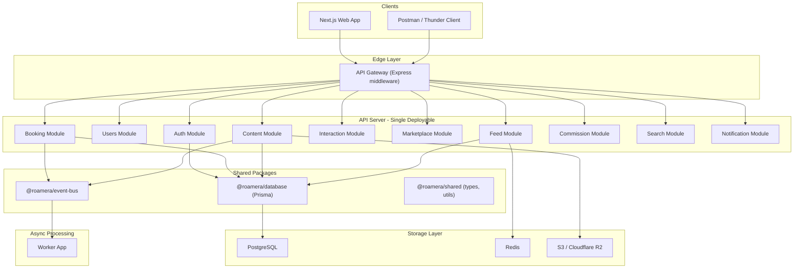

# Roamera — Production Backend Scaffold

## Stack

- **Monorepo**: Turborepo + pnpm workspaces
- **Backend**: Express.js + TypeScript (single deployable, domain-isolated modules)
- **Web**: Next.js 14 (App Router, SSR for SEO on packages/destinations)
- **ORM**: Prisma (schema-first, type-safe, migrations)
- **DB**: PostgreSQL 16
- **Cache**: Redis 7
- **Search**: OpenSearch (stubbed initially, PostgreSQL full-text search as Phase 1)
- **Payments**: Razorpay
- **Event Bus**: Internal EventEmitter abstraction (Kafka-swappable interface)
- **Containerization**: Docker + docker-compose for local dev

---

## Architecture: Pragmatic Modular Monolith

The user's LLD proposes domain packages in `packages/`. For a solo developer, this creates excessive boilerplate (each package needs its own `package.json`, `tsconfig.json`, build config). Instead, we use **domain modules inside the API app** with shared packages only for truly cross-cutting infrastructure:




---

## Folder Structure

```
roamera/
├── apps/
│   ├── api/                          # Express backend
│   │   ├── src/
│   │   │   ├── modules/
│   │   │   │   ├── auth/             # login, register, JWT, RBAC
│   │   │   │   │   ├── auth.controller.ts
│   │   │   │   │   ├── auth.service.ts
│   │   │   │   │   ├── auth.routes.ts
│   │   │   │   │   ├── auth.validator.ts
│   │   │   │   │   └── auth.middleware.ts
│   │   │   │   ├── users/            # profiles, follow system
│   │   │   │   ├── content/          # posts, reels, media upload
│   │   │   │   ├── feed/             # hybrid fanout logic
│   │   │   │   ├── interaction/      # likes, comments, shares
│   │   │   │   ├── marketplace/      # operators, packages
│   │   │   │   ├── booking/          # bookings, idempotency
│   │   │   │   ├── payment/          # Razorpay integration
│   │   │   │   ├── commission/       # immutable ledger
│   │   │   │   ├── search/           # search indexing + queries
│   │   │   │   └── notification/     # in-app + push stubs
│   │   │   ├── middleware/           # rate-limit, error handler, logger
│   │   │   ├── lib/                  # shared utilities within api
│   │   │   ├── config/              # env validation (zod)
│   │   │   └── server.ts
│   │   ├── Dockerfile
│   │   ├── package.json
│   │   └── tsconfig.json
│   │
│   ├── worker/                       # Async job processor
│   │   ├── src/
│   │   │   ├── jobs/
│   │   │   │   ├── feed-fanout.job.ts
│   │   │   │   ├── commission-calc.job.ts
│   │   │   │   ├── search-index.job.ts
│   │   │   │   └── escrow-release.job.ts
│   │   │   └── worker.ts
│   │   ├── Dockerfile
│   │   └── package.json
│   │
│   └── web/                          # Next.js web app
│       ├── src/app/                  # App Router
│       ├── package.json
│       └── next.config.js
│
├── packages/
│   ├── database/                     # Prisma schema + generated client
│   │   ├── prisma/
│   │   │   ├── schema.prisma
│   │   │   └── migrations/
│   │   ├── src/index.ts             # Re-export PrismaClient
│   │   └── package.json
│   │
│   ├── event-bus/                    # EventEmitter abstraction
│   │   ├── src/
│   │   │   ├── bus.ts               # Interface + EventEmitter impl
│   │   │   ├── events.ts            # Typed event definitions
│   │   │   └── index.ts
│   │   └── package.json
│   │
│   └── shared/                       # Types, constants, response wrappers
│       ├── src/
│       │   ├── types/
│       │   ├── errors.ts            # AppError hierarchy
│       │   ├── response.ts          # { success, data, error } wrapper
│       │   └── index.ts
│       └── package.json
│
├── infra/
│   ├── docker/
│   │   ├── postgres/init.sql
│   │   └── redis/redis.conf
│   ├── k8s/                          # Kubernetes manifests (stubs)
│   │   ├── api-deployment.yaml
│   │   ├── worker-deployment.yaml
│   │   └── ingress.yaml
│   └── nginx/                        # Reverse proxy config
│
├── docker-compose.yml                # PG + Redis + API + Worker
├── turbo.json
├── pnpm-workspace.yaml
├── package.json
├── .env.example
├── .gitignore
└── README.md
```

---

## Database Schema (Prisma)

All tables from the LLD, implemented in `packages/database/prisma/schema.prisma`:

- **User** — id, email, username, passwordHash, role (USER/CREATOR/OPERATOR/ADMIN), bio, avatarUrl, timestamps
- **Follow** — composite PK (followerId, followingId)
- **Post** — id, authorId, type (REEL/IMAGE/CAROUSEL), caption, location (Json), tags (String[]), mediaUrl, thumbnailUrl, isDeleted, timestamps
- **Like** — composite PK (userId, postId)
- **Comment** — id, postId, userId, parentCommentId (self-relation), content, timestamps
- **FeedItem** — composite PK (userId, postId), authorId, score (Float), createdAt
- **Operator** — id, ownerId, companyName, verificationStatus, timestamps
- **Package** — id, operatorId, title, destination, durationDays, basePrice (Decimal), currency, inclusions/exclusions (String[]), itinerary (Json), availability (Json), status, timestamps
- **Booking** — id, userId, packageId, status, totalAmount (Decimal), escrowReleased, idempotencyKey (unique), timestamps
- **Payment** — id, bookingId, paymentProvider, providerRef, status, timestamps
- **CommissionLedger** — id, bookingId, operatorAmount, creatorAmount, platformAmount (all Decimal), settlementStatus, createdAt (no updatedAt — immutable)
- **UserPreference** — userId (PK), preferredDestinations (String[]), budgetRange (Json), travelStyle (String[])

Key indexes: `@@index` on authorId+createdAt for posts, GIN-equivalent via Prisma for tags, unique constraint on idempotencyKey for bookings.

---

## Key Implementation Details

### Auth (JWT + RBAC)

- `POST /api/auth/register` — bcrypt hash, return JWT
- `POST /api/auth/login` — verify, return access + refresh tokens
- Middleware: `authenticate` (JWT verify), `authorize(...roles)` (role check)
- Refresh token rotation stored in Redis

### Hybrid Fanout Feed

- On `post.created` event: check author's follower count
- If < 10,000 followers: insert `FeedItem` for each follower (fanout-on-write)
- If >= 10,000: skip fanout; feed query merges precomputed + dynamic results
- `GET /api/feed` reads from `FeedItem` table + supplements with posts from followed large creators, sorted by score/recency

### Booking Idempotency

- Client generates idempotency key (UUID v4)
- `POST /api/bookings` uses `SELECT ... FOR UPDATE` + unique constraint on `idempotencyKey`
- On duplicate key: return existing booking instead of creating new one
- Razorpay order creation tied to booking ID

### Commission Ledger

- On `booking.paid` event: insert immutable `CommissionLedger` row
- Split percentages configurable per operator agreement
- No UPDATE operations — only INSERT and settlement status flag
- Escrow release: worker cron checks `booking.endDate + 48h`, triggers settlement

### Event Bus Abstraction

- Interface: `IEventBus { publish(event, payload), subscribe(event, handler) }`
- Phase 1: Node.js `EventEmitter` implementation
- Phase 2: Swap to Kafka producer/consumer (same interface)
- Typed events: `post.created`, `post.liked`, `booking.created`, `booking.paid`, `commission.created`

### Caching (Redis)

- Feed: `feed:{userId}` — cached paginated feed, TTL 5min
- Post: `post:{postId}` — hot post data, invalidate on update
- Package: `package:{packageId}` — invalidate on edit
- Session: `refresh:{userId}:{tokenId}` — refresh token store

### API Response Format

All endpoints return:

```typescript
{ success: boolean; data: T | null; error: { code: string; message: string } | null; meta?: { page, limit, total } }
```

### Middleware Stack

- `helmet` — security headers
- `cors` — configured for Next.js web origin
- `express-rate-limit` — per-IP + per-user rate limiting
- `pino` — structured JSON logging
- Centralized error handler mapping `AppError` subclasses to HTTP status codes
- Request ID propagation via `x-request-id` header

---

## Docker Compose (Local Dev)

Services:

- **postgres**: PostgreSQL 16, port 5432, persistent volume
- **redis**: Redis 7, port 6379
- **api**: Express backend, port 4000, hot-reload via `tsx watch`
- **worker**: Job processor, hot-reload
- **opensearch**: (optional, commented out for Phase 1)

---

## Implementation Order

The scaffold will be built in this sequence, each step producing working, testable code:

1. **Monorepo skeleton** — Turborepo, pnpm workspace, root configs, `.env.example`, `docker-compose.yml`
2. **Shared packages** — `@roamera/database` (Prisma schema + migrations), `@roamera/event-bus`, `@roamera/shared`
3. **API server foundation** — Express app, middleware stack, config validation, health endpoints, error handling, structured logging
4. **Auth module** — register, login, JWT, refresh tokens, RBAC middleware
5. **Users module** — profiles, follow/unfollow, follower counts
6. **Content module** — CRUD posts/reels, media upload (S3 presigned URLs), tags
7. **Interaction module** — likes (upsert), comments (threaded), share tracking
8. **Feed module** — hybrid fanout logic, feed query endpoint, Redis caching
9. **Marketplace module** — operator onboarding, package CRUD, search/filter
10. **Booking module** — idempotent booking, Razorpay order + webhook, status machine
11. **Commission module** — immutable ledger, split calculation
12. **Worker app** — feed fanout job, commission calc, escrow release cron
13. **Search module** — PostgreSQL full-text search (Phase 1), OpenSearch hooks (Phase 2 stub)
14. **Notification module** — in-app notification table + stubs for push
15. **Next.js web app** — basic pages (feed, package listing, package detail, auth pages)
16. **Docker + K8s stubs** — Dockerfiles, k8s manifests, CI/CD workflow

