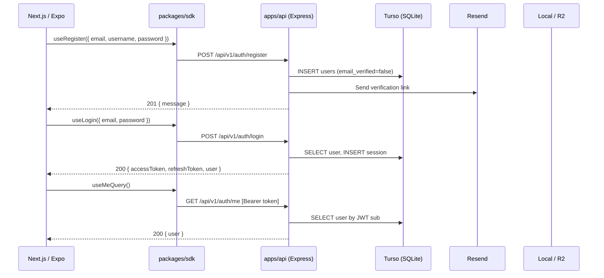

# Sprint 1 — Auth & Profile: Detailed Implementation Plan

**Duration:** ~2 weeks  
**Goal:** Users can register, log in (password or OTP), verify email, manage their profile, and follow other users. JWT auth guards all protected routes.

---

## Architecture Overview



---

## Existing Foundation (Already Built in S0)

What we have and can leverage directly:

- **DB schema:** `users`, `sessions`, `otpTokens`, `passwordResetTokens`, `follows`, `userSettings`, `idempotencyKeys` tables all defined in [apps/api/src/db/schema.ts](apps/api/src/db/schema.ts)
- **Auth middleware:** JWT verify + `requireAdmin` in [apps/api/src/middleware/auth.ts](apps/api/src/middleware/auth.ts)
- **Idempotency middleware:** Fully implemented in [apps/api/src/middleware/idempotency.ts](apps/api/src/middleware/idempotency.ts)
- **Zod schemas:** `RegisterSchema`, `LoginSchema`, `OtpSendSchema`, `OtpVerifySchema`, `RefreshSchema`, `PasswordResetRequestSchema`, `PasswordResetSchema`, `PasswordChangeSchema` in [packages/types/src/schemas/auth.ts](packages/types/src/schemas/auth.ts)
- **User schemas:** `UserSchema`, `UpdateProfileSchema`, `UserSearchParamsSchema` in [packages/types/src/schemas/users.ts](packages/types/src/schemas/users.ts)
- **SDK hooks:** `useLogin`, `useRegister`, `useOtpSend`, `useOtpVerify`, `useLogout`, `useWsToken`, `useMeQuery` in [packages/sdk/src/hooks/auth.ts](packages/sdk/src/hooks/auth.ts)
- **SDK user hooks:** `useUserQuery`, `useUpdateProfile`, `useFollowUser`, `useUserSearch` in [packages/sdk/src/hooks/users.ts](packages/sdk/src/hooks/users.ts)
- **API client:** Full interceptor-based client with token refresh in [packages/sdk/src/client.ts](packages/sdk/src/client.ts)
- **App express setup:** CORS, helmet, rate-limit, pino, error handler in [apps/api/src/app.ts](apps/api/src/app.ts)
- **Env config:** All env vars (JWT_SECRET, JWT_REFRESH_SECRET, RESEND_API_KEY, STORAGE_DRIVER, R2_*) in [apps/api/src/lib/env.ts](apps/api/src/lib/env.ts)

---

## Task Breakdown

### TASK 1: Backend — Auth Routes (`apps/api/src/routes/auth.ts`)

Create the auth router with all endpoints per the API surface spec.

**File:** `apps/api/src/routes/auth.ts`

**Endpoints to implement:**

| Endpoint | Logic |
|----------|-------|
| `POST /register` | Validate via `RegisterSchema`, check unique email+username, `bcrypt.hash(password, 12)`, insert user, generate email verification token (UUID, stored hashed in `passwordResetTokens` or a dedicated column), send verification email via Resend, return 201 |
| `GET /verify-email?token=` | Find token by hash, check not expired/used, set `email_verified=true`, mark token used |
| `POST /login` | Validate via `LoginSchema`, find user by email, `bcrypt.compare`, check `email_verified`, create session (hash refresh token, store in sessions), sign JWT access (15m, `{ sub: userId, role }`) + refresh (7d), return tokens + user |
| `POST /otp/send` | Validate email, generate 6-digit code, `bcrypt.hash(code)`, store in `otpTokens` with 10min TTL, send via Resend |
| `POST /otp/verify` | Find latest unexpired OTP for email, `bcrypt.compare`, mark used, create/find user (auto-register if not exists), issue JWT pair |
| `POST /refresh` | Validate `RefreshSchema`, hash provided refreshToken, find matching session, check not expired, rotate: delete old session + create new, issue new JWT pair |
| `POST /logout` | Auth required, delete session by token hash |
| `POST /password/reset-request` | Find user by email, generate token (UUID), hash + store in `passwordResetTokens` with 1hr TTL, send reset email via Resend |
| `POST /password/reset` | Find token by hash, check not expired/used, `bcrypt.hash(newPassword)`, update user, mark token used, invalidate all sessions |
| `POST /password/change` | Auth required, verify current password, hash new, update, invalidate other sessions |
| `GET /me` | Auth required, return full user object with follower/following/post counts |
| `GET /ws-token` | Auth required, generate short-lived token (UUID, 10min), hash + store in sessions table (with type flag or separate ephemeral store), return plaintext token |

**Key implementation details:**
- Rate limit auth routes: 5 requests per minute per IP on `/register`, `/login`, `/otp/send`, `/password/reset-request`
- Use `bcryptjs` (already in deps) with cost factor 12
- JWT signing: `jsonwebtoken.sign({ sub: userId, role }, JWT_SECRET, { expiresIn: '15m' })`
- Refresh token: random UUID, stored as SHA-256 hash in `sessions.tokenHash`
- Email verification token: random UUID, stored hashed in `passwordResetTokens` table (reuse with a `type` field) or a separate mechanism
- OTP: 6 random digits via `crypto.randomInt(100000, 999999)`

**Helper files to create:**
- `apps/api/src/lib/tokens.ts` — `signAccessToken(userId, role)`, `signRefreshToken()`, `hashToken(token)`, `generateOtp()`
- `apps/api/src/lib/email.ts` — Resend wrapper: `sendVerificationEmail(to, token)`, `sendOtpEmail(to, code)`, `sendPasswordResetEmail(to, token)`

---

### TASK 2: Backend — Users Routes (`apps/api/src/routes/users.ts`)

**File:** `apps/api/src/routes/users.ts`

| Endpoint | Logic |
|----------|-------|
| `GET /:username` | Find user by username, attach follower/following/post counts, attach `isFollowing` (if authenticated viewer follows this user) |
| `PATCH /me` | Auth required, validate `UpdateProfileSchema`, update user fields, return updated user |
| `POST /me/avatar` | Auth required, `multer` single file (max 5MB, image/*), process with `sharp` (resize 256x256, webp), store via storage driver, update `users.avatarKey` |
| `DELETE /me` | Auth required, soft-delete (set `deletedAt` or mark inactive — note: schema doesn't have deletedAt, so set `role='deleted'` or add a column) |
| `GET /search` | Auth required, validate `UserSearchParamsSchema`, search users by username/bio LIKE, paginate |
| `GET /:userId/followers` | Paginated list of users who follow this user |
| `GET /:userId/following` | Paginated list of users this user follows |
| `POST /:userId/follow` | Auth required, insert into `follows`, prevent self-follow, idempotent |
| `DELETE /:userId/follow` | Auth required, delete from `follows` |
| `GET /me/settings` | Auth required, return all key/value pairs from `userSettings` |
| `PUT /me/settings` | Auth required, bulk upsert settings (accept `Record<string, string>`) |

**Helper files to create:**
- `apps/api/src/lib/storage.ts` — Storage abstraction: `uploadFile(buffer, key, mimeType)`, `getPublicUrl(key)`, `deleteFile(key)`. Implements local (write to `data/uploads/`) and R2 (via `@aws-sdk/client-s3`) based on `STORAGE_DRIVER` env.

**Schema change needed:** Add a `deletedAt` column to users table for soft-delete support, or handle via a status field. Recommend adding `deletedAt: integer('deleted_at', { mode: 'timestamp' })` to the users table and generating a new migration.

---

### TASK 3: Backend — Seed Script (`apps/api/src/seed.ts`)

Implement the seed script with:
- 5 demo users (bcrypt-hashed `password123`):
  - `arya_explorer` / `arya@demo.roamera.in`
  - `marco_travels` / `marco@demo.roamera.in`
  - `leo_backpacker` / `leo@demo.roamera.in`
  - `ana_nomad` / `ana@demo.roamera.in`
  - `kenji_wanders` / `kenji@demo.roamera.in`
- All with `email_verified=true`, varied bios/cities/interests/budgetBands
- 15 destinations (India-focused + international mix)
- Some follow relationships between demo users
- Some user settings

---

### TASK 4: Backend — Register Routes in App

**File:** [apps/api/src/routes/index.ts](apps/api/src/routes/index.ts)

- Uncomment/add `router.use('/api/v1/auth', authRouter)`
- Uncomment/add `router.use('/api/v1/users', usersRouter)`
- Wire idempotency middleware on mutation routes

---

### TASK 5: Web — Auth Pages (`apps/web/src/app/(auth)/`)

Create the `(auth)` route group (unauthenticated pages):

**Files to create:**
- `apps/web/src/app/(auth)/layout.tsx` — Centered card layout, Roamera branding
- `apps/web/src/app/(auth)/login/page.tsx` — Email/password form + "Login with OTP" link + "Forgot password?" link + "Register" link
- `apps/web/src/app/(auth)/register/page.tsx` — Username/email/password form + "Already have account?" link
- `apps/web/src/app/(auth)/otp/page.tsx` — Two-step: enter email, then enter 6-digit code
- `apps/web/src/app/(auth)/verify-email/page.tsx` — Calls verify-email API on mount with `?token=` param, shows success/error
- `apps/web/src/app/(auth)/forgot-password/page.tsx` — Enter email form
- `apps/web/src/app/(auth)/reset-password/page.tsx` — New password form (token from URL)

**UI requirements:**
- Use shadcn/ui components (install: Button, Input, Card, Label, Separator)
- Teal primary color, `rounded-2xl` cards
- Dark mode support
- Form validation with Zod schemas from `@roamera/types`
- Loading states on buttons
- Error toast/message display
- Responsive (mobile-first)

---

### TASK 6: Web — App Shell & Auth Guard (`apps/web/src/app/(app)/`)

Create the `(app)` route group (authenticated pages):

**Files to create:**
- `apps/web/src/app/(app)/layout.tsx` — Sidebar/navbar + auth check, redirect to `/login` if no token
- `apps/web/src/app/(app)/page.tsx` — Compass home (stub for S2, shows "Welcome, {username}")
- `apps/web/src/providers/auth-provider.tsx` — React context: stores accessToken + refreshToken in cookies/localStorage, exposes `user`, `login()`, `logout()`, `isAuthenticated`
- `apps/web/src/providers/query-provider.tsx` — TanStack Query provider wrapping the app

**Middleware update:** [apps/web/src/middleware.ts](apps/web/src/middleware.ts) — Check for `accessToken` cookie; if missing on `(app)` routes, redirect to `/login`. Allow `(auth)` routes and public routes through.

---

### TASK 7: Web — Profile Pages

**Files to create:**
- `apps/web/src/app/(app)/u/[username]/page.tsx` — Public profile: avatar, bio, city, interests, budget band, followers/following counts, follow button (if viewing another user), posts grid (stub for S2)
- `apps/web/src/app/(app)/settings/page.tsx` — Edit profile form: avatar upload, username, bio, city, interests (multi-select), budget band (select)
- `apps/web/src/app/(app)/settings/account/page.tsx` — Change password, delete account

**Components to create:**
- `apps/web/src/components/avatar-upload.tsx` — Click-to-upload avatar with preview
- `apps/web/src/components/follow-button.tsx` — Follow/unfollow toggle button
- `apps/web/src/components/user-card.tsx` — Compact user display (avatar + username + bio snippet)
- `apps/web/src/components/followers-modal.tsx` — Modal showing followers/following list

---

### TASK 8: Web — Token Management

**Implementation approach:**
- Store `accessToken` in memory (Zustand store) for API calls
- Store `refreshToken` in an httpOnly cookie (set by API) OR in localStorage (simpler for SPA)
- Configure `packages/sdk` client with `configureClient({ tokenGetter, tokenSetter, refreshFn })`
- The `refreshFn` calls `POST /api/v1/auth/refresh` and returns the new access token
- On app load, attempt silent refresh; if fails, redirect to login

**File:** `apps/web/src/lib/auth-store.ts` — Zustand store for auth state

---

### TASK 9: Mobile — Auth Stack (`apps/mobile/app/(auth)/`)

**Files to create/update:**
- `apps/mobile/app/(auth)/_layout.tsx` — Stack navigator for auth screens
- `apps/mobile/app/(auth)/login.tsx` — Email/password form (update existing stub)
- `apps/mobile/app/(auth)/register.tsx` — Registration form
- `apps/mobile/app/(auth)/otp.tsx` — OTP send + verify flow

**Auth storage:** Use `expo-secure-store` to persist JWT tokens securely on device.

**File:** `apps/mobile/lib/auth.ts` — `getToken()`, `setToken()`, `clearToken()` wrappers around SecureStore

---

### TASK 10: Mobile — Profile Screen

**Files to update:**
- `apps/mobile/app/(tabs)/profile.tsx` — Show current user profile (avatar, bio, stats, edit button)
- `apps/mobile/app/(auth)/` → `(tabs)` navigation guard — redirect to auth if no stored token

---

### TASK 11: Packages — Install shadcn/ui Components

Install and configure shadcn/ui in `apps/web`:
- `Button`, `Input`, `Label`, `Card`, `Separator`, `Dialog`, `DropdownMenu`, `Avatar`, `Badge`, `Toast/Sonner`
- Configure `components.json` for the project
- Ensure Tailwind config uses teal primary + coral accent from design tokens

---

## System Design Decisions

**JWT strategy:**
- Access token: 15 minute expiry, signed with `JWT_SECRET`, payload: `{ sub: userId, role: 'user'|'admin', iat, exp }`
- Refresh token: 7 day expiry, random UUID stored as SHA-256 hash in `sessions` table
- On refresh: old session deleted, new session created (rotation prevents replay)
- `ws_token`: separate 10-minute ephemeral token for WebSocket auth (stored in memory Map on server, not DB — lightweight)

**Email service:**
- Resend SDK (`resend` package already in deps)
- Dev mode: if `RESEND_API_KEY` not set, log email content to console instead of sending
- Templates: simple text emails initially (upgrade to React Email templates post-MVP)

**Storage abstraction:**
- `STORAGE_DRIVER=local`: multer writes to `data/uploads/{year}/{month}/{sha256}.{ext}`
- `STORAGE_DRIVER=r2`: uses `@aws-sdk/client-s3` with R2 endpoint
- Avatar processing: `sharp` resizes to 256x256 square crop, converts to WebP, ~50KB output
- Return URL: local = `/uploads/{key}`, R2 = `https://{bucket}.r2.dev/{key}`

**Soft delete:**
- Add `deletedAt` column to users table
- Deleted users: API returns 404, auth returns "account deleted"
- 30-day grace period: a cron job (S9) will hard-delete after 30 days
- During grace period: user can contact support to restore

---

## Definition of Done

Each task must satisfy these criteria to be considered complete:

| Criteria | Verification |
|----------|--------------|
| All 11 auth endpoints return correct status codes and response shapes | Manual test with curl/Postman |
| All 10 user endpoints work correctly | Manual test |
| JWT access token expires after 15m, refresh works transparently | Verify with SDK interceptor |
| OTP flow: send code, verify code, get JWT | End-to-end test |
| Email verification: register, click link, verify flag flips | End-to-end test |
| Password reset: request, receive email (or console log in dev), reset works | End-to-end test |
| Follow/unfollow: persists, counts update, prevents self-follow | API test |
| Avatar upload: file arrives in `data/uploads/`, user record updated | Upload test |
| Web: register → verify email → login → see profile page | Browser walkthrough |
| Web: OTP flow works end-to-end | Browser walkthrough |
| Web: edit profile (bio, city, interests, avatar) saves correctly | Browser walkthrough |
| Web: follow/unfollow button works, counts update | Browser walkthrough |
| Web: auth guard redirects unauthenticated users to /login | Browser test |
| Mobile: login screen functional, tokens stored in SecureStore | Expo Go test |
| Seed script creates 5 users + 15 destinations successfully | Run `pnpm --filter api db:seed` |
| `pnpm lint && pnpm typecheck` passes with zero errors | CI check |
| No regressions: `GET /api/health` still returns 200 | Smoke test |
| Rate limiting: 6th login attempt within 1 minute returns 429 | Manual test |

---

## Sprint Demo Checklist

At the end of Sprint 1, demonstrate the following flows:

1. **Registration flow:** Open `/register` → fill form → submit → check console for verification email → open verify link → "email verified" page
2. **Login flow:** Open `/login` → enter demo credentials → redirected to home → see "Welcome, arya_explorer"
3. **OTP flow:** Click "Login with OTP" → enter email → check console for code → enter code → logged in
4. **Token refresh:** Wait 15+ minutes (or manually expire token) → next API call silently refreshes → no logout
5. **Profile view:** Navigate to `/u/marco_travels` → see profile with avatar, bio, stats
6. **Profile edit:** Go to `/settings` → change bio → upload avatar → save → verify on profile page
7. **Follow system:** On marco's profile → click Follow → count increments → click Unfollow → count decrements
8. **User search:** Search "ana" → see `ana_nomad` in results → click → view profile
9. **Password reset:** Click "Forgot password?" → enter email → check console for link → reset password → login with new password
10. **Auth guard:** Open incognito → try to access `/` → redirected to `/login`
11. **Mobile:** Open Expo Go → login screen → enter credentials → see profile tab with user info

---

## File Structure After Sprint 1

```
apps/api/src/
  routes/
    auth.ts          (NEW — all auth endpoints)
    users.ts         (NEW — all user endpoints)
    health.ts        (existing)
    index.ts         (updated — wire auth + users routers)
  lib/
    tokens.ts        (NEW — JWT sign/verify, OTP gen, hash)
    email.ts         (NEW — Resend wrapper)
    storage.ts       (NEW — local/R2 abstraction)
    env.ts           (existing)
    logger.ts        (existing)
  middleware/
    auth.ts          (existing)
    error.ts         (existing)
    idempotency.ts   (existing)
    rate-limit.ts    (NEW — per-route rate limiters)
  seed.ts            (updated — full implementation)

apps/web/src/
  app/
    (auth)/
      layout.tsx     (NEW)
      login/page.tsx (NEW)
      register/page.tsx (NEW)
      otp/page.tsx   (NEW)
      verify-email/page.tsx (NEW)
      forgot-password/page.tsx (NEW)
      reset-password/page.tsx (NEW)
    (app)/
      layout.tsx     (NEW — with auth guard + nav)
      page.tsx       (NEW — home stub)
      u/[username]/page.tsx (NEW)
      settings/page.tsx (NEW)
      settings/account/page.tsx (NEW)
  components/
    avatar-upload.tsx (NEW)
    follow-button.tsx (NEW)
    user-card.tsx    (NEW)
    followers-modal.tsx (NEW)
    navbar.tsx       (NEW)
  providers/
    auth-provider.tsx (NEW)
    query-provider.tsx (NEW)
  lib/
    auth-store.ts    (NEW — Zustand)
  middleware.ts      (updated — auth guard logic)

apps/mobile/app/
  (auth)/
    _layout.tsx      (NEW)
    login.tsx        (updated — full form)
    register.tsx     (NEW)
    otp.tsx          (NEW)
  (tabs)/
    profile.tsx      (updated — real profile)
  lib/
    auth.ts          (NEW — SecureStore wrapper)
```

---

## Dependencies to Install

- `apps/web`: shadcn/ui setup (via `npx shadcn@latest init`), `react-hook-form`, `@hookform/resolvers`, `sonner` (toast), `lucide-react`
- `apps/mobile`: `expo-secure-store`, `expo-image-picker` (for avatar)
- No new `apps/api` dependencies needed (bcryptjs, jsonwebtoken, multer, sharp, resend all already in package.json)
