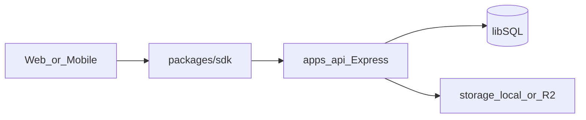

# Sprint 2 — Moments & Social Feed

**Goal (from roadmap):** Users create Moments (posts) with up to 5 photos; all five reactions work; nested comments; global vs following feed with cursor pagination; save (Wanna Go) and `wanna_go` reaction tied to bucket list; unified search and discover surfaces.

**Current foundation:** [apps/api/src/db/schema.ts](apps/api/src/db/schema.ts) defines minimal `posts`, `postPhotos`, `reactions`, `comments`, `savedPosts`, `bucketList` stubs (missing rich fields and indexes). [apps/api/src/routes/index.ts](apps/api/src/routes/index.ts) already reserves `posts` and `feed` mounts. [apps/api/src/lib/storage.ts](apps/api/src/lib/storage.ts) and `sharp` patterns from avatar upload can be reused for post photos and `{key}_thumb.webp` per [docs/architecture/06-system-architecture.md](docs/architecture/06-system-architecture.md) storage section.



---

## 1. Data model and migrations

**Extend `posts`** to match [07-api-surface.md](docs/architecture/07-api-surface.md) CreatePost narrative: e.g. JSON columns or normalized fields for `destinations[]`, `date_from` / `date_to`, `activities[]`, `accommodation`, `budget_inr`, `vacation_type`, `transport_mode`, `hashtags[]`, `itinerary_json`—keep SQLite-friendly (JSON text + Zod validation at API boundary).

**`post_photos`:** add optional `thumb_storage_key` (or convention `{base}_thumb.webp` only in storage). Enforce max 5 rows per post in application logic.

**`reactions`:** add **unique** constraint on `(post_id, user_id)` so each user has at most one reaction per post (POST toggles/changes type). Align with roadmap “all 5 types”.

**`comments`:** add `updated_at`; optional soft-delete flag if you prefer not hard-deleting threaded trees; enforce `parent_id` belongs to same `post_id`.

**`saved_posts`:** composite primary key `(user_id, post_id)` with `uniqueIndex`.

**Indexing:** indexes on `posts(user_id, created_at desc)`, `posts(created_at)` for global feed; use existing `follows` for following feed.

Generate migration via `pnpm --filter api db:generate` after editing schema.

---

## 2. Backend — `POST /api/v1/posts` router

New [apps/api/src/routes/posts.ts](apps/api/src/routes/posts.ts) (or split handlers by concern):

| Area | Routes (see 07 §3) |
|------|---------------------|
| List + CRUD | `GET /` with `feed=global\|following`, `cursor`, `limit`; `POST /`; `GET /:postId`; `PATCH` / `DELETE` (owner); `GET /:postId` **[public]** per spec—implement either truly public JSON or gate behind auth if product wants private beta (document choice). |
| Media | `POST /:postId/photos` multipart (1–5 cumulative), resize + WebP + thumb via `sharp`; `DELETE /:postId/photos/:photoId`. |
| Reactions | `POST` / `DELETE` / `GET` for `:postId/reactions`; on `wanna_go` upsert **`saved_posts`** and append/merge **`bucket_list`** from post destination metadata where possible. |
| Comments | Nested list `GET`; `POST` / `PATCH` / `DELETE` with ownership checks. |
| Saves | `POST` / `DELETE` `/:postId/save` (Wanna Go) distinct from reaction if spec requires both—or map save to saved_posts only. |

**Auth:** reuse [apps/api/src/middleware/auth.ts](apps/api/src/middleware/auth.ts); optional JWT for “public” post detail vs anonymous.

**Idempotency / rate limits:** wire [apps/api/src/middleware/idempotency.ts](apps/api/src/middleware/idempotency.ts) on mutating routes (matching Sprint 1 pattern); add stricter limits on photo uploads and comment spam if desired.

---

## 3. Backend — `GET /api/v1/feed` router

New [apps/api/src/routes/feed.ts](apps/api/src/routes/feed.ts) per [07-api-surface.md](docs/architecture/07-api-surface.md) §4:

- `GET /compass` — cursor-paginated “main feed” (can delegate to same query as `GET /posts` or return enriched cards).
- `GET /trending` — MVP: aggregate hashtag counts / destination mention frequency from posts JSON or lightweight counters table (defer heavy analytics if needed).
- `GET /destinations`, `GET /destinations/:id` — backed by existing [destinations](apps/api/src/db/schema.ts) table seeded in S1.
- `GET /search?q=` — unified: merge user search (existing users route logic), posts title/content/hashtags, destination name/country (cap limits per type).
- `GET /saved` — list saved posts for current user.
- `GET|POST|DELETE /bucket-list` — CRUD using `bucket_list` table; align payloads with roadmap acceptance (“wanna_go adds destination”).

Mount in [apps/api/src/routes/index.ts](apps/api/src/routes/index.ts):

```typescript
router.use('/api/v1/posts', postsRouter);
router.use('/api/v1/feed', feedRouter);
```

Ensure static `/uploads` continues to serve local keys for photo URLs (`getPublicUrl` consistency with web `NEXT_PUBLIC_API_URL`).

---

## 4. Types and SDK (`packages/`)

Add [packages/types/src/schemas/posts.ts](packages/types/src/schemas/posts.ts): `PostSchema`, `PostCardSchema`, `CreatePostSchema`, `UpdatePostSchema`, `ReactionSchema`, `CommentSchema`, `CreateCommentSchema`, `FeedCursorSchema`, plus feed response wrappers. Export from [packages/types/src/index.ts](packages/types/src/index.ts).

Add [packages/sdk/src/hooks/posts.ts](packages/sdk/src/hooks/posts.ts) and [packages/sdk/src/hooks/feed.ts](packages/sdk/src/hooks/feed.ts): infinite-query patterns (`useInfiniteQuery`) for compass/following/global; mutations `useCreatePost`, `useUploadPostPhotos`, `useReact`, `useSavePost`, comment CRUD, `useUnifiedSearch`.

---

## 5. Web (`apps/web`)

- Replace Compass stub [apps/web/src/app/(app)/home/page.tsx](apps/web/src/app/(app)/home/page.tsx) (or `/` route if moved): **global/following toggle**, infinite scroll (TanStack Query + intersection observer).
- **Post card:** cover photo, author, title, snippet, reaction bar (5 types + counts), comments count.
- **`/moment/[postId]`** (or `/p/[id]`): detail with carousel, full fields, reactions, threaded comments, save.
- **Create flow:** modal or `/compose` route—multi-upload, hashtags, itinerary JSON builder (minimal: JSON textarea or day list MVP).
- **Discover:** `/destinations` grid; **search overlay** wired to `/api/v1/feed/search`.
- **Saved:** page listing `/api/v1/feed/saved`.
- **Profile tab on `/u/[username]`:** integrate user’s posts list (reuse post card).

Use existing auth + navbar; reuse [packages/config tailwind preset](packages/config/tailwind/preset.js) for Moments UI polish.

---

## 6. Mobile (`apps/mobile`)

- [apps/mobile/app/(tabs)/index.tsx](apps/mobile/app/(tabs)/index.tsx): feed list + pull-to-refresh + infinite scroll.
- Post detail route (stack under tabs or modal).
- Create Moment: `expo-image-picker` (add dependency if missing), multipart upload pipeline.
- Reuse SecureStore-backed client from Sprint 1.

---

## 7. Seed and QA

Extend [apps/api/src/seed.ts](apps/api/src/seed.ts): sample Moments per demo user (1–3 posts, 2–5 photos paths or placeholder keys), reactions, threaded comments—so Compass is non-empty without manual setup.

**Definition of done (from roadmap acceptance):**

- Create post with photos → appears in **global** feed immediately.
- **Following** feed only shows posts from followed users.
- All **five** reactions work; **`wanna_go`** updates bucket list / save behavior per spec you lock.
- Comments: create, edit, delete, **nested replies**.
- Cursor pagination works (stable ordering; no duplicates on pagination).
- `pnpm lint && pnpm typecheck` clean; `/api/health` still OK.

---

## Recommended build order

1. Schema + migration + seed sample posts  
2. Types/Zod  
3. Posts CRUD + list (`feed` query params)  
4. Photos upload + thumbnails  
5. Reactions + saves + `wanna_go` → bucket/saved_posts  
6. Comments  
7. Feed router (compass, destinations, search, saved, bucket-list)  
8. SDK hooks  
9. Web Compass + detail + compose + search  
10. Mobile Compass + detail + compose  

This sequence keeps vertical slices testable via curl/SDK before UI.
