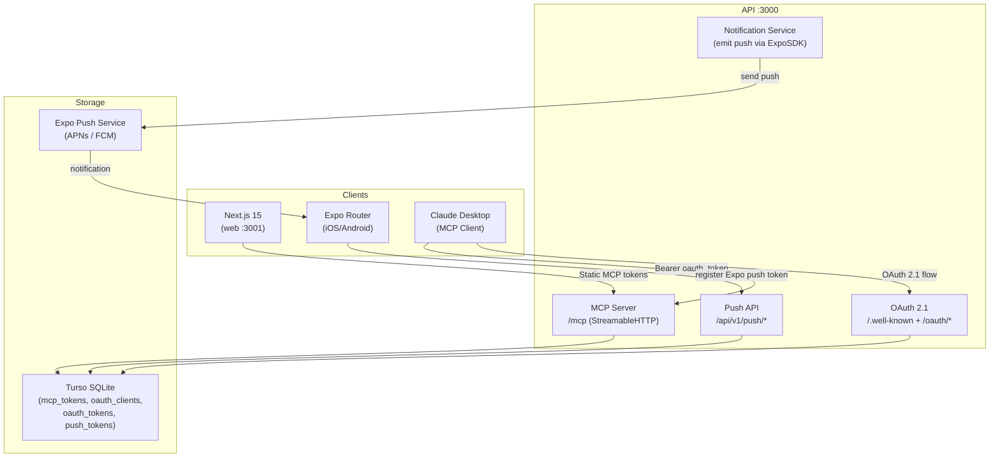

# Sprint 11 — MCP Server, Mobile Polish & Push Notifications

## S1–S10 Debt Audit

| Sprint | Open Item | Action |
|--------|-----------|--------|
| S5 | Budget + packing mobile screens | Build in S11 (trip detail sub-screens) |
| S6 | Circles list + detail mobile | Build in S11 |
| S7 | JustSplit mobile screen | Build in S11 |
| S8 | Journeys/atlas mobile | Deferred to post-MVP (complexity vs value) |
| S9 | Push channel + notification screen + badge | Build in S11 |
| S10 | Dexie offline sync (mobile) | Build in S11 |
| S10 | Web dark mode, `/settings/mcp`, OAuth consent page | Build in S11 |

---

## Architecture



---

## Part A — Backend

### A1. Install dependencies

```bash
pnpm add @modelcontextprotocol/sdk expo-server-sdk --filter api
```

### A2. DB schema additions — [`apps/api/src/db/schema.ts`](apps/api/src/db/schema.ts)

Add 4 tables after the existing `mcp_tokens` stub:

- `oauth_clients` — id, clientId, clientSecretHash, name, redirectUris (JSON), scopes (JSON), createdBy
- `oauth_codes` — id, clientId, userId, code, codeChallenge, codeChallengeMethod, scopes, expiresAt
- `oauth_tokens` — id, clientId, userId, accessTokenHash, refreshTokenHash, scopes, expiresAt, revokedAt
- `push_tokens` — id, userId, token (Expo push token), platform (ios/android/web), createdAt

Then run:
```bash
pnpm --filter api db:generate && pnpm --filter api db:migrate
```

### A3. Create [`apps/api/src/routes/mcp.ts`](apps/api/src/routes/mcp.ts)

Three sections in one file:

**OAuth 2.1 endpoints** (all under `/api/v1/mcp`):
- `GET /.well-known/oauth-authorization-server` — discovery document (issuer, token_endpoint, authorization_endpoint, etc.)
- `POST /oauth/token` — auth code + PKCE exchange → issue access token + refresh; also handles `grant_type=refresh_token`
- `POST /oauth/revoke` — revoke access or refresh token
- `POST /oauth/register` — Dynamic Client Registration
- `GET /oauth/authorize` — render consent screen (returns JSON for API, web uses `/oauth/authorize`)
- `POST /oauth/authorize` — approve/deny consent → issue auth code

**Static MCP token CRUD**:
- `GET /tokens` — list user's static tokens
- `POST /tokens` — create token (name, scopes) → store `sha256(token)` → return raw token once
- `DELETE /tokens/:id` — revoke

**MCP HTTP transport** (StreamableHTTP):
- `POST /server` — MCP protocol endpoint; auth middleware validates Bearer (OAuth access token OR static `mcp_*` token)
- Registers 11 tools from `§17` of `07-api-surface.md`:

| Tool | Implementation (calls existing route logic) |
|------|---------------------------------------------|
| `get_trips` | re-uses `db.select().from(trips)` filtered by userId |
| `get_trip_details` | days + places + members for a tripId |
| `create_trip` | insert trip, return id |
| `add_place_to_trip` | insert `dayAssignments` row |
| `get_weather` | calls `weatherRouter` helper |
| `search_places` | calls Nominatim via `mapsRouter` helper |
| `get_budget_summary` | queries `expenses` for a trip |
| `get_packing_list` | queries `packingItems` for a trip |
| `mark_item_packed` | updates `packingItems.isPacked` |
| `get_user_atlas` | queries `visitedCountries` |
| `get_notifications` | queries `notifications` (unread) |

MCP rate limiting: 300 req/min/user via existing `express-rate-limit`.

Register in [`apps/api/src/routes/index.ts`](apps/api/src/routes/index.ts) (uncomment the existing comment).

### A4. Create [`apps/api/src/routes/push.ts`](apps/api/src/routes/push.ts)

- `POST /api/v1/push/register` — auth; upsert `push_tokens` row with Expo push token
- `DELETE /api/v1/push/unregister` — auth; remove push token for current device

Register in `routes/index.ts`.

### A5. Push sender in [`apps/api/src/lib/push.ts`](apps/api/src/lib/push.ts) (new)

```typescript
import Expo from 'expo-server-sdk';
const expo = new Expo();
export async function sendPushToUser(userId: string, title: string, body: string, data?: object)
```

Called from `notificationsRouter` after inserting a notification row. Looks up all `push_tokens` for the user and calls `expo.sendPushNotificationsAsync(messages)`.

---

## Part B — Mobile (`apps/mobile`)

### B1. Install dependencies

```bash
pnpm add expo-notifications expo-haptics expo-linking --filter mobile
pnpm add dexie --filter mobile
```

Update [`apps/mobile/app.json`](apps/mobile/app.json) to add `expo-notifications` and `expo-haptics` plugins.

### B2. Push notifications — [`apps/mobile/lib/push.ts`](apps/mobile/lib/push.ts) (new)

```typescript
async function registerForPushNotifications(): Promise<string | null>
  // 1. expo-device check (not emulator for APNs)
  // 2. requestPermissionsAsync()
  // 3. getExpoPushTokenAsync({ projectId: Constants.expoConfig.extra.eas.projectId })
  // 4. POST /api/v1/push/register { token, platform }
  // 5. return token
```

Add `NotificationHandler.setNotificationHandler` for foreground notifications. Handle `addNotificationResponseReceivedListener` for deep link navigation.

Call `registerForPushNotifications()` inside `ApiAuthBootstrap` after auth is initialized.

### B3. Compass tab — [`apps/mobile/app/(tabs)/index.tsx`](apps/mobile/app/(tabs)/index.tsx)

Replace placeholder with:
- `FlatList` of posts from `GET /api/v1/feed/compass`
- Post card: cover image, title, author avatar, reaction counts, `expo-haptics` on reaction tap
- Pull-to-refresh via `refetch`
- Loading skeleton (animated `View` placeholder)

### B4. Trips tab — [`apps/mobile/app/(tabs)/trips.tsx`](apps/mobile/app/(tabs)/trips.tsx)

- List of trips from `GET /api/v1/trips`
- Tap → `router.push('/trips/[tripId]')` — new screen
- Create [`apps/mobile/app/trips/[tripId].tsx`](apps/mobile/app/trips/[tripId].tsx): days list, places, budget summary card, packing checklist link
- Create [`apps/mobile/app/trips/[tripId]/budget.tsx`](apps/mobile/app/trips/[tripId]/budget.tsx): expense list + add expense
- Create [`apps/mobile/app/trips/[tripId]/packing.tsx`](apps/mobile/app/trips/[tripId]/packing.tsx): packing item list with swipe-to-check via `expo-haptics`

Register new screens in `_layout.tsx` Stack.

### B5. AI tab — [`apps/mobile/app/(tabs)/ai.tsx`](apps/mobile/app/(tabs)/ai.tsx)

Replace placeholder with conversational AI planner chat UI:
- `FlatList` of messages, text input + send button
- `POST /api/v1/ai/chat` with `{ message, context: { tripId? } }`
- Streaming response displayed word-by-word

### B6. Circles tab — [`apps/mobile/app/(tabs)/circles.tsx`](apps/mobile/app/(tabs)/circles.tsx)

- List of circles from `GET /api/v1/circles`
- Tap → `router.push('/circles/[circleId]')` — new screen
- Create [`apps/mobile/app/circles/[circleId].tsx`](apps/mobile/app/circles/[circleId].tsx): members list, JustSplit summary

### B7. Profile tab — [`apps/mobile/app/(tabs)/profile.tsx`](apps/mobile/app/(tabs)/profile.tsx)

Replace placeholder with:
- Avatar, username, stats (posts, followers, following)
- Moments grid
- Settings link → logout

### B8. Notifications screen — [`apps/mobile/app/notifications.tsx`](apps/mobile/app/notifications.tsx)

- List unread notifications from `GET /api/v1/notifications`
- Mark all read button
- Notification badge on Profile tab icon from unread count

### B9. Offline banner + Dexie sync — [`apps/mobile/lib/offline.ts`](apps/mobile/lib/offline.ts)

```typescript
// Dexie database: trips, days, places cached from /bundle
const db = new Dexie('roamera');
db.version(1).stores({ trips: 'id', days: '++id,tripId', places: '++id,tripId' });

// NetInfo listener → show offline banner in _layout.tsx when disconnected
// On reconnect: flush mutation queue
```

Offline banner component in [`apps/mobile/components/OfflineBanner.tsx`](apps/mobile/components/OfflineBanner.tsx).

### B10. Dark mode — [`apps/mobile/tailwind.config.js`](apps/mobile/tailwind.config.js)

NativeWind already installed. Add `darkMode: 'class'` and wrap `_layout.tsx` with `useColorScheme()` → apply `dark` class. All tab/screen components use `dark:bg-gray-900 dark:text-white` via NativeWind.

---

## Part C — Web

### C1. [`apps/web/src/app/(app)/settings/mcp/page.tsx`](apps/web/src/app/(app)/settings/mcp/page.tsx) (new)

- List user's MCP tokens via `GET /api/v1/mcp/tokens`
- Create token form (name + scope picker → copies raw token shown once)
- Revoke button per token
- Usage instructions (how to add to Claude Desktop `claude_desktop_config.json`)

### C2. [`apps/web/src/app/oauth/authorize/page.tsx`](apps/web/src/app/oauth/authorize/page.tsx) (new)

OAuth consent screen:
- Shows client name, scopes being requested
- "Allow" / "Deny" buttons → `POST /api/v1/mcp/oauth/authorize`

### C3. Dark mode toggle in [`apps/web/src/app/(app)/settings/page.tsx`](apps/web/src/app/(app)/settings/page.tsx)

Already exists. Add `theme` section:
- Toggle switch using `next-themes` (`pnpm add next-themes --filter web`)
- Wraps root layout with `ThemeProvider defaultTheme="system"`
- All shadcn/ui components already support `dark:` — only need the provider wired up

---

## Part D — Types & SDK

### D1. [`packages/types/src/schemas/mcp.ts`](packages/types/src/schemas/mcp.ts) (new)

- `McpTokenSchema` (id, name, scopes, lastUsedAt, createdAt)
- `CreateMcpTokenSchema` (name, scopes[])
- `PushTokenSchema` (token, platform)

Export from [`packages/types/src/index.ts`](packages/types/src/index.ts).

### D2. [`packages/sdk/src/hooks/mcp.ts`](packages/sdk/src/hooks/mcp.ts) (new)

- `useMcpTokens()`, `useCreateMcpToken()`, `useRevokeMcpToken()`
- `useRegisterPushToken()`

Export from [`packages/sdk/src/index.ts`](packages/sdk/src/index.ts).

---

## Part E — Tests

| File | Key assertions |
|------|----------------|
| `apps/api/src/__tests__/mcp.test.ts` | Create static token → 201 + token field; call `POST /mcp/server` with Bearer → 200 tool response; revoke token → 204; call with revoked token → 401 |
| `apps/api/src/__tests__/push.test.ts` | Register push token → 201; duplicate register → 200 upsert; unregister → 204; register without auth → 401 |

Both run inside the existing sequential vitest config.

> Total after S11: ~95 API tests.

---

## Part F — Documentation & Git

- Mark S11 as `✅ Done` in [`docs/architecture/08-build-roadmap.md`](docs/architecture/08-build-roadmap.md)
- Update [`docs/architecture/07-api-surface.md`](docs/architecture/07-api-surface.md) §17 with `✅ Implemented (S11)`; add §22 Push Tokens
- Add S11 smoke tests + acceptance criteria to [`docs/sprint-verification.md`](docs/sprint-verification.md)
- Save plan to `docs/plans/sprint-11-mcp-mobile.md`
- Update `AGENTS.md` with S11 as-built notes + current sprint status table
- Commit `feat: sprint 11 - MCP server, OAuth 2.1, push notifications, mobile polish`
- **Push to GitHub**: `git push origin HEAD`
- Start all services for demo

---

## Files Changed Summary

**API:** `schema.ts` (4 tables), `mcp.ts` (new), `push.ts` (new), `lib/push.ts` (new), `routes/index.ts`

**Mobile:** `app/(tabs)/index.tsx`, `trips.tsx`, `ai.tsx`, `circles.tsx`, `profile.tsx`, `app/trips/[tripId].tsx` (new), `app/trips/[tripId]/budget.tsx` (new), `app/trips/[tripId]/packing.tsx` (new), `app/circles/[circleId].tsx` (new), `app/notifications.tsx` (new), `lib/push.ts` (new), `lib/offline.ts` (new), `components/OfflineBanner.tsx` (new), `_layout.tsx`

**Web:** `settings/mcp/page.tsx` (new), `oauth/authorize/page.tsx` (new), `settings/page.tsx` (dark mode), `layout.tsx` (ThemeProvider)

**Types/SDK:** `schemas/mcp.ts` (new), `hooks/mcp.ts` (new), both `index.ts`

**Tests:** `mcp.test.ts` (new), `push.test.ts` (new)

**Docs:** `08-build-roadmap.md`, `07-api-surface.md`, `sprint-verification.md`, `AGENTS.md`, `docs/plans/sprint-11-mcp-mobile.md` (new)
