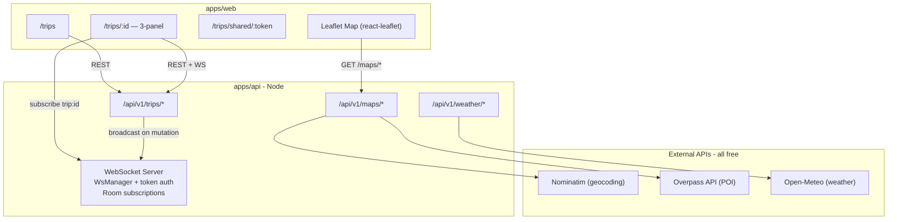

# Sprint 4 — Trip Planner Core, Real-Time Collaboration, and Maps

**Status:** ✅ Done  
**Duration:** 3 weeks  
**Goal:** Full trip planning experience with days, places, drag-drop, Leaflet map, weather, real-time collaboration, and share/export features.

---

## Architecture

---

## Part A: Sprint 1-3 Debt Fixes

All critical debt fixed before Sprint 4 build:

| Issue | Fix | File |
|-------|-----|------|
| WebSocket auth not wired | Implemented WsManager with token auth | `apps/api/src/lib/ws.ts`, `index.ts` |
| User posts cursor broken | Fixed cursor encoding to `{createdAt, id}` JSON | `apps/api/src/routes/users.ts` |
| Single post ignores isPublished | Added isPublished + owner check | `apps/api/src/routes/posts.ts` |
| AI refine SSE mismatch | SDK now accumulates chunks, parses on [DONE] | `packages/sdk/src/hooks/ai.ts` |
| Hotel UI sends city, API needs cityCode | Added city→cityCode fallback map | `apps/api/src/routes/travel.ts` |
| Seed duplicates destinations on re-run | Added unique index on destinations.name | `apps/api/src/db/schema.ts` |
| Landing page outdated | Updated status badge to S1–S4 | `apps/web/src/app/page.tsx` |
| Account delete doesn't set role=deleted | Added role='deleted' to schema + route | `apps/api/src/db/schema.ts`, `users.ts` |
| Avatar URL inconsistent in /me | Standardized on `getPublicUrl()` | `apps/api/src/routes/auth.ts` |

---

## Part B: Backend Implementation

### New Files Created

| File | Purpose |
|------|---------|
| `apps/api/src/lib/ws.ts` | WsManager class — token auth, rooms, broadcast, cleanup |
| `apps/api/src/routes/trips.ts` | Full CRUD: trips, members, days, places, assignments, notes, share, ICS |
| `apps/api/src/routes/maps.ts` | Nominatim search/autocomplete/reverse + Overpass POI |
| `apps/api/src/routes/weather.ts` | Open-Meteo current + forecast with 5-min cache |

### WebSocket Events Broadcast

| Event | Trigger |
|-------|---------|
| `trip:updated` | PATCH /trips/:id |
| `day:created` / `day:updated` / `day:deleted` | Day mutations |
| `place:created` / `place:updated` / `place:deleted` | Place mutations |
| `assignment:created` / `assignment:updated` / `assignment:deleted` | Assignment mutations |
| `note:created` / `note:updated` / `note:deleted` | Day note mutations |
| `member:added` / `member:removed` | Member mutations |

### Database Changes

- New migration `drizzle/0003_volatile_lizard.sql`: adds `destinations_name_uniq` unique index
- Updated `users.role` enum to include `'deleted'` value
- Trip skeleton tables (trips, tripMembers, days, places, dayAssignments, dayNotes) already existed — activated by implementing routes

---

## Part C: Frontend Implementation

### New Files Created

| File | Purpose |
|------|---------|
| `apps/web/src/app/(app)/trips/page.tsx` | Trips list with card grid |
| `apps/web/src/app/(app)/trips/[tripId]/page.tsx` | 3-panel trip detail (days + map + detail/add panel) |
| `apps/web/src/app/(app)/trips/shared/[token]/page.tsx` | Public read-only shared trip view |
| `apps/web/src/components/trips/create-trip-modal.tsx` | Create trip / import AI plan |
| `apps/web/src/components/trips/trip-map.tsx` | Leaflet map with colored POI markers |
| `apps/web/src/components/trips/place-card.tsx` | Sortable place card with DnD handle |
| `apps/web/src/components/trips/add-place.tsx` | Nominatim autocomplete + place form |
| `apps/web/src/components/trips/weather-widget.tsx` | 7-day forecast or single-day widget |
| `apps/web/src/components/trips/members-modal.tsx` | Member list + invite + role management |
| `packages/types/src/schemas/trips.ts` | Zod schemas for Trip, Day, Place, Assignment, etc. |
| `packages/sdk/src/hooks/trips.ts` | TanStack Query hooks for all trip operations |
| `packages/sdk/src/hooks/maps.ts` | Nominatim/Overpass hooks |
| `packages/sdk/src/hooks/weather.ts` | Open-Meteo weather hooks |

### Dependencies Added

- `@dnd-kit/core`, `@dnd-kit/sortable`, `@dnd-kit/utilities` — drag-and-drop
- `react-leaflet`, `leaflet`, `@types/leaflet` — interactive map

---

## Part D: Seed Data

Two demo trips seeded:

| Trip | Owner | Days | Places |
|------|-------|------|--------|
| Rajasthan Heritage Tour | arya_explorer | 4 | 5 (Amber Fort, City Palace, Mehrangarh Fort, Lake Pichola, Chokhi Dhani) |
| Goa Beach Getaway | leo_backpacker | 3 | 4 (Baga Beach, Basilica, Palolem Beach, Thalassa) |

---

## Definition of Done ✅

- [x] All API endpoints return 200 with correct shape (smoke tested)
- [x] `pnpm typecheck` passes for all packages (api, types, sdk, web)
- [x] Drizzle migration generated and applied successfully
- [x] Seed creates 2 trips with days, places, assignments, members
- [x] Trip CRUD: create, read, update, delete, copy, cover upload
- [x] Trip Members: invite, role change, remove
- [x] Days: add, update, delete with auto-renumber
- [x] Places: add with Nominatim search, update, delete
- [x] Assignments: link place to day, reorder, move to different day, delete
- [x] Day Notes: create, update, delete
- [x] WebSocket: `WsManager` with token auth, room subscriptions, broadcasts
- [x] Maps: Nominatim search/autocomplete/reverse, Overpass POI
- [x] Weather: Open-Meteo current + 16-day forecast with cache
- [x] Share: generate token, public view at `/trips/shared/:token`
- [x] ICS export: calendar file with timed events
- [x] Web: Trips list page with cover/dates/role
- [x] Web: Trip detail 3-panel (days+DnD, map, detail)
- [x] Web: Drag-drop reorder via `@dnd-kit`
- [x] Web: Leaflet map with colored category markers
- [x] Web: Weather widget per day
- [x] Web: Members modal with invite
- [x] Web: Share + copy link
- [x] Web: ICS download button
- [x] Web: Public shared trip page (no login)
- [x] `Trips` added to navbar

---

## Known Dev-Environment Notes

- **Weather API SSL**: `UNABLE_TO_GET_ISSUER_CERT_LOCALLY` in some dev setups — set `NODE_TLS_REJECT_UNAUTHORIZED=0` for local testing only; not needed in production.
- **Nominatim rate limit**: 1 req/sec — autocomplete is throttled; may be slow on first request.
- **Overpass API**: Response may be slow for large bounding boxes.

---

## Reference

- Demo script: `docs/sprint-verification.md` §Sprint 4 Demo Walkthrough
- API surface: `docs/architecture/07-api-surface.md` §5 Trips, §12 Maps, §13 Weather
- Roadmap: `docs/architecture/08-build-roadmap.md` Sprint 4 row
