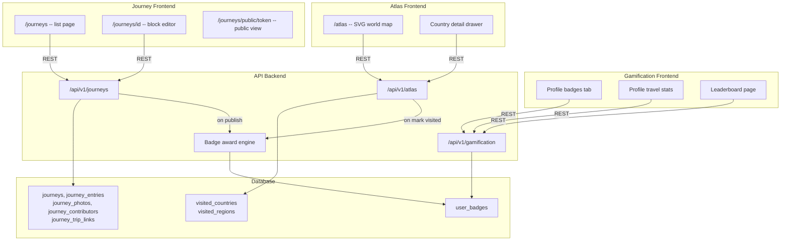

# Sprint 8 -- Journey Magazine, Atlas, Gamification, and S1-S7 Debt Cleanup

Sprint 8 is a three-feature sprint covering the content creation side (Journey Magazine), the stats/tracking side (Atlas), and motivation (Gamification). All three share the profile page as their integration point.

### Reference Documents
- **API endpoints:** [docs/architecture/07-api-surface.md](docs/architecture/07-api-surface.md) -- sections 8 (Journey), 9 (Atlas), 10 (Gamification)
- **DB schema:** [docs/architecture/06-system-architecture.md](docs/architecture/06-system-architecture.md) -- Journey/Atlas/Gamification tables
- **PRD vision:** [docs/architecture/03-prd-vision.md](docs/architecture/03-prd-vision.md) -- Screen 11 (Travel Graph), Journey creation
- **Existing stubs:** [apps/api/src/db/schema.ts](apps/api/src/db/schema.ts) -- lines 765-830 (journeys, journeyEntries, visitedCountries, visitedRegions, userBadges)
- **Feature matrix:** [docs/architecture/04-feature-matrix.md](docs/architecture/04-feature-matrix.md) -- sections S (Gamification) and T (Journal)

---

## S1-S7 Debt Audit

| Issue | Priority | Fix |
|-------|----------|-----|
| `AGENTS.md` heading says "as-built notes (S1-S6)" but includes S7 | Low | Update heading to "(S1-S7)" |
| S4 real-time collab two-tab checkbox still `[ ]` in sprint-verification.md | Low | Mark with note "(requires manual browser test)" |
| S8-S12 rows in roadmap overview table have no Status cell | Low | Add "Planned" to S9-S12 |
| `docs/plans/` missing S0 plan | Very Low | Document-only, skip |

---

## Architecture



---

## Part A: S1-S7 Debt Cleanup

1. Update [AGENTS.md](AGENTS.md) heading from "(S1-S6)" to "(S1-S7)"
2. Mark S4 two-tab checkbox in [docs/sprint-verification.md](docs/sprint-verification.md) with "(manual browser test)"
3. Add "Planned" status to S9-S12 rows in [docs/architecture/08-build-roadmap.md](docs/architecture/08-build-roadmap.md) overview table

---

## Part B: Schema Migration

Existing stubs to keep as-is: `journeys`, `journeyEntries`, `visitedCountries`, `visitedRegions`, `userBadges`

**Missing tables to add to [apps/api/src/db/schema.ts](apps/api/src/db/schema.ts):**

```
journey_photos      id, entry_id (FK journey_entries), storage_key TEXT,
                    caption TEXT, taken_at TIMESTAMP, order_index INT
journey_contributors  journey_id (FK journeys), user_id (FK users),
                      role ('owner'|'contributor'), invited_at TIMESTAMP
                      -- uniqueIndex on (journey_id, user_id)
journey_trip_links  journey_id (FK journeys), trip_id (FK trips)
                    -- uniqueIndex on (journey_id, trip_id)
```

**Modifications to existing stubs:**
- `journeys`: add `layoutPref TEXT default 'magazine'` column (per 06-system-architecture schema)
- `visitedCountries`: add uniqueIndex on `(user_id, country_code)`
- `visitedRegions`: add uniqueIndex on `(user_id, region_code)`

Then `pnpm --filter api db:generate` + `db:migrate`.

---

## Part C: Backend Routes

### C.1 Journeys Router -- new [apps/api/src/routes/journeys.ts](apps/api/src/routes/journeys.ts)

17 endpoints at `/api/v1/journeys` (per [07-api-surface.md section 8](docs/architecture/07-api-surface.md)):

| Method | Path | Auth | Description |
|--------|------|------|-------------|
| GET | `/` | auth | User's journeys (owned + contributor) |
| POST | `/` | auth | Create journey |
| GET | `/:journeyId` | auth (contributor) | Detail + entries |
| PATCH | `/:journeyId` | auth (owner) | Update title/description/layout |
| DELETE | `/:journeyId` | auth (owner) | Delete + cascade |
| POST | `/:journeyId/share` | auth (owner) | Generate share token |
| DELETE | `/:journeyId/share` | auth (owner) | Revoke share link |
| GET | `/public/:token` | public | Public journey view (no auth) |
| GET | `/:journeyId/entries` | auth (contributor) | Entries list |
| POST | `/:journeyId/entries` | auth (contributor) | Add entry (rich content JSON blocks) |
| PATCH | `/:journeyId/entries/:id` | auth (contributor) | Edit entry |
| DELETE | `/:journeyId/entries/:id` | auth (contributor) | Delete entry |
| POST | `/:journeyId/entries/:id/photos` | auth (contributor) | Upload photos (multipart) |
| POST | `/:journeyId/contributors` | auth (owner) | Invite contributor by username |
| DELETE | `/:journeyId/contributors/:userId` | auth (owner) | Remove contributor |
| POST | `/:journeyId/trips/:tripId` | auth (owner) | Link a trip |
| DELETE | `/:journeyId/trips/:tripId` | auth (owner) | Unlink trip |

**Rich content JSON format** (per entry `contentJson`):
```json
[
  { "type": "heading", "text": "Day 1 in Jaipur" },
  { "type": "text", "text": "We arrived at the Pink City..." },
  { "type": "photo", "storageKey": "...", "caption": "Hawa Mahal at sunset" },
  { "type": "quote", "text": "Travel is the only thing you buy that makes you richer" },
  { "type": "divider" }
]
```

Photo upload: use existing `multer` + `storage.ts` pattern from posts (S2). Store in `/uploads/journeys/` locally (or R2 in prod).

Access control: `getContributorRole(journeyId, userId)` returns `'owner' | 'contributor' | null`.

### C.2 Atlas Router -- new [apps/api/src/routes/atlas.ts](apps/api/src/routes/atlas.ts)

6 endpoints at `/api/v1/atlas`:

| Method | Path | Auth | Description |
|--------|------|------|-------------|
| GET | `/countries` | auth | User's visited countries |
| POST | `/countries/:code` | auth | Mark visited (ISO 3166-1 alpha-2) |
| DELETE | `/countries/:code` | auth | Unmark |
| GET | `/stats` | auth | Aggregated stats (count, % of 195, regions, badges) |
| GET | `/regions/:countryCode` | auth | Visited regions in country |
| POST | `/regions/:regionCode` | auth | Mark region visited |

**Stats computation:**
- Total countries: count distinct country_code for user
- Percentage: total / 195 (UN member states)
- Continent breakdown: use a static JSON mapping (ISO code -> continent)
- Badge check: on each mark/unmark, call badge engine

### C.3 Gamification Router -- new [apps/api/src/routes/gamification.ts](apps/api/src/routes/gamification.ts)

3 endpoints at `/api/v1/gamification`:

| Method | Path | Auth | Description |
|--------|------|------|-------------|
| GET | `/badges` | auth | User's earned badges |
| GET | `/stats` | auth | Aggregated travel stats |
| GET | `/leaderboard` | auth | Top travelers (friends + global) |

### C.4 Badge Engine -- new [apps/api/src/lib/badges.ts](apps/api/src/lib/badges.ts)

Called after actions (post creation, country visit, trip creation, etc.):

```typescript
async function checkAndAwardBadges(userId: string): Promise<void>
```

**Badge definitions (static):**

| Badge Type | Icon | Condition |
|-----------|------|-----------|
| `first_post` | "First Moment" | posts count >= 1 |
| `ten_posts` | "Storyteller" | posts count >= 10 |
| `first_journey` | "Journal Keeper" | journeys count >= 1 |
| `five_countries` | "Globetrotter" | visited countries >= 5 |
| `ten_countries` | "World Explorer" | visited countries >= 10 |
| `first_trip` | "Trip Planner" | trips count >= 1 |
| `group_traveler` | "Social Butterfly" | circles membership >= 3 |
| `budget_master` | "Budget Master" | expense groups >= 2 |

Badge engine is idempotent -- checks existing badges before awarding.

### C.5 Route Registration + Seed Data

Register in [apps/api/src/routes/index.ts](apps/api/src/routes/index.ts):
```
router.use('/api/v1/journeys', journeysRouter);
router.use('/api/v1/atlas', atlasRouter);
router.use('/api/v1/gamification', gamificationRouter);
```

Seed data in [apps/api/src/seed.ts](apps/api/src/seed.ts):
- 2 demo journeys: "Rajasthan Heritage Journal" (arya, 4 entries with text+photo+quote blocks) and "Goa Beach Diary" (marco, 3 entries)
- 1 contributor per journey
- 8 visited countries for arya (IN, TH, JP, NP, LK, ID, VN, MY)
- 5 visited countries for marco (IN, BR, PT, ES, FR)
- 4 badges per user (earned from existing data)
- Static country-continent JSON: bundle `apps/api/src/lib/countries.json` (195 entries, ~5KB)

---

## Part D: Types and SDK

### D.1 Types -- [packages/types/src/schemas/journeys.ts](packages/types/src/schemas/journeys.ts)

Zod schemas: `JourneySchema`, `CreateJourneySchema`, `JourneyEntrySchema`, `CreateEntrySchema`, `ContentBlockSchema`, `JourneyContributorSchema`, `JourneyPhotoSchema`

### D.2 Types -- [packages/types/src/schemas/atlas.ts](packages/types/src/schemas/atlas.ts)

Zod schemas: `VisitedCountrySchema`, `AtlasStatsSchema`, `VisitedRegionSchema`, `ContinentBreakdownSchema`

### D.3 Types -- [packages/types/src/schemas/gamification.ts](packages/types/src/schemas/gamification.ts)

Zod schemas: `BadgeSchema`, `TravelStatsSchema`, `LeaderboardEntrySchema`

### D.4 SDK Hooks

- [packages/sdk/src/hooks/journeys.ts](packages/sdk/src/hooks/journeys.ts): `useJourneys`, `useJourney`, `useCreateJourney`, `useJourneyEntries`, `useCreateEntry`, `useUpdateEntry`, `useDeleteEntry`, `useShareJourney`, `useInviteContributor`
- [packages/sdk/src/hooks/atlas.ts](packages/sdk/src/hooks/atlas.ts): `useVisitedCountries`, `useMarkCountryVisited`, `useUnmarkCountry`, `useAtlasStats`, `useVisitedRegions`, `useMarkRegionVisited`
- [packages/sdk/src/hooks/gamification.ts](packages/sdk/src/hooks/gamification.ts): `useBadges`, `useTravelStats`, `useLeaderboard`

---

## Part E: Frontend

### E.1 Journeys Page -- [apps/web/src/app/(app)/journeys/page.tsx](apps/web/src/app/(app)/journeys/page.tsx)

- Grid of journey cards (cover image, title, entry count, public/private badge)
- "New Journey" button + modal (title, description)
- Each card links to `/journeys/{id}`

### E.2 Journey Editor -- [apps/web/src/app/(app)/journeys/[journeyId]/page.tsx](apps/web/src/app/(app)/journeys/[journeyId]/page.tsx)

- Magazine-style layout with entries as blocks
- Each block: heading, text (markdown/plain), photo (with caption), quote, divider
- "Add Block" button with block type picker
- Drag-and-drop reorder (dnd-kit)
- Share button (generates public link, copy to clipboard)
- Contributors panel (sidebar)
- Linked trips panel

### E.3 Public Journey View -- [apps/web/src/app/journeys/public/[token]/page.tsx](apps/web/src/app/journeys/public/[token]/page.tsx)

- Beautiful read-only magazine layout (no auth required)
- Hero cover image, author name, date
- Full-width photo blocks, typography-focused text
- Route: outside `(app)` layout (no navbar/auth check)

### E.4 Atlas Page -- [apps/web/src/app/(app)/atlas/page.tsx](apps/web/src/app/(app)/atlas/page.tsx)

- SVG world map (inline SVG with country paths, color-fill visited countries in teal)
- Hover tooltip: country name + visit date
- Click: opens country detail drawer (regions list, mark sub-regions)
- Stats sidebar: total countries, percentage of world, continent breakdown bars
- "Mark Visited" search bar (country name autocomplete from static list)

SVG map: use a lightweight world map SVG (~50KB) with ISO alpha-2 coded path IDs. Bundle as a React component.

### E.5 Gamification Integration

- Add **Badges** and **Stats** tabs to user profile page [apps/web/src/app/(app)/u/[username]/page.tsx](apps/web/src/app/(app)/u/[username]/page.tsx)
- Badge grid: icon + name + earned date
- Stats panel: countries visited, posts, trips, days traveled
- Optional: leaderboard accessible from profile or as `/leaderboard` page

### E.6 Navigation

Update [apps/web/src/components/navbar.tsx](apps/web/src/components/navbar.tsx):
- Add `BookOpen` icon link to `/journeys` (after Split/Receipt)
- Add `Globe2` icon link to `/atlas` (after Journeys)

---

## Part F: Verification + Docs

- Update [docs/sprint-verification.md](docs/sprint-verification.md) with S8 smoke tests + demo walkthrough (8 scenes)
- Save plan to `docs/plans/sprint-8-journey-atlas.md`
- Update [docs/architecture/08-build-roadmap.md](docs/architecture/08-build-roadmap.md): mark S8 done, add as-built notes
- Update [docs/architecture/07-api-surface.md](docs/architecture/07-api-surface.md): mark sections 8, 9, 10 as implemented
- Update landing page badge: `S1-S8 live`
- Run `pnpm typecheck`, `db:migrate`, `db:seed`, smoke tests
- Start all services, git commit + push

---

## Part G: Start Services + Push

```bash
pnpm --filter api dev     # :3000
pnpm --filter web dev     # :3001
# AI service on :8000

git add -A && git commit -m "feat(S8): Journey Magazine, Atlas, Gamification"
git push origin main
```
