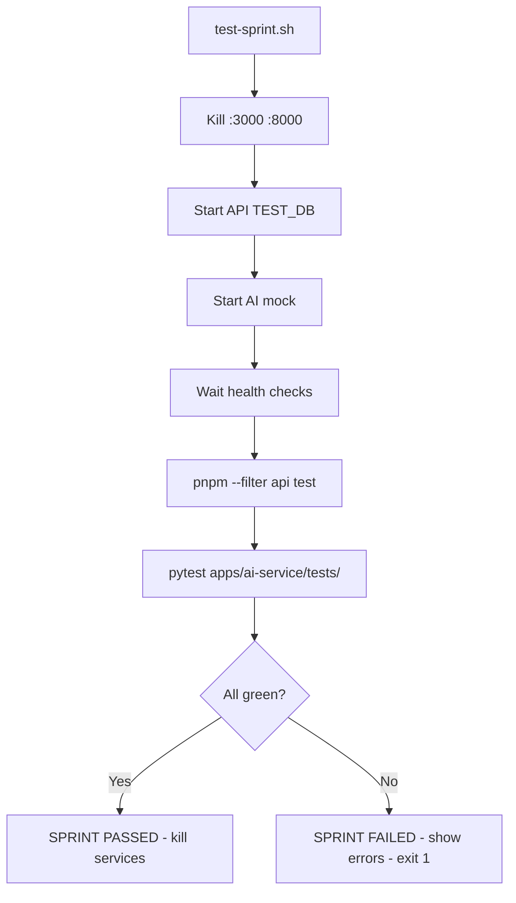

# Sprint 9 — Notifications, Admin Panel, Comprehensive Test Suite

## S1–S8 Debt Audit

| Sprint | Open Items | Action |
|--------|-----------|--------|
| S4 | Bundle/offline sync, GPX import | Correctly deferred to S10/post-MVP — no action |
| S5–S8 | Mobile screens | Correctly deferred to S11 — no action |
| S8 | Roadmap checkboxes for SDK hooks (`useJourneysQuery`, `useAtlasQuery`, `useBadgesQuery`) show `[ ]` but code exists | Mark `[x]` in roadmap — doc fix only |

---

## Part A — Fix AI Service (Blocking Demo Issue)

**Root cause:** `GOOGLE_API_KEY=""` and `GROQ_API_KEY=""` → `generate_with_fallback` raises `RuntimeError` → HTTP 500 on all AI calls.

### A1. Add `MockAIClient`

**[`apps/ai-service/src/ai/client.py`](apps/ai-service/src/ai/client.py)** — add before the `_CLIENTS` dict:

```python
class MockAIClient:
    async def generate(self, prompt: str, schema=None) -> str:
        return json.dumps({
            "destination": "Demo City",
            "nights": 3,
            "days": [{"day": 1, "activities": [
                {"name": "Morning city walk", "duration": "2h", "cost": 0},
                {"name": "Local cuisine lunch", "duration": "1h", "cost": 500}
            ]}],
            "estimated_cost": {"total": 8000, "currency": "INR"},
            "tips": ["Book accommodation in advance", "Try local street food"]
        })
    async def generate_with_image(self, prompt: str, image_url: str) -> str:
        return "A stunning travel destination with rich culture and beautiful landscapes."
```

Add `"mock": MockAIClient` to `_CLIENTS`. In `get_ai_client`, if the chosen provider's key is empty, automatically fall back to mock.

### A2. Change Default Provider

**[`apps/ai-service/src/config.py`](apps/ai-service/src/config.py)** — change `ai_provider: str = "gemini"` to `ai_provider: str = "mock"`. Real keys override via `.env`.

### A3. Create Dev `.env`

**Create [`apps/ai-service/.env`](apps/ai-service/.env)** from `.env.example` with `AI_PROVIDER=mock`. Add a `GOOGLE_API_KEY=` placeholder comment so devs know where to put their key.

### A4. Health Endpoint Update

**[`apps/ai-service/src/routes/health.py`](apps/ai-service/src/routes/health.py)** — add `"mock_mode": settings.ai_provider == "mock"` to response so the web UI can show a dev warning.

---

## Part B — Sprint 9 Backend

### B1. Schema Migration

The `notifications`, `notification_prefs`, `system_notices`, `user_notice_dismissals`, and `audit_log` tables **already exist** in `0000_left_veda.sql`. Only missing: performance indexes and a unique constraint on prefs.

**Edit [`apps/api/src/db/schema.ts`](apps/api/src/db/schema.ts)** — add to `notifications` and `notificationPrefs` tables:

```typescript
// In notifications table definition — add table config:
{ userReadIdx: index('notif_user_read_idx').on(t.userId, t.readAt) }

// In notificationPrefs table definition — add:  
{ uniqueUserEvent: uniqueIndex('notif_prefs_user_event').on(t.userId, t.eventType) }

// In systemNotices:
{ activeIdx: index('notices_active_idx').on(t.isActive) }
```

Then run `pnpm --filter api db:generate` → `0008_*.sql`, then `db:migrate`.

### B2. Notification Helper

**New [`apps/api/src/lib/notifications.ts`](apps/api/src/lib/notifications.ts)** — central function called by all route modules:

```typescript
export async function createNotification(opts: {
  userId: string;          // recipient
  actorId?: string;        // who triggered it
  type: string;            // 'follow' | 'comment' | 'reaction' | 'trip_invite' | ...
  title: string;
  body?: string;
  resourceType?: string;   // 'post' | 'trip' | 'circle'
  resourceId?: string;
  data?: Record<string, unknown>;
}): Promise<void>
```

It:
1. Checks `notification_prefs` for `inApp` preference (default true)
2. Inserts into `notifications`
3. Broadcasts `notification:new` to `user:{userId}` room via `getWsManager()`
4. If `email` pref is true, calls `sendNotificationEmail()` (non-blocking)

Add `'notification:new' | 'notification:updated'` to `WsEvent` union in `ws.ts`.

### B3. Notifications Router

**New [`apps/api/src/routes/notifications.ts`](apps/api/src/routes/notifications.ts)** — 8 endpoints matching `docs/architecture/07-api-surface.md §14`:

| Method | Path | Description |
|--------|------|-------------|
| `GET` | `/` | Paginated feed (`?cursor=&limit=20`) |
| `GET` | `/unread-count` | `{ count: N }` |
| `POST` | `/:id/read` | Mark single notification read |
| `POST` | `/read-all` | Mark all read, broadcast `notification:updated` |
| `DELETE` | `/:id` | Delete notification |
| `POST` | `/:id/respond` | Interactive respond (`{ action: 'accept'|'decline' }`) |
| `GET` | `/preferences` | All per-event-type prefs |
| `PATCH` | `/preferences` | Upsert prefs (array of `{ eventType, inApp, email }`) |

### B4. Admin Router

**New [`apps/api/src/routes/admin.ts`](apps/api/src/routes/admin.ts)** — all routes use `authenticate` + `requireAdmin`:

| Method | Path | Description |
|--------|------|-------------|
| `GET` | `/users` | Paginated user list with `?q=&role=&suspended=` |
| `GET` | `/users/:id` | User detail + post/trip/badge counts |
| `PATCH` | `/users/:id` | Update `role` or `isSuspended` |
| `DELETE` | `/users/:id` | Hard delete |
| `GET` | `/audit-log` | Paginated log with `?userId=&action=&from=&to=` |
| `GET` | `/notices` | All notices (active + inactive) |
| `POST` | `/notices` | Create notice |
| `PATCH` | `/notices/:id` | Update notice (title, body, active) |
| `DELETE` | `/notices/:id` | Delete notice |
| `GET` | `/stats` | `{ users, posts, trips, circles, dau }` |

### B5. Suspended User Middleware

**[`apps/api/src/middleware/auth.ts`](apps/api/src/middleware/auth.ts)** — in `authenticate`, after verifying JWT, check `users.isSuspended` from DB. If suspended, return `403 { error: 'Account suspended' }`.

Add `isSuspended` column to `users` table (boolean, default false). This requires a new migration.

### B6. Trigger `createNotification` in Existing Routes

- `users.ts` — on `POST /follow/:id` → notify followee
- `posts.ts` — on `POST /:postId/comments` → notify post author; on `POST /:postId/reactions` → notify post author (if not self)
- `trips.ts` — on add member → notify new member

### B7. Background Jobs

**New [`apps/api/src/jobs/cron.ts`](apps/api/src/jobs/cron.ts)** using `node-cron` (already in deps):

```typescript
// Every hour: process email notification queue
cron.schedule('0 * * * *', () => processEmailQueue());

// Nightly 2am: DB backup to R2
cron.schedule('0 2 * * *', () => backupDatabase());
```

`backupDatabase()` runs `turso db dump` → saves to R2 key `backups/db-{date}.sql`. In dev with no Turso URL, skip with a log.

Import and start in `apps/api/src/index.ts`.

### B8. Register Routes in index.ts

```typescript
import notificationsRouter from './notifications';
import adminRouter from './admin';

router.use('/api/v1/notifications', notificationsRouter);
router.use('/api/v1/admin', adminRouter);  // full admin (users, audit, notices, stats)
```

### B9. Update Seed

**[`apps/api/src/seed.ts`](apps/api/src/seed.ts)** — add:
- Seed user `arya_explorer` with role `admin`
- 2 demo system notices (one active, one inactive)
- 5 sample notifications for demo users

---

## Part C — Sprint 9 Web

### C1. Notification Bell in Navbar

**[`apps/web/src/components/navbar.tsx`](apps/web/src/components/navbar.tsx)** — add before the profile link:

```tsx
<NotificationBell />   // new component
```

**New [`apps/web/src/components/notification-bell.tsx`](apps/web/src/components/notification-bell.tsx)**:
- Uses `useUnreadCount()` SDK hook → shows `Bell` icon with red badge if count > 0
- On click: opens slide-in `NotificationDrawer`

**New [`apps/web/src/components/notification-drawer.tsx`](apps/web/src/components/notification-drawer.tsx)**:
- Lists notifications from `useNotifications()` hook
- Mark as read on click
- "Mark all read" button
- For `trip_invite` type: inline Accept / Decline buttons → calls `useRespondNotification()`

### C2. Notification Preferences Page

**New [`apps/web/src/app/(app)/settings/notifications/page.tsx`](apps/web/src/app/(app)/settings/notifications/page.tsx)**:
- Toggle grid: event types (follow, comment, reaction, trip_invite) × channels (in-app, email)
- Uses `useNotificationPrefs()` and `useUpdateNotificationPrefs()` hooks

### C3. Admin Panel

**New pages** (guarded by `user.role === 'admin'`):

- [`apps/web/src/app/(app)/admin/page.tsx`](apps/web/src/app/(app)/admin/page.tsx) — stats dashboard (4 count cards)
- [`apps/web/src/app/(app)/admin/users/page.tsx`](apps/web/src/app/(app)/admin/users/page.tsx) — user table with search, role badge, suspend toggle
- [`apps/web/src/app/(app)/admin/audit-log/page.tsx`](apps/web/src/app/(app)/admin/audit-log/page.tsx) — scrollable log table with filters
- [`apps/web/src/app/(app)/admin/notices/page.tsx`](apps/web/src/app/(app)/admin/notices/page.tsx) — notice CRUD with active toggle

**Add admin link to navbar** — only rendered when `user.role === 'admin'`:
```tsx
{user?.role === 'admin' && (
  <Link href="/admin" title="Admin"><Shield className="h-5 w-5" /></Link>
)}
```

### C4. System Notice Banner

**[`apps/web/src/app/(app)/layout.tsx`](apps/web/src/app/(app)/layout.tsx)** — fetch active notices on mount, show a dismissible banner at the top. Uses `GET /api/v1/admin/notices?active=true` (public endpoint).

---

## Part D — Types & SDK

**New [`packages/types/src/schemas/notifications.ts`](packages/types/src/schemas/notifications.ts)**:
- `NotificationSchema`, `NotificationPrefSchema`, `NotificationPrefUpdateSchema`

**New [`packages/sdk/src/hooks/notifications.ts`](packages/sdk/src/hooks/notifications.ts)**:
- `useNotifications`, `useUnreadCount`, `useMarkRead`, `useMarkAllRead`, `useDeleteNotification`, `useRespondNotification`, `useNotificationPrefs`, `useUpdateNotificationPrefs`

Update exports in [`packages/types/src/index.ts`](packages/types/src/index.ts) and [`packages/sdk/src/index.ts`](packages/sdk/src/index.ts).

---

## Part E — Comprehensive Test Suite

### E1. API App Refactor

**New [`apps/api/src/app.ts`](apps/api/src/app.ts)** — extract Express `app` (all middleware + routes), export without calling `listen()`.

**[`apps/api/src/index.ts`](apps/api/src/index.ts)** — imports `app` from `./app`, calls `app.listen(env.PORT)`. This is required for supertest to work without binding a real port.

### E2. Install Test Dependencies

```bash
pnpm add -D vitest @vitest/coverage-v8 supertest @types/supertest --filter api
```

Add to `apps/ai-service/requirements-dev.txt`:
```
pytest==8.3.5
pytest-asyncio==0.24.0
```

### E3. Vitest Config & Setup

**New [`apps/api/vitest.config.ts`](apps/api/vitest.config.ts)**:
```typescript
export default defineConfig({
  test: {
    globalSetup: './src/__tests__/setup.ts',
    environment: 'node',
    reporters: ['verbose'],
  },
});
```

**New [`apps/api/src/__tests__/setup.ts`](apps/api/src/__tests__/setup.ts)** — sets `DATABASE_URL=file:./data/test.db`, runs migrations, seeds test users, exports `getToken(email): Promise<string>` helper.

**Add to `apps/api/package.json`:**
```json
"test": "vitest run",
"test:watch": "vitest",
"test:coverage": "vitest run --coverage"
```

### E4. API Test Files

One file per domain, each using `supertest(app)`:

| File | Key assertions |
|------|---------------|
| `auth.test.ts` | Register → 201, login → token, invalid creds → 401, OTP flow |
| `feed.test.ts` | `/feed/compass` → array, `/feed/trending` → array |
| `posts.test.ts` | Create post → 201, get by id → 200, react → 200, comment → 201 |
| `trips.test.ts` | Create trip → 201, add member → 200, add place → 201 |
| `circles.test.ts` | Create circle → 201, send message → 201, list members → 200 |
| `expenses.test.ts` | Create group → 201, add expense → 201, get settlements → 200 |
| `journeys.test.ts` | Create → 201, add entry → 201, share → 200, public view → 200 |
| `atlas.test.ts` | Mark country → 201, unmark → 200, stats → valid shape |
| `gamification.test.ts` | Badges → array, leaderboard → sorted array |
| `notifications.test.ts` | Feed → array, unread-count → `{count}`, mark-read → 200, prefs → 200 |
| `admin.test.ts` | Non-admin → 403, admin user list → 200, stats → valid shape |
| `ai.test.ts` | `/ai/plan` with mock AI env → 200 with itinerary shape |

### E5. AI Service Tests

**New `apps/ai-service/tests/` directory** with `pytest.ini` (`asyncio_mode = auto`):

| File | Assertions |
|------|-----------|
| `test_health.py` | `GET /health` → `{"status": "ok"}` |
| `test_hmac.py` | No headers → 401, expired ts → 401, valid HMAC → passes auth |
| `test_plan.py` | Valid HMAC + mock provider → 200, response has `days` array |
| `test_caption.py` | Valid HMAC + mock provider → 200, response is a string |

All tests use `httpx.AsyncClient(app=app, base_url="http://test")` with `AI_PROVIDER=mock`.

### E6. Sprint Test Runner

**New [`scripts/test-sprint.sh`](scripts/test-sprint.sh)**:



Script outputs a summary table with pass/fail counts per suite and total time.

---

## Part F — Documentation & Git

- Mark S8 SDK hook checkboxes as `[x]` in `docs/architecture/08-build-roadmap.md`
- Add S9 as `[x] Done` with deliverables and "As-Built Notes" in roadmap
- Update `docs/architecture/07-api-surface.md` §14 and §16 with `✅ Implemented (S9)`
- Add S9 API smoke tests and acceptance criteria to `docs/sprint-verification.md`
- Add "Running the test suite" section to `docs/sprint-verification.md`
- Update `AGENTS.md` with S9 as-built notes and post-sprint testing convention
- Save plan to `docs/plans/sprint-9-notifications-admin.md`
- Commit `feat: sprint 9 - notifications, admin panel, test suite, AI mock` and push

---

## Files Changed Summary

**AI Service (fix):** `client.py`, `config.py`, `.env` (create), `health.py`

**API Backend:** `schema.ts`, `lib/notifications.ts` (new), `lib/ws.ts`, `routes/notifications.ts` (new), `routes/admin.ts` (new), `routes/index.ts`, `routes/users.ts`, `routes/posts.ts`, `routes/trips.ts`, `jobs/cron.ts` (new), `middleware/auth.ts`, `seed.ts`

**API Tests:** `app.ts` (new extract), `index.ts` (slim), `vitest.config.ts`, `__tests__/setup.ts`, 12 `*.test.ts` files, `package.json`

**AI Tests:** `requirements-dev.txt`, `tests/__init__.py`, `tests/pytest.ini`, 4 `test_*.py` files

**Web:** `navbar.tsx`, `notification-bell.tsx` (new), `notification-drawer.tsx` (new), `settings/notifications/page.tsx` (new), `admin/page.tsx` + 3 sub-pages (new), `(app)/layout.tsx`

**Types/SDK:** `schemas/notifications.ts` (new), `hooks/notifications.ts` (new), `index.ts` (both)

**Scripts:** `scripts/test-sprint.sh` (new)

**Docs:** `08-build-roadmap.md`, `07-api-surface.md`, `sprint-verification.md`, `AGENTS.md`, `docs/plans/sprint-9-*.md` (new)
